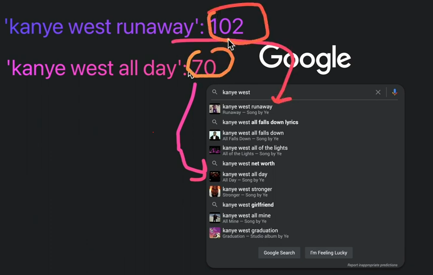

# Programming Challenges

## Basics 

- Q1 : WAP to calculate area of a circle. Take radius as an input from user
    ```py
    import math

    radius = float(input("enter the radius of a circle"))
    Area_Of_Circle = math.pi * pow(radius, 2)
    print(round(Area_Of_Circle,2))
    ```

- Q2 : WAP to calculate area of a rectangle. Take length & breadth from user
    ```py
    length = float(input("Enter the length of a rectangle"))
    breadth = float(input("Enter the breadth of a rectangle"))

    area_of_reactangle = length * breadth
    print(area_of_reactangle)
    ```

- Q3 : WAP to calculate volume of a cuboid. Take user input
    ```py
    length = float(input("Enter the length of a cuboid"))
    breadth = float(input("Enter the breadth of a cuboid"))
    height = float(input("Enter the height of a cuboid"))

    volume_of_cuboid = length * breadth * height
    print(volume_of_cuboid)
    ```

- Q4 : WAP to calculate simple interest. Take user input
    ```py
    principle_balance = float(input("Enter the principle"))
    annual_interest_rate = float(input("Enter the rate"))
    time = float(input("Enter the time (in years)"))

    simple_interest = (principle_balance * annual_interest_rate * time) / 100
    print("Simple Interest is : " , simple_interest)
    ```

- Q5 : WAP to calculate average of three numbers 
    ```py
    num1 = int(input("Enter the any 1st Integer number"))
    num2 = int(input("Enter the any 2nd Integer number"))
    num3 = int(input("Enter the any 3rd Integer number"))

    avg_of_three_numbers = (num1 + num2 + num3)/3
    print(round(avg_of_three_numbers, 1))
    ```

## Operators 

- WAP to swap values of two int variables
    ```py
    num1 = 5 
    num2 = 2 

    # swapping values of 2 variables each other with 3rd variable
    num3 = num1
    num1 = num2
    num2 = num3

    print("Value of num1 is : ", num1)
    print("Value of num2 is : ", num2)
    ```

- WAP to swap values of two int variables without using third variable
    ```py
    num1 = 5 
    num2 = 2 

    # swaping values of 2 variables together without 3rd variable  
    num1 = num1 + num2 
    num2 = num1 - num2
    num1 = num1 - num2

    print("num1 =", num1)
    print("num2 =", num2)
    ```

- WAP to get the individual digits from a integer number & print them (eg : 137 => 1,3,7)
    ```py
    num = 137

    newNum = str(num) # typecasting from integer to string

    for digit_num in newNum :
         print("Digit :" , digit_num)
    ```
    ```cpp
    #include <iostream>    
    using namespace std;

    int main() {
        int n = 137;
        // int n = -137; 
            // if we have negative number then we'll get each digit in negative also

        while(n != 0) {

            int digit = n%10; // this variable will be created/initialized in the memory from scratch as new variable 
                        // because we're created it inside the loop 💡💡💡
                // taking out the digit
                
            cout << "digit: " << digit << endl;
            n = n/10; // making the number small
        }

        cout << "DONE" << endl;
    }
    ```
    - Note : we can't solve this problem by using `%` modulus operator inside JS , python

- WAP to combine a number based on individual given digits & print it (eg : 1,3,4 => 134) 
    ```py
    digit_num1 = 1
    digit_num2 = 3
    digit_num3 = 7

    # this code is not effectice what if we have 10000 numbers
        # so individually , we can't put them manually 
        # so in that situation , we need to put each number inside an array
    new_num = f'{digit_num1}{digit_num2}{digit_num3}'

    print(new_num)
    ```

- WAP to print last digit of a given number
    ```py
    num = 137

    last_digit_num = num%10
    print(last_digit_num)
    ```

- WAP to print a given number but without last digit
    ```py
    import math

    num = 137

    # First way : 
    skip_last_digit_num = math.trunc(num/10)

    # second way :
    second_way = int(str(num)[:-1])

    print("Skipping last digit from a number :" , skip_last_digit_num)
    ```

- WAP to input a character from keyboard and print it's ASCII code
    ```py
    letter = input("Enter a character :")

    print(f'ASCII Code of {letter} is :', ord(letter))
    ```

- WAP to decimal to binary 
    - answer : https://www.geeksforgeeks.org/python-program-to-covert-decimal-to-binary-number/
    ```py

    ```

- WAP to binary to decimal
    - answer : https://www.scaler.com/topics/binary-to-decimal-in-python/
    ```py

    ```

## Output Question 

- variable scope MCQ : 
- pre & post increment & decrement MCQ
- break & continue with loop MCQ
- switch statement MCQ

## decision control

- WAP to check whether a given number is positive or non-positive
- WAP to check whether a given number is divisible by 5 or not 
- WAP to check whether a given number is even or odd
- WAP to check whether a given number is even or odd without using % operator
- WAP a program to check whether an year is a leap year or not 
- WAP to check whether a given number is positive , negative or zero
- WAP to find greater between two numbers
- WAP to find greater among three numbers
- WAP which takes marks of 5 subjects (assume maximum marks for each subject is 100)
    - Display result as pass or fail. Also print division obtained if candidate has passed the exam

## switch statement 

- Write a program which takes month number as an input & display number of days in that month
- write a menu driven program with following options :
    - a. addition
    - b. subtraction 
    - c. multiplication
    - d. division
    - e. exit
- write a program which takes day number of a week & display unique greeting message for the day
- write a menu driven program with following options : 
    - a. check whether a given set of three numbers are lengths of an isosceles triangle or not 
    - b. check whether a given set of three numbers are lengths of sides of a right angled triangle or not 
    - c. check whether a given set of three numbers are equilateral triangle or not 
    - d. Exit

## iterative control 

- Program to print digit pattern
- WAP to print first 10 natural numbers
- WAP to print first 10 natural numbers in reverse order
- WAP to print first **N** natural numbers
- WAP to print first **N** natural numbers in reverse order
- WAP to print first 10 even natural numbers
- WAP to print first 10 even natural numbers in reverse order
- WAP to print first 10 odd natural numbers
- WAP to print first 10 odd natural numbers in reverse order
- WAP to print first **N** odd natural numbers 
- WAP to print first **N** odd natural numbers in reverse order
- WAP to print squares of first N natural numbers
- WAP to calculate sum of first N natural numbers 

## loop

- WAP to calculate factorial of a number
- WAP to calculate sum of digits of a given number
- WAP to count digits in a given number
- WAP to reverse a number  
- WAP to print table of user's choice 
- WAP to check whether a given number is a term in fibonacci series or not  
- WAP to check whether a given number is prime or not 
- WAP to print all prime numbers under 100
- WAP to find Nth term of a fibonacci series
- WAP to calculate LCM of two numbers
- WAP to calculate GCD/HCF of two numbers
- WAP to print all factors of a given number
- WAP to print all prime factors of a given number 
- WAP to print all prime numbers between two given numbers
- WAP to calculate sum of squares of first **N** natural numbers
- WAP to calculate sum of cubes of first **N** natural numbers
- WAP to calculate sum of first **N** odd natural numbers
- WAP to print first **N** terms of a fibonacci series
- WAP to print next prime number of a given number
- WAP to check whether two given numbers are co-Prime or not 
- WAP to print first **N** prime numbers

## start pattern 

- Program to Print Floyd’s Triangle
- solid square pattern , hollow square
- https://www.faceprep.in/c/pattern-programs-in-c/
- https://www.geeksforgeeks.org/how-to-learn-pattern-printing-easily/
- 

## functions 

- write a function to calculate area of a circle (TSRS)
- write a function to print first **n** natural numbers (TSRS)
- write a function to print first **n** even natural numbers (TSRS)
- write a function to calculate sum of first **n** natural numbers (TSRS)
- write a function to calculate sum of squares of first **n** natural numbers (TSRS)
- write a function to check whether a given number is even or odd (TSRS) (Return 1 if even otherwise return 0)
- write a function to calculate factorial of a number (TSRS)
- write a function to calculate number of permutations which can be made from **n** items , selected **r** at a time (TSRS)
- write a function to calculate number of combinations which can be made from **n** items , selected **r** at a time (TSRS)
- write a function to check whether a given number is prime or not (TSRS) (Return 1 if prime , otherwise return 0)
- write a function to find next prime number of a give number (TSRS)
- write a function to print all prime numbers between two given numbers (TSRS)
- write a function to check whether a given number is an armstrong number or not 
- write a function to print all Armstrong numbers in the given range
- write a function to remove all occurrence of a given digit from a given number

## Clever programmer 

- doubling the each numbers of an array - 
    - inpout : [1,2,3,4,5]
    - output : [2,4,6,8,10]
- finding square of each number of an array (hint - use ** -> exponential symbol)
    - input : [1,2,3,4,5]
    - output : [1,4,9,16,25]
- counting total letters in a string 
    ```js
    const letterCounter = () => {
        const phrase = 'hey, can you go to grocery store with me?'

        let result = 0

        for (let indexNum in phrase) {
            console.log(Number(indexNum)+1)
            result = Number(indexNum) + 1 
                // here we added by 1 because we want 41 , 40 because in string also , index starts from 0 💡💡💡
        }

        return {result} // here no need to defined anything else because when we have same name of key & value 
            // then we just need to define it as key only , no need to give value 
            // in string , everything will be counted like space , symbol , etc
    }

    console.log(howManyLetters()) // output : { result : '40' }
    ```
    - but for this solution , we can use `length` property like this
        ```js
        const howManyLetters = (phrase) => {
            return {result : phase.length} // this is the easiest way 
        }

        const phrase = prompt("write your phrase") // making dynamic

        console.log(howManyLetters())
        ``` 
- create a function that adds all the numbers in the array
    ```js
    const sumArray = (numbers) => {
        let result = 0 // this is common practice in programming , where we define initial number

        for (const number of numbers) {
            console.log(number) 
        }

        return { result }
    }

    const nums = [1, 2, 3, 4]
    console.log(sumArray(nums))
    /* 
    output : 1
            2
            3
            4

        { result: 0 }
   */
    ```
    - here we're just checking whether we're able to access numbers or not , so we're able to access numbers <br>
        now we need to find result
        ```js
        const sumArray = (numbers) => {
            let result = 0 // this is common practice in programming , where we define initial number

            for (const number of numbers) {
                console.log(number) 
                result = result + number 
            }

            return { result }
        }

        const nums = [1, 2, 3, 4]
        console.log(sumArray(nums)) // output : { result: 10 }
        ```
- find a max number from an array 
    - we can use filter() method
    ```js
    const max = (numbers) => {
        let result = numbers[0] // by-default , we're initializing result value
            // Note : here we can't put result -> variable as const 
                // below , we're updating the value

        for (const number of numbers) {
            if (number > result) {
                result = number
            }
        }

        return result
    }

    console.log(max([1, 2, 3, 4, 5, 6])) // output : { result: 6} 
    ```
- letter frequency , this algo will tell how much that particular letter is repeating inside the sentence
    - Eg : input phrase is - how are you doing
    - output : O : 3  , h : 1 , w : 1
    ```js
    const letterFrequency = (phrase) => {
        // output : letterFrequency('haha') -> {'h': 2, 'a': 2}
        console.log(phrase)

        for (const letter of phrase) {
            console.log(letter)
        }
    }
    ```
    - checking , inside terminal , if we check , `freg = {'h' : 1}` <br>
        & if we do `h` in freq then we'll get true , if we do 'a' in freq , we'll get false 💡💡💡 
    - `STEP 1` : phrase is 'haha'
        - so first time , h will be initialize as 1
    - `STEP 2` : second time , we'll check whether 'a' exists in the object or not 
        - if not , then we'll give 'a' : 1
    - `STEP 3` : now when 3rd time loop run 
        - then we'll check i.e 'h' already exist inside that object , so we'll increment that existing `h` by 1 <br>
            we'll not do like this {'h': 1, 'a': 1, 'h': 1}
    - writing pseudo code 
        ```js
        const letterFrequency = (phrase) => {
            // output : letterFrequency('haha') -> {'h': 2, 'a': 2}
            console.log(phrase)
            // make a `frequency` object {}

            for (const letter of phrase) {
                // check if letter exists in frequency
                    // increment the value by + 1
                // otherwise , set the value to 1
            }

            return frequency
        }
        ```
        - `best practice` : write the logic of a problem as pseudo code & the movement you're able to understand logic
            - then convert it into code i.e called pseudo code 🔥🔥🔥 
    - writing code 
        ```js
        const letterFrequency = (phrase) => {
          // output : letterFrequency('haha') -> {'h': 2, 'a': 2}
          console.log(phrase);
          // make a `frequency` object {}

          let frequency = {};

          for (const letter of phrase) {
            // check if letter exists in frequency
            if (letter in frequency) {
              // increment the value by + 1

                // OR frequency[letter] += 1
                // OR frequency[letter]++ --> this one only increment by 1 only 
                frequency[letter] = frequency[letter] + 1; // but here let's say we want to increment by 10 or any number
                    // then we can use this way 💡💡💡
                    // so always use this way -> frequency[letter] += 1 --> because this way is very common

                // Note : where we're not putting frequency.letter because it'll create letter as property
                    // so we're using computer properties of object ES6 feature 💡💡💡

              // otherwise , set the value to 1
            } else {
              frequency[letter] = 1;
            }
          }

          return frequency;
        };

        console.log(letterFrequency('haha')); // output : {h: 2, a: 2}
        console.log(letterFrequency('lol, what are you doing later tonight lol, haha!')); 
            // output : we'll get proper output
        ```
    - now for further things we can check whether this algo is working or not 
- calculate total word frequency 
    - Eg : `wordFrequency('lol what lol') -> input should be -> {lol: 2, 'what': 1}` 
    - `split()` is a method which takes a string & convert it into an array , 
        - so we'll use `space` to split into words 💡💡💡
    ```js
    const wordFrequency = (phrase) => {
        let frequency = {};

        words = phrase.split(' ')
        console.log(words)

        for (const word of words) {
            console.log(word)
            if (word in frequency) {
                frequency[word] += 1
            } else {
                frequency[word] = 1
            }
        }

        console.log(words)
        return frequency;
    };

    console.log(wordFrequency('lol what lol')); // output : {lol: 2, what: 1}
    ```
    - so now we can simplify this code by using that previous function i.e letterFrequency() like this
        ```js
        const wordFrequency = (phrase) => {
            words = phrase.split(' ')       
            return letterFrequency(words)
        };
        console.log(wordFrequency('lol what lol')); // output : {lol: 2, what: 1}
        ```
        - so here we used DRY principle , so here we reuse the logic
    - importance of this algo Eg : when we write words on google like kanye west 
        & you'll see "Kanye west runaway"  will come at first , so why is it coming first <br>
        because it's clicked mostly around the world 
        - like google using like this 
            
        - so "kanye west runaway" is clicked mostly that's why it's coming at top <br>
            & "kanye west all day" is coming below after sorting 💡💡💡
        - so this the technique used on google also & google is checking phrase frequency <br>
            means which phrase is mostly typed in
        - & sort of algorithms , also used in cryptocurrency
- ques 1 : sorting array 
    ```
    // Test you code by forking this repl: 
    // 👉 COMMING SOON!


    // Write a function that takes in an array and sort the numbers inside from least to greatest

    function sortArray (array) {
      
    }

    // BONUS sort the array without using .sort()
    ```
- Ques 2 : convert hours to second
    - notes to solve this problem : 
        ```
        // Pseudo Code
        /*
        Convert Hours to Seconds

        1 hour = 60 minutes
        1 minute = 60 seconds
        2 minutes = 120 seconds ✅
        3 minutes = 180 seconds ✅

        minute * 60 = seconds
        hours  * 60  = minutes

        */

        function howManySeconds(hours) {
          //Your function should return an integer
          //of how many seconds are in the hour
        let minutes = hours * 60  
        let seconds = minutes * 60

        return seconds
        }


        console.log(howManySeconds(24))


        module.exports = {
          howManySeconds
        }
        ```
    ```
    // Test you code by forking this repl: 
    // 👉 https://replit.com/@CleverLance/ConvertHoursToSeconds#solution.js

    // Solution 👉 https://www.loom.com/share/3de1aa5d007047ef82652530f04600b1

    // Write a function that takes a parameter (hours) and converts
    // it to seconds

    function howManySeconds(hours) {
      // Your function should return an integer
      // of how many seconds are in the hour
    }

    //Topics: Variables,functions, Math
    ```
- Ques 3 : days in a month
    ```
    // Test you code by forking this repl: 
    // 👉 COMMING SOON!

    // Create a function that takes the month and year (as integers)
    // and returns the number of DAYS in that month

    // Hints:
    // Don't forget about leap year!
    // Keep in mind which month has 30 days, 31 days, and 28 days
    // Use everything you learned to get to the answer

    const daysInMonth = (month,year) => {
      
    }

    // Example:
    // daysInMonth(2,2018) -> 28
    // days(4,654) -> 30
    // days(2,2020) -> 29
    ```
- Ques 4 : palindrome checker
    ```
    // Test you code by forking this repl: 
    // 👉 https://replit.com/@CleverLance/PalindromChecker-Solution#index.js

    // Solution 👉 https://www.loom.com/share/2dd2d840dc5f4576a369524bdc3e8336


    // Write a function that takes in string and checks if it is a Palindrome
    // A palindrome is a word that is the same forwards and backwards!
    // Ex: racecar -> racecar

    function isPalindrome (string) {
      // Should return true IF it's a palindrome
    }


    //Topics: Strings, loops
    ```
- Ques 5 : savings strategy
    ```
    // Test you code by forking this repl: 
    // 👉 COMMING SOON!


    // The 50-30-20 strategy is a simple way to budget
    // which involves spending 50% of after-tax income on needs,
    // 30% after tax income on wants,
    // 20% after-tax income on savings or paying off debt.

    // Create a function that takes an income amount and return an OBJECT with what they have for needs, wants, and savings

    function savingsStrategy (income) {
      
    }

    // Ex:
    // Input: fiftyThirtyTwenty(10000)
    // Output: { "Needs": 5000, "Wants": 3000, "Savings": 2000 }


    //Topics: Objects
    ```
