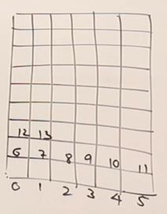
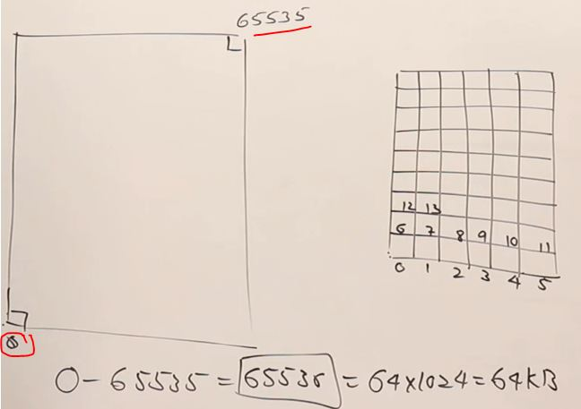
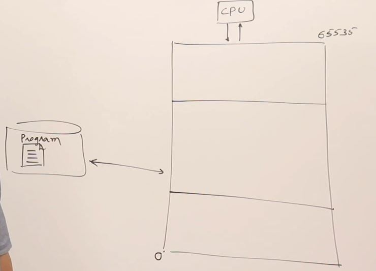
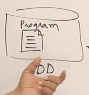
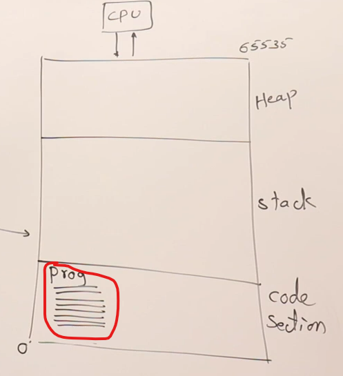
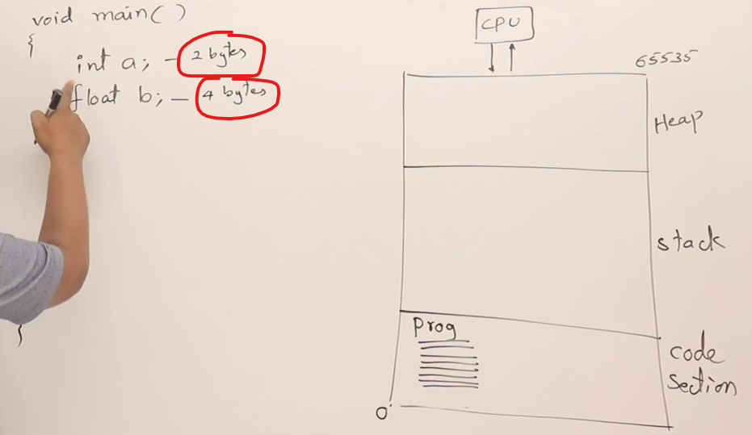
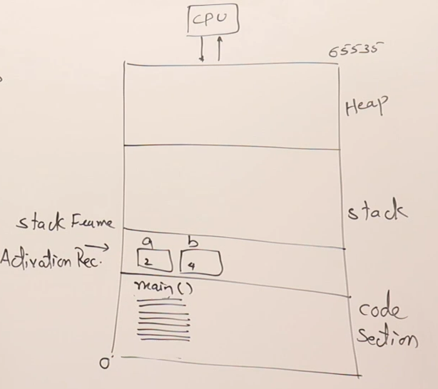

# memory management

- 2 types of memory used by programming language : `stack` & `heap` 

## lecture - Abdul Bari 

- we'll see static vs dynamic memory allocation & we'll talk about these topics
    - `1` : about main memory
    - `2` : how a program will use/utilize main memory
    - `3` : static allocation
    - `4` : dynamic allocation

- `main memory` 
    - to know about static vs dynamic memory allocation , so first we need to know about memory  
        
    - let's say , this one complete block shows a memory 
    - memory is divided into smaller addressable unit i.e called byte. So memory is divided into bytes ✅  
        & assume those each boxes are bytes & every byte is having it's address 
    - let's say , each block has it's address like this & goes on  
        
        - here we're starting from the bottom  
            Note : here memory diagram is in 2-dimensional but addresses which we define are linear address  
            means we didn't define as coordinates x , y . Address always have single value 
        
        - here address of bottom left corner byte is `0` & top right corner is `65535`  
            so `0 to 65535` gives total bytes is `65536` which is `64x1024=64KB`
        - so we'll assume that 64KB as size of main memory
    - in our computer , if you have larger size of RAM like 4GB or 8GB then entire memory is not used as a single unit  
        but it's divided into manageable pieces that're called a `segment` & usually , the size of one segment is 64KB   
        so we'll assume that the size of a segment is 64KB

- `how our program utilizes main memory` : 
    
    - assume that bottom left corner is `0` & top most right corner is the total bytes i.e 65535 
    - so that entire memory is divided into 3 sections & used by a program like this  
        
        - now let's see how a program uses these 3 sections
    - Example : how a program uses these 3 sections
        - `1` : we have that program in our hardDisk like this  
            
            - so this program first goes inside the main memory . so the area which is occupied by the program  
                in the main memory that section is called as `code section` ✅ like this  
                
            - & size of the `code section` is not fixed , it's size depends on the size of the program ✅
            - so `code section` is the area where the machine code of the program is loaded ✅
        - `2` : Now once the program is loaded then the CPU will start executing the program 
            - & that program utilize the remaining memory as a divided into Stack & a Heap ✅
        - `3` : Now let's see how Stack & Heap memory used by the program ✅
            - how stack memory used by the program 
                - example picture :  
                    
                    - here we're assuming that integer takes 2 bytes & float takes 4 bytes
                    - in C++ , number of bytes taken by integer depends on the compiler & OS  
                        here we took 2 bytes for integer for easy explanation purpose
                    - in turbo C , takes 2 bytes for an integer & in codeblocks , etc takes 4 bytes
                - we 2 variables & both of them taking total 6 bytes ,  
                    so take 6 bytes will be allocated inside the stack like this  
                    
                    - so that 6 bytes will be given to the program i.e main() function ✅
                    - & take block of memory of stack which belongs to the main() function  
                        is called as stack frame of a main() function or activation record of main() function ✔️
                - so whatever the variables are defined inside main() function or inside a function  
                    then the memory for those variables will be created inside the `stack` ✅
                - so the portion of the memory i.e given to the function is called as activation record of that function
                - so how the memory is allocated inside the `stack` , it depends whatever the variables  
                    you have inside a function ✅
                - so the size of the memory required by a function was decided at compile time  
                    so the compiler will see inside the main() function , those variables needs some bytes  
                    so before executing the program , memory will be allocated by the compiler  
                    & that memory obtained inside the `stack` once the programs start executing  
                    so this is called `stack memory allocation` ✅
                - `Ques` : what is `static` here : ✅
                    - how many bytes of memory is required by that main() function  
                        was decided at compile time before executing the program. so size of the memory is static  
                    - `Ques` : when it was decided : 
                        - at compile time . so when everything is done at compile time or before runtime is called static ✅ 
                    - so memory allocation is `static` 

    starts from second video of stack vs heap of abdul bari sir
