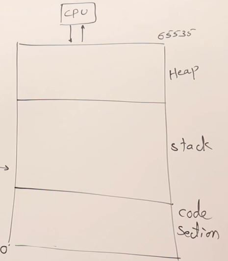

# memory management

- 2 types of memory used by programming language : `stack` & `heap` 

## lecture - Abdul Bari 

- we'll see static vs dynamic memory allocation & we'll talk about these topics
    - `1` : about main memory
    - `2` : how a program will use/utilize main memory
    - `3` : static allocation
    - `4` : dynamic allocation

- `main memory` 
    - to know about static vs dynamic memory allocation , so first we need to know about memory  
        
    - let's say , this one complete block shows a memory 
    - memory is divided into smaller addressable unit i.e called byte. So memory is divided into bytes ✅  
        & assume those each boxes are bytes & every byte is having it's address 
    - let's say , each block has it's address like this & goes on  
        
        - here we're starting from the bottom  
            Note : here memory diagram is in 2-dimensional but addresses which we define are linear address  
            means we didn't define as coordinates x , y . Address always have single value 
        
        - here address of bottom left corner byte is `0` & top right corner is `65535`  
            so `0 to 65535` gives total bytes is `65536` which is `64x1024=64KB`
        - so we'll assume that 64KB as size of main memory
    - in our computer , if you have larger size of RAM like 4GB or 8GB then entire memory is not used as a single unit  
        but it's divided into manageable pieces that're called a `segment` & usually , the size of one segment is 64KB   
        so we'll assume that the size of a segment is 64KB

- `how our program utilizes main memory` : 
    
    - assume that bottom left corner is `0` & top most right corner is the total bytes i.e 65535 
    - so that entire memory is divided into 3 sections & used by a program like this  
        
        - now let's see how a program uses these 3 sections

starts from 04:42

