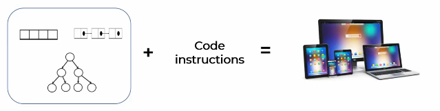
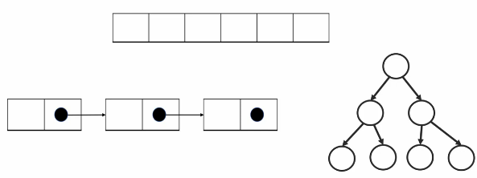
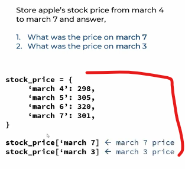
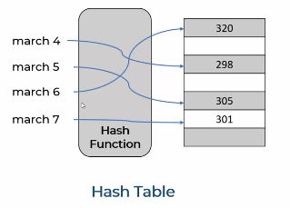
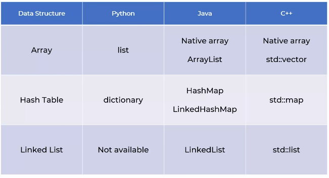

# What is DSA

## lecture - code basics YT 

- when you're build a home then you need certain building blocks & on the top of it <br>
    we apply instructions for building home you get the home as a result like this
    
- so similar , when you're building a software application , you need Raw building blocks <br>
    i.e Data structure 💡💡💡 like array , linkedlist , tree , etc & on top of that , <br>
    you apply the code instructions (which operates/run on that data structures) & as a result , <br>
    we'll get a software application 💡💡💡
    

- Data structures are building blocks or raw material for any software programs 
    - use right data structure for a problem 
        - Eg : you're building a window & you're using brinks which is wrong , so we need to use wooden material like this
        
        - so as a software engineer , pick the right data structure for a problem
    - Linkedlist , tree , array , etc like this <br>
        
        - they are just containers to store data in a specific memory layout
        - Eg : you want to represent apple's stock price for 5 days & you want to ask questions from program
            - Ques : What was the price on day 1 & day 3
            - so here we want to care about sequence , so for this problem , you can write simple python program like this 
                ```py
                stock_price = [298 , 305, 320, 301, 292] # stock prices are stored in list/array form

                stock_price[0] # stock price on day 1
                stock_price[2] # stock price on day 3
                ``` 
        - Eg : but now , let's say we have problem like store apple's stock price from march 4 to march 7 & answer <br>
            along with the dates . now you asking question from the problem like 
            - Ques : what was the stock price on march 7 & march 3
            - ans : then you can use Dictionary in python likes this <br>
                
                - where we can access specific prices on a day by using specific key
        - so here we can see , we used two different Data structure i.e list & Dictionaries (which is a hashmap behind the scene) <br>
            so you used two different Data structure to solve two different problems <br>
            so based on the problem , always pick right data structure to solve the problem 💡💡💡
    - let's see the memory layout of those two data structure 
        - for an array , in memory i.e RAM , those numbers or elements are stored in contiguous memory location
        - now for object or Dictionary , behind the scene , it used hashmap (as a Data structure) & the way hashmap works , <br>
            you have a key on which you applied hash function which will give an address of a bucket <br>
            & using that address of bucket , now you access a value/element of that key like this
            
            - this way we'll get O(1) complexity for your search & your search operation is really fast
            - but if you're not really good at DS then you'll use an array for this problem & it'll work <br>
                but program is not optimize & increase the technical debt

- Data structure is the conceptual thing & different programing languages implement data structure in different way Like this
    
    - Eg : in Java , array data structure is implement in 2 different ways i.e Native array & arraylist
- Data structure is like a bat , you can play cricket even if you don't know how to hold the bat <br>
    but you won't be able to become good batsman 👍

- why do we need DSA ? 
    - reference video - https://www.youtube.com/watch?v=_dDojx5YKKw 🔥
    - Eg : let's say you're getting two phone , one is nokia old phone which has only basic feature <br>
        & another one smart phone which has many features . so you'll take smart phone becuz it's fast & efficient
    - so DSA is used to check the level , efficiency , smartness of developer in problem solving  
    - Eg : let's say you need to a work & to make that work easy , we need correct set of tools , so here tools is Data structure <br>
        & to complete that work properly , you should know how to run those tools i.e algorithm 💡💡💡
    - so by using those tools properly , we can increase the performance & speed of our code , gets optimize 
