# What is DSA

## lecture - code basics YT 

- when you're build a home then you need certain building blocks & on the top of it <br>
    we apply instructions for building home you get the home as a result like this
    
- so similar , when you're building a software application , you need Raw building blocks <br>
    i.e Data structure 💡💡💡 like array , linkedlist , tree , etc & on top of that , <br>
    you apply the code instructions (which operates/run on that data structures) & as a result , <br>
    we'll get a software application 💡💡💡
    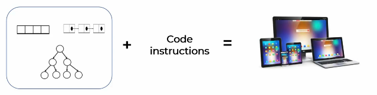

- Data structures are building blocks or raw material for any software programs 
    - use right data structure for a problem 
        - Eg : you're building a window & you're using bricks then you'll able to make a window <br>
            but that window doesn't look good which is wrong , so we need to use wooden material like this
        
        - so as a software engineer , pick the right data structure for a problem in order to optimize the code <br>
            in terms of space & time complexity
    - Linkedlist , tree , array , etc like this <br>
        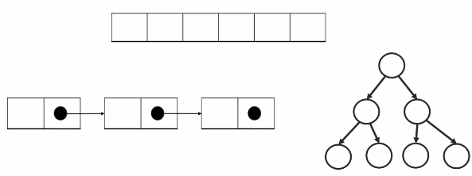
        - they are just containers to store data in a specific memory layout
        - Eg : you want to represent apple's stock price for 5 days & you want to ask questions from program
            - Ques : What was the price on day 1 & day 3
            - so here we want to care about sequence , so for this problem , you can write simple python program like this 
                ```py
                stock_price = [298 , 305, 320, 301, 292] # stock prices are stored in list/array form

                stock_price[0] # stock price on day 1
                stock_price[2] # stock price on day 3
                ``` 
        - Eg : but now , let's say we have problem like store apple's stock price from march 4 to march 7 & answer <br>
            along with the dates . now you asking question from the problem like 
            - Ques : what was the stock price on march 7 & march 3
            - ans : then you can use Dictionary in python likes this <br>
                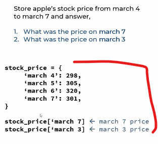
                - where we can access specific prices on a day by using specific key
        - so here we can see , we used two different Data structure i.e list & Dictionaries (which is a hashmap behind the scene) <br>
            so you used two different Data structure to solve two different problems <br>
            so based on the problem , always pick right data structure to solve the problem 💡💡💡
    - let's see the memory layout of those two data structure 
        - for an array , in memory i.e RAM , those numbers or elements are stored in contiguous memory location
        - now for object or Dictionary , behind the scene , it used hashmap (as a Data structure) & the way hashmap works , <br>
            you have a key on which you applied hash function which will give an address of a bucket <br>
            & using that address of bucket , now you access a value/element of that key like this
            
            - this way we'll get O(1) complexity for your search & your search operation is really fast
            - but if you're not really good at DS then you'll use an array for this problem & it'll work <br>
                but program is not optimize & increase the technical debt

- Data structure is the conceptual thing & different programing languages implement data structure in different way Like this
    
    - Eg : in Java , array data structure is implement in 2 different ways i.e Native array & arraylist
- Data structure is like a bat , you can play cricket even if you don't know how to hold the bat <br>
    but you won't be able to become good batsman 👍

- why do we need DSA ? 
    - reference video - https://www.youtube.com/watch?v=_dDojx5YKKw 🔥
    - Eg : let's say you're getting two phone , one is nokia old phone which has only basic feature <br>
        & another one smart phone which has many features . so you'll take smart phone becuz it's fast & efficient
    - so DSA is used to check the level , efficiency , smartness of developer in problem solving  
    - Eg : let's say you need to a work & to make that work easy , we need correct set of tools , so here tools is Data structure <br>
        & to complete that work properly , you should know how to run those tools i.e algorithm 💡💡💡
    - so by using those tools properly , we can increase the performance & speed of our code , gets optimize 

## lecture - Neso Academy YT (intro Data structures)

- Introduction to Data Structures : https://www.youtube.com/watch?v=xLetJpcjHS0&list=PLBlnK6fEyqRj9lld8sWIUNwlKfdUoPd1Y

- before understanding what is Data structure , let's see `what is Data ?` 
    - Dictionary Definition of Data : <br> 
        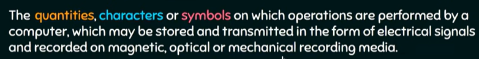
        - Eg : c = a + b , here we can think about a & b as data because we're performing operations on them <br>
            & a & b are just quantities & we can store them , transmit them
- `when data become information ?` : 
    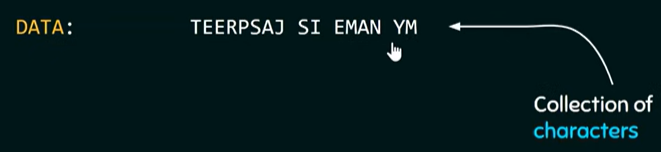
    - so just collection of characters or collection of symbols like this then that just a data <br>
    - now if i ask from you that what is written on there then you can't understand <br>
        but when i process that data or when we reverse that whole string then that data becomes an information like this 
        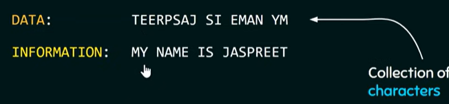
    - now here we can say that data becomes information becuz now you can extract some meaning from it
    - means if data is arranged in a systematic way then it gets a structure & become meaningful <br>
        then that meaningful or processed data is called information 💡💡💡
- `why we need Data structure ?` : 
    - it's not difficult to understand that the data needs to be managed in such a way . <br>
        so that it can produce some meaningful information
    - so to provide an appropriate way to structure the data , we need to know about `Data Structures` 💡💡💡
    - so Data structure gives the day to structure the data in order to appropriately manage the data <br>
        so that we an get some meaningful information from it 
- `what is a Data structure ?` : 
    - a Data structure is the systematic way to arrange , organize , manage the data , so that it can be used efficiently
    - here "efficiently" means in terms of time as well as space
- `Example of Data structure` : 
    - Eg : array - it's a data structure because it helps us to manage data in sequential manner
    - `why array data structure is useful` : 
        - instead of creating multiple variables of same type . why not create an array to store all the values
        - like it's useful for strong strings (string - is a sequence & collection of characters) <br>
            so let's say a string contains 100 of characters then instead of creating 100 variables separately , use array
- `Real life examples of Data structure to know why we need DS` : ✅
    - `1` : stack data structure is used in implementing redo & undo feature : eg - google docs , power point , MS word 
        - explanation - how stack data structure is used to implement redo & undo feature <br>
            let's say we wrote this line inside google docs like this <br> 
            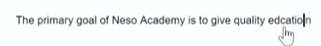
            - & here we forgot to mention "u" on "education" word
            - now here stack will maintained where each & every information (which i entered) gets stored like this
                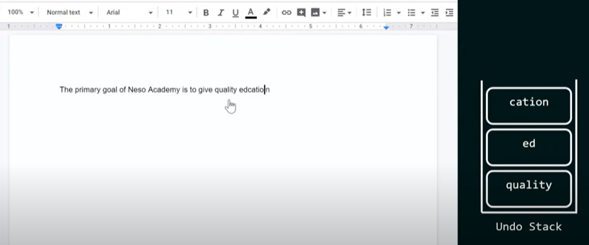 <br>
                so each word will be stored separately inside undo stack
            - & inside stack data structure , we can only access top element , so when we press Ctrl + Z (which means undo) <br>
                so top element will be popped out the `undo stack` & pushed inside `Redo stack` like this 
                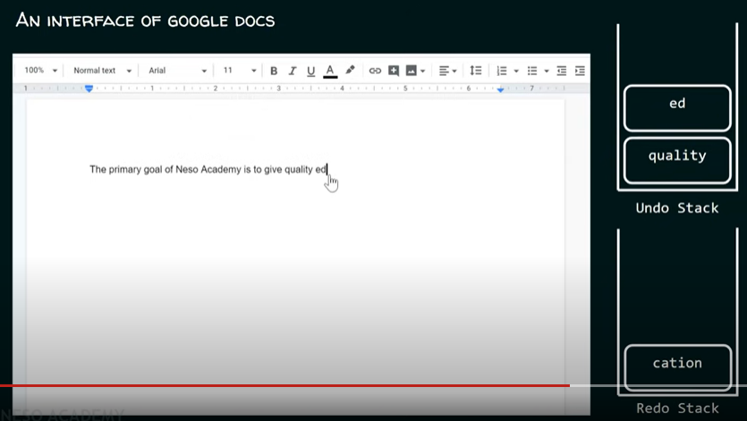
                - that's why , you can see that "cation" word is removed 
            - & if we press Ctrl + Z (then that top most item popped out from `undo stack` & pushed inside `redo stack`) <br>
                but we want to redo then Ctrl + Y (then the top most item will be popped out from redo-stack & pushed inside undo-stack)
    - `2` : which data structure is used to store an image as a bitmap/raster ? 
        - there're two types of images i.e bitmap/raster image & vector image
        - array is a the data structure which is used to store an image as a bitmap/raster 💡💡💡
        - Explanation : Bitmap images are stored in tiny box form like this 
            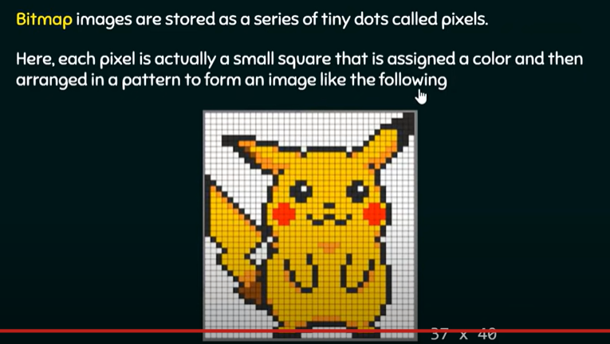 <br>
            so you can think of a two dimensional array & inside of that two dimensional array , you're storing pixel information <br>
            so each pixel is storing color & arranging it in a systematic way & finally , we get that pikachu as a result 💡💡💡
    - `3` : ques : storing the friendship information on a social networking site
        - Eg : here we have the image of James & his friends like this <br>
            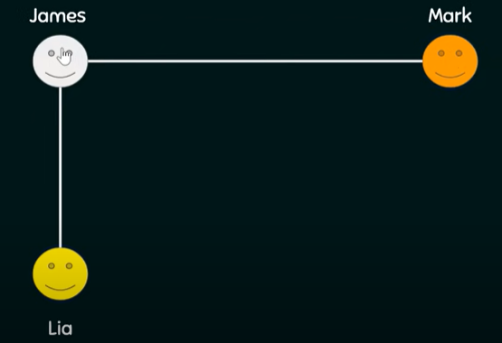 <br>
            - so here that line is a edge which is presenting that lia is a friend & mark is a friend of James
            - & lucy is also a friend of both mark & lia like this
                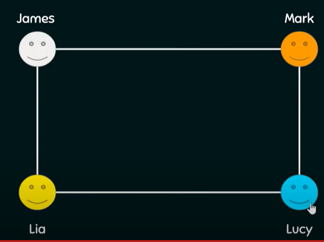 <br>
                but James & Lucy are not friend that's why we don't have edge b/w them
            - so store this information , graph data structure is used

## lecture - Codesikho YT

- `why we need DSA ?` : 
    - Eg : let's say you have 1 million post out of which you need only first 10 post <br>
        but you want to show post related to user only in a particular order
        - or how you'll be able to decide that which post should be shown first , etc.. <br>
            so everything will be decided based on a set of rules i.e algorithm 💡💡💡
        - & a data structure will be used with that algorithm
    - `1` : you also want to show result as fast as possible means less time as much as possible 
    - `2` : you want to optimize memory consumption 

- `what is Data structure ?` : 
    - a thing where can store our data or means it's a way to organize your data 💡💡💡
    - types of data structures : Array , linked list , stack , binary tree , graph , binary search tree , heap , misc , matrix , queue , hashing
    - `why these different Data structures are made , why we don't have only one ✅` : 
        - basically , major operations are CRUD
        - so there's one data structure which can be fast for creation , <br>
            there's another data structure which can be fast for update , etc
        - so based on requirement , we need to identify which data structure can be better  
        - Eg : you have the website where you'll announce the results & there're 2 lakh students <br>
            & at the same time , all those students will check their results at the same time <br>
            so here you want that your READ operation should be fast & if WRITE operation is slow then it's fine <br>
            but priority is READ operation should be fast . so for READ operation , we'll choose a data structure <br>
            which has READ operation fast 💡💡💡

- `what is an algorithm ?` : 
    - means it's a way to solve a problem or it's a procedure & set of rules to solve a problem <br>
        or algorithm means breaking down the problem into mathematical steps 💡💡💡 
    - Eg : we have to fetch 10 post out of 1 million in a particular order according to user preference <br>
        so for this we need to set an algorithm i.e search engine algorithm (made by google) to find <br>
        out data related to a search string & you need to fetch that post based on many factors <br>
        like which post has many likes & engagement 
        - so basically , you need to write an algorithm based on those factors <br>
            & if those posts have those factors then you'll show at the top in the UI <br>
            & those posts which has less engagement then you need to show at the very bottom
        - so you as a programmer need to decide which kind-of rule/conditions you want <br>
            to make for that algorithm based on your requirement 
        - so through search engine algorithm (of google) , you want to show data based on that searched string <br> 
            but again question will come i.e which website will be shown at the top & which one will be at the bottom <br>
            & depends on many many factors & this is called algorithm
    - so complexity of algorithm will be defined based on your requirements/needs 💡💡💡

- `example of DS & algo` : ✅ 
    - Eg : let's say you want to sort numbers means you need to put numbers in ascending order <br>
        means smallest number comes first & biggest number at last
    - so this is your input -> `[4,2,3,1]` & we want output like this `[1, 2, 3, 4]` <br>
        so to achieve this , we need to think about logic or need to make set of rules . so that we can achieve this task
    - so that set of rules or steps or process i.e called algorithm & data structure is used i.e array

## lecture - letMeCode YT

- https://www.youtube.com/watch?v=iOrpyrU1cP4&list=PLFkGT3yG6ujnhZ7Pkkq_6YYqqrZTZMDgp&ab_channel=LetMeCode
