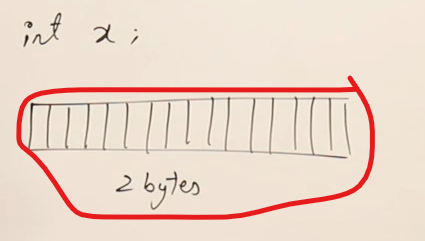
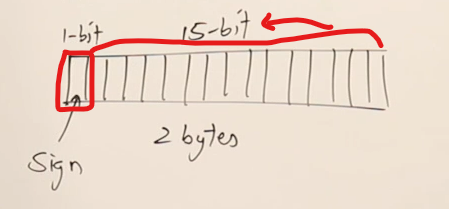
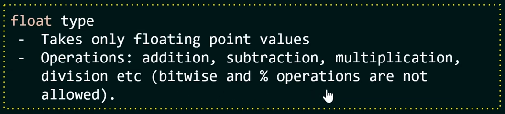
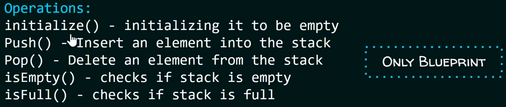

# ADT & various types of list

- ADT in javascript : 
    - Extra Resources : https://www.codecademy.com/article/goku-kun/introduction-to-adts-in-javascript
- ADT in C++ : 
    - https://www.javatpoint.com/abstract-data-type-in-data-structure
- ADT in Java : 
- ADT in python : 
    - https://medium.com/@tssovi/abstract-data-type-adt-in-python-33e6ce1f961e

## lecture - abdul bari

- ADT - means abstract data types
- before "abstract" word , first see , `what is datatype ?` ✅
    - so datatype means 
        - `1` : representation of data : 
            - means how the data is represented  
            - means how you're storing the data
        - `2` : operation on data
            - means what're the operations that you allow on the data
    - `representation of data` : 
        - Eg : in C/C++ , integer datatype takes 2 bytes or 4 bytes based on compiler , <br>
            so if we define a variable of integer type
            ```cpp
            int x ; 
            ```
            - then in c/c++ , we'll get a memory of 2 bytes i.e 16 bits like this <br> 
                
                - so integer type data is stored in 2 bytes together as a single value/data 
                - & here 1 bite is reserved for sign bit to allow both positive as well as negative numbers <br>
                    & rest of the 15 bits are allowed for storing data for any number 💡💡💡 like this
                    
            - this is how integer datatype is represented inside the memory in two bytes <br>
                & this is the representation of integer datatype
    - `operation on data` : 
        - let's take eg of integer datatype & what are the operations allowed on integer type data in C/C++ <br>
            i.e arithmetic operations are allowed on them i.e `+` , `-` , `*` , `/` , `%` <br>
            & apart from this , we can do relational operations & increment & decrement operators are allowed <br>
            including pre & post increment & decrement
    - so if you talk about any datatype in a language then that datatype have it's representations <br>
        & a set of operations on the data 💡💡💡
    - so while learning a language & when we learn about datatype then mostly we learn about operation of those datatypes <br>
        & sometimes , we go into detail & also understand it's representation ✔️

- `what is abstract ?` : 
    - abstract means hiding internal details 💡💡💡
    - Eg : for integer variable & those arithmetic operations , so for performing those operations <br>  
        do we really need to know how they're performing in the binary form inside the main memory <br>
        Ans : is NO 💡💡💡
        - so we don't need to know internal details about how those arithmetic operators are performing <br>
            we're just concern about to use those operators . so without knowing about them , we can use them <br> 
            so those things are hidden from us , so we can call them as abstract without knowing internal details .
        - so this is the example of primitive datatype because integer is a primitive datatype 💡💡💡
    - `why we need abstract datatype` : 
        - this is related to OOPS , so by using classes we can define our own datatypes that're abstract <br>
            i'e without knowing internally data , we can use them
        - Eg : taking list/collection of elements , so here we have list -> 8, 3, 9, 4, 6, 10, 12 
            - now how to represent a list means what're the things that i have to store for representing the list
            - so the data is required i.e ✔️
                - `1` : we need space for storing elements 
                - `2` : need some capacity for the list
                - `3` : inside that capacity , how many elements already i have in a list i.e length/total-size of the list
                - so representing that list , we need 3 things & to represent , we have 2 options i.e 💡💡💡<br>
                    - `1` : array
                    - `2` : linked list
            - operations that we need to perform on that list i.e : ✔️  
                - `1` : like we can add more elements -> add(x)
                - `2` : or remove an element -> remove(x)
                - `3` : or search of an element -> search(key) 
            - so now , we have the representation of data & the operations on the data . <br>
                so when you have these 2 things together then it's a datatype 💡💡💡
            - now we can put those 2 things together & can define a class in any OOPs language <br>
                & how the representation is done , we don't need to understand that's what abstract means <br>
                means when the class is written then we can create object of that class & use that object directly
        - abstract datatype means data + operations on the data together <br>
            & let it be used as datatype by hiding all the internal details 💡💡💡 . Eg : in JS , map() array method <br>  
            so that's the example of ADT

## lecture - neso academy YT

- `difference b/w data types vs abstract data types` : 
    - `what is datatype ?` : 
        - 2 important things about data types ✅
            - `1` : it defines a certain `domain` of values
            - `2` : it defines what `operations` are allowed on those values
        - Eg : of datatype defines what `operations` are allowed on those values
            - `int` datatype
                - takes only integer values 
                - Operations can be for performed on that integer value <br>
                    like addition , subtraction , multiplication bitwise operations , etc
            - in `float` datatype , we can do this <br>
                
    - there're 2 things in data types i.e predefined/inbuilt datatypes & user defined datatype
    - `what is user defined data types` : ✅
        - before understanding what is abstract datatype , we must know user defined data types
        - based on primitive datatypes , there's a concept of user defined data types
        - means the `operations & values` of user defined data types are not specified in the programming language itself <br>
            but is specified by the user 💡💡💡
            - here operations & values are not predefine inside the programming language itself
        - example - user defined data types : structure , union & enumeration 
            - by using structures , we're defining our own type by combining other primitive data types
                ```cpp
                struct point {
                    int x;
                    int y;
                }
                ```
                - here we combine two integers from the new type i.e point (which is user defined datatype)

- `what is ADT`? :
    - ADTs are like user defined data types which `defines operations on values using functions` <br>
        `without specifying what's there inside the function & how the operations are performed` 💡💡💡
    - Eg : stack ADT
        - A stack consists of elements of same type arranged in a sequential order <br>
        - Ques : so here elements are allowed of what type i.e same type 💡💡💡
        - so operations which are allowed on stack ADT i.e  
            
        - so here we're using these methods/function , so we know what those methods can accept & what they return <br>
            but without knowing about internal/inside details 💡💡💡
    - think ADT as a `black box` which hides the inner structure & design of the datatype from the user
    - & there're multiple ways to implement an ADT 💡💡💡
    - Eg : A stack ADT can be implemented using arrays or linked lists 
        - `Note` : so here stack is itself a data structure & we can implement stack ADT <br>
            by using other data structures like arrays , etc 💡💡💡
    
- `why do we need ADT ?` : ✅
    - basic things to know : ✅
        - `1` : the program which uses data structures is called a `client` program 💡💡💡 <br>
            `2` : & it has access to the ADT i.e interface <br>
            `3` : the program which implements the data structure is known as the `implementation` 💡💡💡
        - so here have two program i.e client & implementations programs
        - difference b/w client program & implementation program
            - implementation program : means the program which implements the data structure 
            - client program : means who just use the data structure
    - `advantages of ADT` : 
        - eg : if someone wants to use the stack in the program , then he can simply use push & pop operations <br>  
            without knowing it's implementation . so user don't need to know the internal details of push & pop operations
        - & if in future , the implementation of stack is changed from array to linked list <br>
            then the client program will work in the same way without begin affected 💡💡💡
        - so client program or user can use interface without knowing inside

  - conclusion : 
    - `ADT provides` abstraction means hiding details from the user <br>
        because user just want to use that thing without knowing the internal details of that thing <br>
        so this separation is required 
