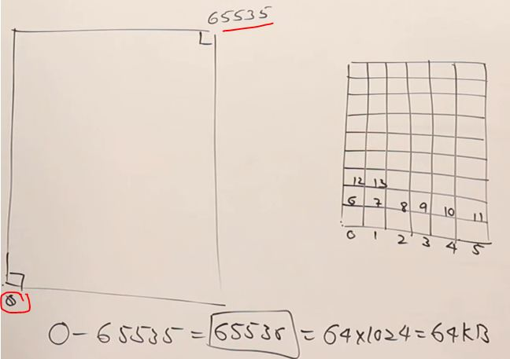

# memory management

- 2 types of memory used by programming language : `stack` & `heap` 

## lecture - Abdul Bari 

- we'll see static vs dynamic memory allocation & we'll talk about these topics
    - `1` : about main memory
    - `2` : how a program will use/utilize main memory
    - `3` : static allocation
    - `4` : dynamic allocation

- `main memory` 
    - to know about static vs dynamic memory allocation , so first we need to know about memory <br>
        
    - let's say , this one complete block shows a memory 
    - memory is divided into smaller addressable unit i.e called byte. So memory is divided into bytes ✅ <br>
        & assume those each boxes are bytes & every byte is having it's address 
    - let's say , each block has it's address like this & goes on <br>
        
        - here we're starting from the bottom <br>
            Note : here memory diagram is in 2-dimensional but addresses which we define are linear address <br>
            means we didn't define as coordinates x , y . Address always have single value 
        
        - here address of bottom left corner byte is `0` & top right corner is `65535` <br>
            so `0 to 65535` gives total bytes is `65536` which is `64x1024=64KB`
        - so we'll assume that 64KB as size of main memory
    - in our computer , if you have larger size of RAM like 4GB or 8GB then entire memory is not used as a single unit <br>
        but it's divided into manageable pieces that're called a `segment` & usually , the size of one segment is 64KB <br> 
        so we'll assume that the size of a segment is 64KB

- `how our program utilizes main memory` : 
    
    - assume that bottom left corner is `0` & top most right corner is the total bytes i.e 65535 
    - so that entire memory is divided into 3 sections & used by a program like this <br>
        
        - now let's see how a program uses these 3 sections
    - Example : how a program uses these 3 sections
        - `1` : we have that program in our hardDisk like this <br>
            
            - so this program first goes inside the main memory . so the area which is occupied by the program <br>
                in the main memory that section is called as `code section` ✅ like this <br>
                
            - & size of the `code section` is not fixed , it's size depends on the size of the program ✅
            - so `code section` is the area where the machine code of the program is loaded ✅
        - `2` : Now once the program is loaded then the CPU will start executing the program 
            - & that program utilize the remaining memory as a divided into Stack & a Heap ✅
        - `3` : Now let's see how Stack & Heap memory used by the program ✅
            - how stack memory used by the program 
                - example picture :  
                    
                    - here we're assuming that integer takes 2 bytes & float takes 4 bytes
                    - in C++ , number of bytes taken by integer depends on the compiler & OS <br>
                        here we took 2 bytes for integer for easy explanation purpose
                    - in turbo C , takes 2 bytes for an integer & in codeblocks , etc takes 4 bytes
                - we 2 variables & both of them taking total 6 bytes , <br>
                    so take 6 bytes will be allocated inside the stack like this <br>
                    
                    - so that 6 bytes will be given to the program i.e main() function ✅
                    - & take block of memory of stack which belongs to the main() function <br>
                        is called as stack frame of a main() function or activation record of main() function ✔️
                - so whatever the variables are defined inside main() function or inside a function <br>
                    then the memory for those variables will be created inside the `stack` ✅
                - so the portion of the memory i.e given to the function is called as activation record of that function
                - so how the memory is allocated inside the `stack` , it depends whatever the variables <br>
                    you have inside a function ✅
                - so the size of the memory required by a function was decided at compile time <br>
                    so the compiler will see inside the main() function , those variables needs some bytes <br>
                    so before executing the program , memory will be allocated by the compiler <br>
                    & that memory obtained inside the `stack` once the programs start executing <br>
                    so this is called `stack memory allocation` ✅
                - `Ques` : what is `static` here : ✅
                    - how many bytes of memory is required by that main() function <br>
                        was decided at compile time before executing the program. so size of the memory is static <br>
                    - `Ques` : when it was decided : 
                        - at compile time . so when everything is done at compile time or before runtime is called static ✅ 
                    - so memory allocation is `static` 

- `static allocation + stack memory` : 
    - if there're sequence of function calls then how are the memories are allocated inside the stack
    - Eg : static memory allocation
        ```cpp
        void fun2(int i) {
            int a;
        }

        void fun1() {
            int x;
            fun2(x);
        }

        void main() {
            int a;
            float b;

            func1();
        }
        ```
        - here main() function is calling fun1() & fun1() is calling fun2() , So if following function calls are made <br>
            then how memories allocated for all these functions
        - so first , this complete code will be copied inside code section like this
            
            - so inside `code section` block , you can consider that complete code gets converted into as machine code
            - Now let's start executing 
        - so in C++ code , when the program starts executing then it'll start from the main() function <br> 
            now the movement , it enters inside `main()` function . It requires variables <br>
            so memory for those a & b variables will be allocated inside `stack` like this 
            
        - now main() function calls , fun1() function . so control goes to fun1() . now inside fun1() function <br>
            the first thing is it'll see variables declarations . so we have variables inside fun1() <br>
            so memory for variables of fun1() function will be created inside the stack 
            - & that piece of memory inside stack , belongs to main() & that above one belongs to fun1() like this
            
        - right now which functions is executing i.e fun1() because we called from main() function <br>
            so inside stack , that topmost activision memory record belongs to fun1() (becuz it's executing right now) 💡💡💡
        - now fun1() will call fun2() function . so again execution control will goes to fun2() <br>
            now fun2() have 2 variables i.e a parameter & inside fun2() body , a local variable <br> 
            so `inside stack , block of memory` will be allocated for those two variables of fun2() function like this 💡💡💡
            
            - right now , fun2() is running & inside stack , topmost activation memory record will be fun2() 
            - now one thing you can observe that we started from main() function & it has not yet finished <br>
                but it has called fun1() but main() function activation record is as it is inside that stack <br>
                then activation record or memory of fun1() is created/allocated inside stack & fun1() is still running <br>
                & fun1() called fun2() , so activation record of fun2() is created & activation record of fun2() is still there in memory

    - now let's continue with our execution . so right now fun2() is current execution function <br>
        now the movement fun2() has finished/terminated when ending curly braces hits then inside fun1() , <br>
        assume there's a statement after fun2() then execution control comes to that statement like this 
        
        - now inside stack , execution record of fun2() function will be pop-out/deleted/removed like this 💡💡💡
        
    - now inside fun2() function body , after that statement (which we assume) is finished with execution . <br>
        now inside main() function , after fun1() , execution control will come back <br>
        on that statement (which we're again assuming) like this 
        
        - & once the fun1() function finishes it's work then it's activation record/memory gets removed from inside stack 💡
        - & now main() function also ends , so it's record also deleted from stack
        - now programs ends
    - so here we can see that when activation record gets created then each activation record created <br>
        like from bottom to top like stairs 💡💡💡 <br> 
        
        
        
        - but when the each function is done then step by step each activation record pop-out/deleted from top to bottom <br>
    - so the way , each activation record are created from bottom to top then at the time of delete <br>
        execution record gets deleted from top to bottom . so this mechanism is called `stack` <br>
        & that's why it's called `stack` 💡💡💡 
        - so for function calls , stack memory is used 💡💡💡
    - now how much memory is required by a function . it depends on the number of variables & their sizes <br>
        & this is decided by the compiler only . so inside stack , memory for functions are automatically created <br>
        & automatically deleted when the function ends . programmer doesn't have to do for it's allocation & destruction . <br>
        just programmer has to declare the variable inside the function body

- `dynamic allocation + heap memory` : we'll see how heap , dynamically allocate memory
    - let's see how heap memories utilized by our program
    - what is heap
        - means just piling up or just increase an amount , if the things are kept one above another or randomness then we use heap
        - 'heap"  term can be used in two situations : ✅
            - `1` : if the things are properly organize like stack then we'll say heap
            - `2` : but the things are not organize & putted in random order then we'll say heap  
            - so `Heap` term can be used for organized things as well as unorganized thing 
        - so in program , most of the time `Heap` memory is used for unorganized stuff . Stack memory is organized <br>
            which we saw that how execution order goes 
        - things to remember while dealing with Heap memory ✅
            - `1` : Heap memory is treated like a resource 
                - means like printer is a resource for your program . so if your program want to use a printer <br> 
                    then it can request for a printer. Use the printer & once it has finished using it <br>
                    then it should release the printer so that other applications 
                - same way , Heap memory should be used like a resource when required , you take the heap memory <br> 
                    you don't need, you release the heap memory 
                - so this the practice you should do while dealing with Heap memory
            - `2` : program/code section can't directly access Heap memory
                - code section memory block can directly access inside itself & inside stack memory <br>
                    but can't directly access stuff from heap memory 
                - so that's why , we use pointer in order to access heap memory 💡💡💡
    - Eg : accessing heap memory via pointer in C++
        ```cpp
        void main() {
            int *p; // assume memory taken by pointer is 2 bytes -- 2 bytes take just for easy concept understanding
                // but actually amount of memory taken by pointer depends on size of integer
                    // if the integer is 2 bytes then pointer takes 2 bytes
                    // if the integer is 4 bytes then pointer takes 4 bytes
                    // & size of the integer depends on compiler or hardware 💡
        }
        ``` 
        - now where the memory of the pointer variable gets allocated ?
            - so we already seen that in static memory allocation that <br>
                whatever all the variables are declared inside your functions . Those functions variables will occupy memory <br> 
                inside the stack , in their activation record 💡💡💡
            - so that pointer variable i.e `*p` , memory is located inside activation record of main() inside the stack like this
                
        - now i want to allocate memory in Heap , so we'll define memory size manually like this
            ```cpp
            void main() {
                int *p;
                p = new int[5]; 
            }
            ```
            - `p = new int[5];` - so this statement will allocate memory in heap i.e size of array i.e 5 <br>
                & `p` pointer will point that array & suppose the beginning address of that array is 500 <br>
                & inside p , also 500 stored like this
                
            - so whenever you see `new` keyword , then `new` means memory is allocated in `heap` 💡💡💡 <br>
                & inside a function , for simple variable declaration then memory is allocated of that variable inside stack 
            - & in c++ , `new` keyword is used for memory allocation but in c language , we use malloc() function like this 💡💡💡
                ```c
                void main() {
                    int *p;
                    p = new int[5]; // c++ syntax - for pointer memory allocation
                    p = (int *)malloc(2*5); // c syntax - for pointer memory allocation
                        // here 2 * 5 means 2 bytes * 5 integer 
                        // & (int *) -- means we did type casting into pointer
                }
                ```
        - complete picture look like this <br>
            
            - so `new` keyword is used to allocate memory in `heap` 💡💡💡 
            - `Note ✅` : a machine code program can't directly access Heap memory
                - so first , machine code program will access the pointer variable which is inside stack memory
                - then that pointer variable will give the address of that heap memory inside heap <br> 
                    & give the access of integer array 💡💡💡
        - now we already said that Heap memory will be treated as resource <br>
            so after sometimes , if you don't need that array means you don't want that pointer variable should point to that array <br>
            then you can set that pointer variable as null like this
            ```cpp
            void main() {
                int *p;
                p = new int[5]; 
                p = (int *)malloc(2*5); 

                p = NULL ;
            }
            ```
            - then now inside heap memory , nothing is pointer to that array , so now what about that memory ? is it lost ?
                - No , as a good practice , if you don't need Heap memory then we should de-allocate <br>
                - so as we have requested for allocation then same way we should de-allocate 💡💡💡 like this
                ```cpp
                void main() {
                    int *p;
                    p = new int[5]; 
                    p = (int *)malloc(2*5); 

                    delete []p 
                    p = NULL ;
                }
                ```
                - so as we define this `delete []p` then the memory of that array inside Heap memory , <br>
                    will get deleted 💡💡💡 & then we set `p = NULL` . so due to this , inside stack , p will be set as 0 like this
                    
        - so this is how , Heap memory explicitly requested & explicitly released/disposed <br>
            & if you're not releasing the Heap memory then the memory will still belonging to your program <br>
            & that memory can't be used again . so due to this , it causes loss of memory <br>
            & loss of memory is called as memory leak 💡💡💡
        - & if you don't release Heap Memory & do this again & again then one time heap memory gets full <br>
            then there's no free space left in Heap memory 💡💡💡
        - so that's why as a best practice , when you don't need Heap memory then release the memory 💡💡💡

## lecture - Kunal khushwaha

- when we write `a = 10` & in programming , memory management , there're 2 types of memories
    - `1` : stack
    - `2` : Heap
    - when in programming language , we write `a = 10` then here `a` is reference variable & `10` is object 💡💡💡
    - how it's stored in memory , so a function call or a variable stored in `stack` <br>
        & the actual value of that object will stored in `Heap` & `a` is pointing to that object like this
        
    - so when you say , give me the value of `a` then it's gonna say 10
    - what is `a` variable is pointing towards ? 
        - `a` variable is pointing to `10`
        - means `a` variable will point to the memory address of that particular thing 💡💡💡 <br>
            because every object has a memory address
        - & this is how memory is managed
        - so inside stack memory , `a` is positing to towards the Heap memory 💡 <br>
            Heap is another section of memory/RAM/hardDisk where Heap memory exist & also inside registers in CPU's
    - stack & heap memory concept will be clear when we do recursion 💡 

- primitive type vs reference type ✅
    - to remind , `a` variable will go inside stack memory & `10` will be stored inside heap memory <br> 
        & `a` variable will just pointing that memory address where `10` stored inside heap memory <br>
        so ultimately `a` is pointing to heap memory 💡💡💡
    - Eg : Kunal is a object of a class i.e world like this `name = "world"`
        - & type of this `kunal` object i.e Human becuz we're all are class of human <br>
            so object have a type which can be defined by classes 💡💡💡
        - so `"kunal"` object will be stored inside heap memory
        - now if you want to call this object then you'll call him by his name i.e kunal <br>
            & let's say his mom also calls him as Son . So if you're calling him as Kunal <br>
            & only his mom is calling him as Son then same person being called i.e Kunal object & so on like this
            
        - now let's say Kunal (which is original object) is giving a party then money of original object begin spent only <br> 
            it's not that there're 4 Kunal for those 4 people
            - so things goes likes this <br>
                
                - & here those variables are pointing their own object
        - `1` : so More than one reference variables can point to the same object
        - `2` : if any of those reference variable change that original object then original object is going to be changed <br>
            & it's going to be changed for all 💡💡💡
            - Eg : if Son , gets the Haircut then everybody can see the haircut of that original object i.e Kunal <br>
                even change was made via that `son` reference variable then original object was changed 💡💡💡
            - & since those reference variables are pointing to that original object <br>
                then change will be visible to all those variables
            - so here comes concept for pass by reference , pass by value 💡💡💡
    - Eg : if have an array
        ```js
        let a = [1, 2, 3, 4, 5]
        let b = a
        ```
        - so behind the scene , `a` will point to that array & whatever `a` is point to , `b` also point to that like this  
            
        - now if you change something inside that array via `a` reference variable like this
            ```js
            let a = [1, 2, 3, 4, 5]
            let b = a
            a[0] = 99
            ```
        - then inside that array , on 0th index , value will be overwritten by 99 <br>
            now when you display output then is `b` also show that updated 99 or original 1
        - so `b` reference variable also show updated 99 inside that array <br> 
            because `b` is also pointing to the same object because datatype of array is object <br>
            so if the original object changed by the one reference variable then change of that original object <br>
            will be visible to other reference variables those who're pointing to the same object 💡💡💡
        - we'll see mutability , immutability , sometimes we'll get updated object & sometimes not later on
    - Eg : what happens when there's no reference variable is pointing to that object
        - Scenario , let's say right now , kunal's friend & it's GF pointing to the original Kunal object like this
            
        - but now third person came & that object it's begin called as Alexander by their friends <br>
            now his GF is pointing towards that Alexander object like this
            
        - now Kunal Object is no more called as baby & whatever changes will be made baby - reference variable <br>
            will be done inside that Alexander Object , now Kunal object gets upset & gave up his name <br>
            so there's no name of that object like this
            
        - now that's the Object with no reference variable means there's no variable pointing towards that object <br>
            so that object will be removed from the memory when garbage collection fire 💡💡💡
        - Garbage collection : means that object which don't have reference variable pointing towards <br>
            then automatically garbage collection will be execute then that memory will be deleted 💡💡💡 like this 
            
            - so before `a` reference variable was pointing to `10` , now it's pointing to "kunal"  
            - so `10` will be removed from the memory by garbage collection . that's how python works 💡💡💡

    - so `a=10` behind the scene will looks like this 💡💡💡
        ```
        a --> reference variable wil be stored inside stack memory
        10 ---> object will be stored inside heap memory

        a --> will point to the heap memory
        ```
        - & if we do like this `c = a + b` then 
            ````
            c = a + b --> this will get the value from Heap memory
                |
                V
                this will get the value from Heap memory

                - & then both value of a & b will get combined & stored inside c reference variable 
                - then value of c reference variable will get another Heap memory 💡💡💡
            ```
