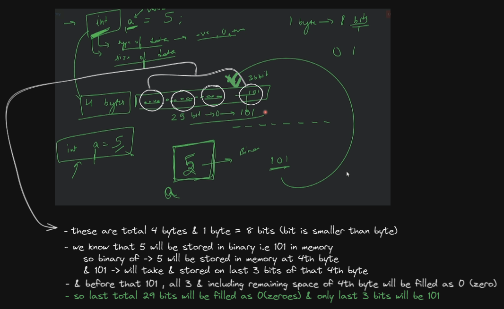
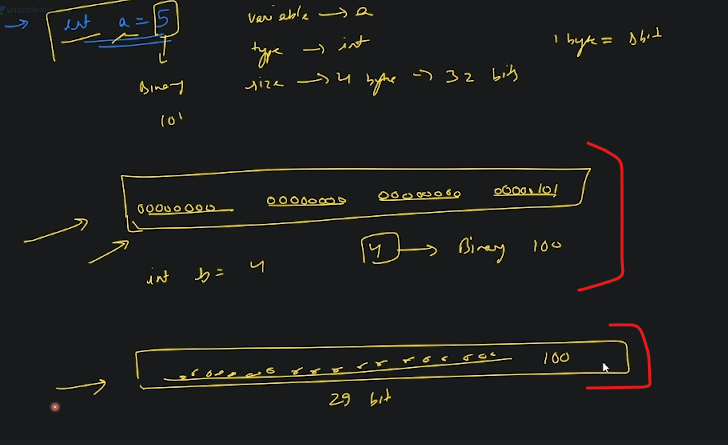
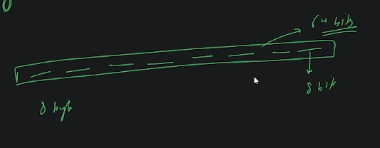

# basic Stuff of programming 

## lecture 2 - Love babbar course purchased

- `datatype` : 
    - for more about memory space : https://www.tutorialspoint.com/computer_fundamentals/computer_memory_units.htm
    - size of `int` datatype depends on compiler but generally we take 4bytes
        - & `1 byte = 8 bits` , here `bits means O or 1` 💡💡💡
        - so in memory , `int` datatype will be created 4 bytes like this 
            
            
            - `Note ✅` : this is just for positive numbers which will be store in the memory in that way which is shown in picture
    - `int` datatype can store positive as well as negative values (whether it's a simple number or a fraction number)
    - `bool` datatype means boolean datatype 
        - it only represent either true or false to check whether that condition is true or false
        - so when we write the condition inside the if statement & in other condition syntax  
            then behind the scene that condition gets converted into true or false 💡💡💡
        - `0` -> means false & `1` means true 💡💡💡
        - size of the boolean datatype is `1byte` , not 1bit
    - `float` datatype 
        - it only store decimal/point value 
        - size is 4 bytes 
    - `double` datatype 
        - only store decimal/point value
        - size is 8 bytes  
            in memory it'll take 8 bytes & 1 bytes = 8 bits , so total 64 bits like this
            
        - difference b/w float & double are 
            - `1` : size are different  
            - `2` : double datatype is more precise/accurate than float in order to store decimal numbers 💡💡💡 
    - `ch` datatype means character datatype 
        - size takes 1 byte
        - always use single quotes to store a litter or a character , don't use double quotes  
            but for string datatype we always use double quotes 💡💡💡

- `how negative(-ve) numbers are stored in memory` ? : (not important becuz not asked in interview ✌)
    - let's say we have `int x = -5` , so we'll see algo/flow/steps to know how negatives number stored in memory
    - `STEP 1` : 

    lecture 2 - timeline  45:29