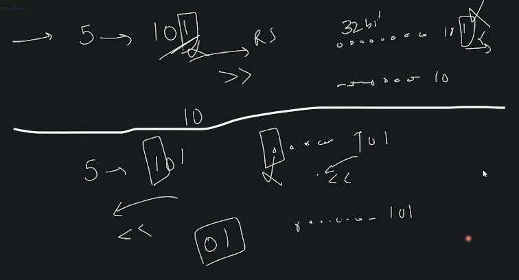

# basic Stuff of programming 

## lecture 2 - Love babbar course purchased

- `datatype` : 
    - for more about memory space : https://www.tutorialspoint.com/computer_fundamentals/computer_memory_units.htm
    - size of `int` datatype depends on compiler but generally we take 4bytes
        - & `1 byte = 8 bits` , here `bits means O or 1` 💡💡💡
        - so in memory , `int` datatype will be created 4 bytes like this 
            
            
            - `Note ✅` : this is just for positive numbers which will be store in the memory in that way which is shown in picture
    - `int` datatype can store positive as well as negative values (whether it's a simple number or a fraction number)
    - `bool` datatype means boolean datatype 
        - it only represent either true or false to check whether that condition is true or false
        - so when we write the condition inside the if statement & in other condition syntax <br>
            then behind the scene that condition gets converted into true or false 💡💡💡
        - `0` -> means false & `1` means true 💡💡💡
        - size of the boolean datatype is `1byte` , not 1bit
    - `float` datatype 
        - it only store decimal/point value 
        - size is 4 bytes 
    - `double` datatype 
        - only store decimal/point value
        - size is 8 bytes <br>
            in memory it'll take 8 bytes & 1 bytes = 8 bits , so total 64 bits like this
            
        - difference b/w float & double are 
            - `1` : size are different  
            - `2` : double datatype is more precise/accurate than float in order to store decimal numbers 💡💡💡 
    - `ch` datatype means character datatype 
        - size takes 1 byte
        - always use single quotes to store a litter or a character , don't use double quotes <br>
            but for string datatype we always use double quotes 💡💡💡
    - we have more datatype like `long` , `short` 

- `how negative(-ve) numbers are stored in memory` ? : (not important becuz not asked in interview ❌❌)
    - let's say we have `int x = -5` , so we'll see algo/flow/steps to know how negatives number stored in memory
    - `STEP 1` : skip the minus or negative sign from that negative number , so here we'll get `5`
    - `STEP 2` : convert that number into binary representation , so for 5 is 101
    - `STEP 3` : take 2's compliment
        - how to take 2's compliment : 
            - for taking 2's compliment , find 1's compliment then add `1`
                - example : `STEP 1` : finding 1's compliment means flip all the bits 
                    - `STEP 1.1` & then do addition with that 1's compliment by `1` <br>
                        let's say we hav 1010 , so when we flip means keep opposite number 
                        
            - so in STEP 1 & 2 , we just took the example to understand
            - `STEP 1` : now that 101 which is stored in memory , convert it in 1's compliment in order to do 2's compliment 
                - so all those 0(zeroes) will become 1 like this & that 101 , it's bit will get flipped like this
                    
                - then add with 1 then we'll get this output 
                    
                    - & this is will be store in `-5`
    - if we see how the integer datatype number stored then in the memory , total is 32bits<br>
        1st bit will show the sign of whether that number is positive or negative <br>
        so if it's `1` then negative & `0` then it's positive 💡💡💡 , 
        - eg : inside lecture-9-4.png , first bit is `1` so it's negative number 
        - & remaining 31bits will contain actual number like this 💡💡💡
            
        - now to access that number , then find out 2's compliment of that 31 bits then you'll get `5` as answer <br>
            & then `5` will be stored in memory in binary form & starting number is `1` that's why `-5` like this 💡💡💡
            
    - if you didn't understand then do DRY RUN of these numbers -> -11 , -4, -8, -5 
    - `how much numbers i can create via 31 bits` : 
        - we know a integer number takes 32bits & 1st bit will contain sign <br>
            & rest 31 bits are used for containing actual number , so we learn about `permutation & combination 📒`
        - so if we have 31 bits then how much numbers i can create with this 31 bits , <br>
            so range will be `-2^31 to 2^31 - 1` , so in that 31 box , each box can contain either O or 1 <br>
            that's why here we took `2`
        - Eg : a character datatype have size is 1 byte , so 1 byte = 8 bits <br>
            so each memory block contain 8 bits , so `2^8` , so combinations will be `256` 💡💡💡
            - `Note ✅` : each characters/letters/symbols stored in ASCII values <br>
                so each character is mapped with an integer number like `'a' is mapped with 97` & that integer number <br>
                is converted into binary & that binary representation is stored in memory like this 💡💡💡
                
                
                - so that ASCII value also gets converted into binary representation because computer only understand O & 1
                - & here we took `2^8` because a character datatype takes 1 byte = 8 bits , & `2` because in memory <br>
                    either we can put 0 or 1
    - `Ques ✅` : if char & int both are stored in binary then how are we going to differentiate b/w int & char in memory
        - Ans : datatype of that value & size of that datatype which we're using is enough to differentiate 

- `operators` : 
    - we have `+` , `-` , `*` , `/` & `%`
    - really game starts with `/` (division) 
        - Eg : you're using C++ lang & you define this `int a = 5;` & when you do like this `a/3` then you'll get 1.6666 <br> 
            but here you used `int` datatype , so only `1` will be the actual output 💡💡💡
        - Eg : `float a = 5.7;` & `int b = 3;` then a/b then we'll get `1.6` as a output
        - Ques : here we have two question ✅
            ```cpp
            // Ques 1
            int ans = 5.0/3;
            cout <<< ans 

            // Ques 2
            cout <<< (5.0/3) 
            ```
            - now what'll be the output , so first ques will be `1` <br> 
                because we'll get the answer in decimal but then we're storing the number inside the `int` datatype
            - & in second ques , we're just printing , so we'll get 1.6 because we're not storing in any datatype 💡💡💡
            - so conclusion is when we divide `int/int` then we'll get `int` <br>
                `float/int` , we'll get float & `double/int` give double , so here type casting going on internally , so we know <br>
                2 types of type casting i.e implicit & explicit type casting , so here implicit type casting going on <br> 
                which is done by the compiler 💡💡💡 
        - Ques : converting a character into int , so is this possible 
            ```cpp
            char character = 'a';
            int num = (int)character; // so here we're doing explicit type conversion , it's not done by the compiler

            cout << "value of num is " << num << endl;
            // output : 97
                // why we got 97 , because 'a' small -> a character is mapped to the 97 ASCII value  
            ```
            - so in C++ , it's possible but not in JS 
    - `%` modulus operator gives remainder when we divide
        - Eg : `5%3` means we're dividing 5 by 3 like this <br>
            
    - for more operators check this : https://www.tutorialspoint.com/computer_programming/computer_programming_operators.htm
    - in C++ , if we use `!` not logical operator like this 
        ```cpp
        int a = 5;

        cout << !a; // output : 0
        cout << !!a; // output : 1

        // Imp Note 🔥 : 0 -> means false & 1 -> means true 💡💡💡 
        ```
    - `bitwise operator ✅` : 
        - bitwise operator means we're working on `bit` or binary representation of a number 💡💡💡
        - `&` and bitwise operator : <br> 
            
            - means if both are true means if both are `1` then we'll get `1` otherwise 0 , <br>
            here we can see the `truth table` 💡💡💡 
            
        - `|` (OR) operator : means if any bit is `1` then we'll get `1` otherwise 0
            
            - `O/p` means output
        - `~` (Not) bitwise operator 
            - this sign is `tilde sign`
            - it will convert `0` into `1` & `1` is converted into `0` 💡💡💡  
        - `XOR` : `(most imp 🔥)`
            - means `Exclusive OR` operator
            - we'll get `0` when both are `1` & if anyone is `1` then we'll get `1` , so in truth table 💡💡💡
                
            - this operator is most most important to crack some questions in interview 🔥🔥🔥
            - XOR symbol is `a^b`
        - `<<` left shift operator
            - eg : if we have `5 << 1` then means shift 5 by `1` bit because we took `1` to shift on left side 💡💡💡
                
                - so here when we shift by `1` then `5` gets multiplied `2` that's why we got `10`
                - but if we do `5 << 2` then shift 5 by 2 bits on left side 
                    
                - so here we can see that whenever we're shifting by any number that number gets multiply by `2` only like this
                    
                    - so can we say that left shift operator , is always gets multiply by 2 💡💡💡 <br>
                        
        - `>>` right shift operator
            - Eg : of right shift operator , <br> 
                
            - so when we're shifting with `5 >> 2` then means we're dividing by 5/2 <br>
                
                - but do Dry run & find only the exceptions where we can't multiply by 2 💡💡💡 
        - so left & right shift operator example like this <br>
            
        - `Note` : when we're doing right or left shift bitwise operator then on that empty bit/bits will be padded by 0
            - Ques : tell me that always `0` will be padded in every case
            - Ans : in positive number , padding will happen with `0(zero)` in both left & right shift bitwise operators <br>
                but for negative number , padding is dependent on compiler
            - in left shift operator , padding will happen on right side <br>
                & in right shift operator , padding will starts added on left side 💡💡💡

- `homework` : 
    - see how left & right shift bitwise operators work with negative number 
    - make flowchart of prime number

