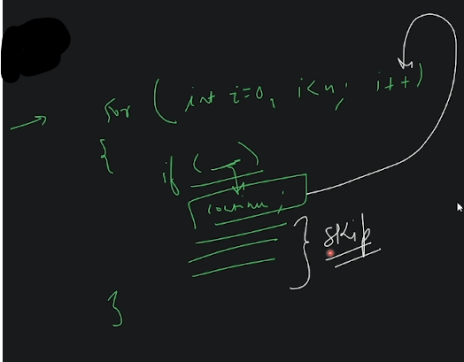
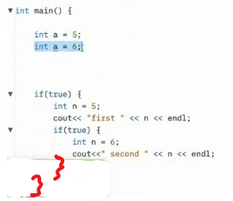
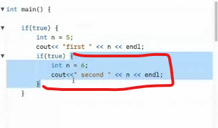

# Programming Basics 2 

## lecture 3.1 - Love babbar course purchased

- difference in if else if statement & if if statement
    - in if else if else statement , 
        if any if or else if statement gets `true` then further else if & else statement will not be checked 
    - but in if if statement , even if first `if statement` gets true then still all further `if statements` will checked  
  
- `switch statement` : 
    - after every `case` put break & before `default` statement , also put `break` keyword <br>   
        if we don't put `break` keyword for that `case` then further `case` statement will also be executed <br>
        with that `case` statement
    - `break` keyword used to terminate/stop the further execution
    - `calculator` is the best example to understand switch statement 💡💡💡 
    - `Note 🔥` : inside parenthesis of switch statement , what we can put 
        ```js
        switch() {} 
            // inside parenthesis , we can put an expression also like this switch(a+2*b) 
            // or we can put a number directly inside of it also or a variable as usually we do 💡💡💡
        ```
        - but we can't put a string inside of it like this `switch("hello")` <br>
            & if we don't put anything inside of it like this `switch() {}` then we'll get error i.e <br>
            needs terminating expression 💡💡💡

- `for loop` : 
    - for loop syntax is like this <br>
        `first` : is initialization <br>
        `second` : condition <br>
        `third` : updation
    - infinite loop : 💡💡💡
        - https://www.javatpoint.com/infinite-loop-in-c
        - https://www.educba.com/infinite-loop-in-c/ 

- we can write this `i = i + 1` like this `i++` or `++i` (most imp concept 🔥)
    - `i++` means post increment & `++i` means pre-increment
    - in post increment , first old value will be used/stored & then increment will happen on that old value 
        ```cpp
        int i = 5;
        cout << i++ ; // output : 5 then it's incremented by 1 & then stored inside i -> variable 💡💡💡
        cout << i ; // output : 6
        ```
        - post-increment says that first use that value whatever that variable contain 
            & after using it , i'll increment it by 1 & stored the incremented value inside that variable itself <br> 
            so previous value will be overwritten by the new incremented value 💡💡💡
    - in pre-increment , first increment will happen then that incremented value will be used/stored 
        ```cpp
        int i = 5;
        cout << ++i ; // output : 6 then it's incremented by 1 
            // & then overwrite the 5 value through updated value stored inside i -> variable 💡💡💡
        ```

- using `break` & `continue` keyword with if statement within loops
    - when we use `break` inside if statement condition within loop <br>
        & when that condition gets true then our loop will terminated & we come back outside the loop
    - when we use `continue` keyword inside if statement & when that condition gets true <br> 
        then our control goes to updation or increment/decrement statement of the loop then condition <br>
        then comes inside the body of the loop like this
        ```cpp
        int n = 10;

        for (int i = 1; i <= n; i++) {
            if (i % 2 === 0) {
                continue;
            }

            cout << i << endl
        }
        // output : 1 
                //  3
                //  5
                //  7
                //  9
        ```
        - behind the scene , it'll work like this <br>
            

- `variable scope 🔥` , eg : <br>
    
    - we can't redefine same variables in same scope 💡💡💡
    - on line no. 7 , that `n` variable we can use inside this complete block of scope of outer if statement i.e  
        
    - but variable `n` which is on line no. 10, we can use inside that scope only i.e <br>
        
    - `Note 🔥` : but here we made same variable name , so this line of code i.e `count << " second " << n << endl;` <br>
        have two option i.e it can use either `n` which is on line no. 10 or 7 <br>
        but how do it know that which one to use , so Rules is : whenever we're accessing then whatever is near or very close <br>
        so that line code will use `n` variable which is on line no. 10 , so i.e called local scope reference 💡💡🔥 
    - another example : 
        ```js
        if (true) {
            let n = 5 
            if (true) {
                let n = 2
                console.log(n) // output : 2
            }
            console.log(n) // output : 5
        }
        ```
- Note : 
    - MCQ's comes in post , pre increment or decrement , break & continue keyword

- & when we do patterns then we'll become master of loops , when you make calculator
    then you'll become master of if else , if else if , switch statement 💡💡💡

- now you can start leetcode for solving basic small problems

- `Homework` : 
    - when to use `if` statement & when to use `switch` statement ✅
        - you can watch Eddy video 
    - when to use for loop & when while loop : https://stackoverflow.com/questions/6710601/when-to-use-while-loop-rather-than-for-loop ✅
    - when to use do while loop 

- lecture 3.1 - timeline : 1:08:58 - 1:10:19
    - `advice ✅` summary , don't rush to complete the course in 2 months , give enough time to understand things clearly <br>
        so that you can digest & remember for even 2 years 🔥🔥🔥

- Ques & MCQ : 
    - variable scope MCQ : https://testbook.com/objective-questions/mcq-on-scope-of-a-variable--5eea6a1139140f30f369ebab
    - pre & post increment & decrement MCQ : https://webrewrite.com/c-objective-questions-answers-operators-set-1/
    - break & continue with loop MCQ : https://www.computersprofessor.com/2017/11/c-programming-questions-and-answers-on_30.html
    - switch statement MCQ : https://www.examtray.com/c-questions/c-mcq-questions-and-answers-switch-case-syntax
