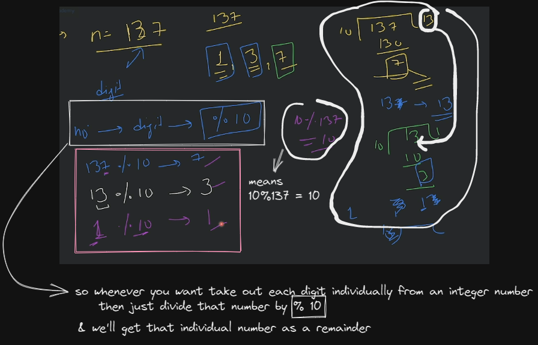
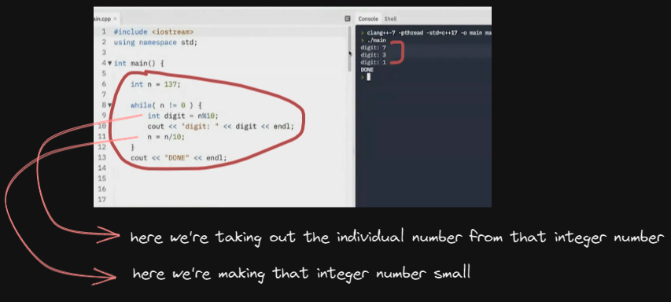
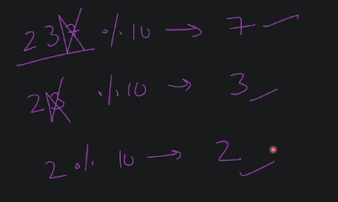
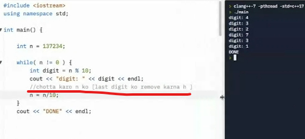
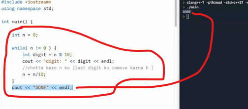
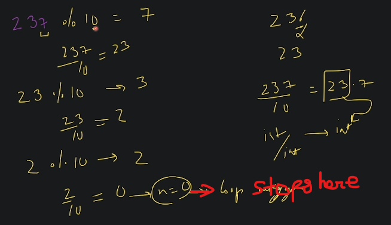
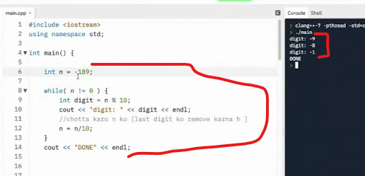
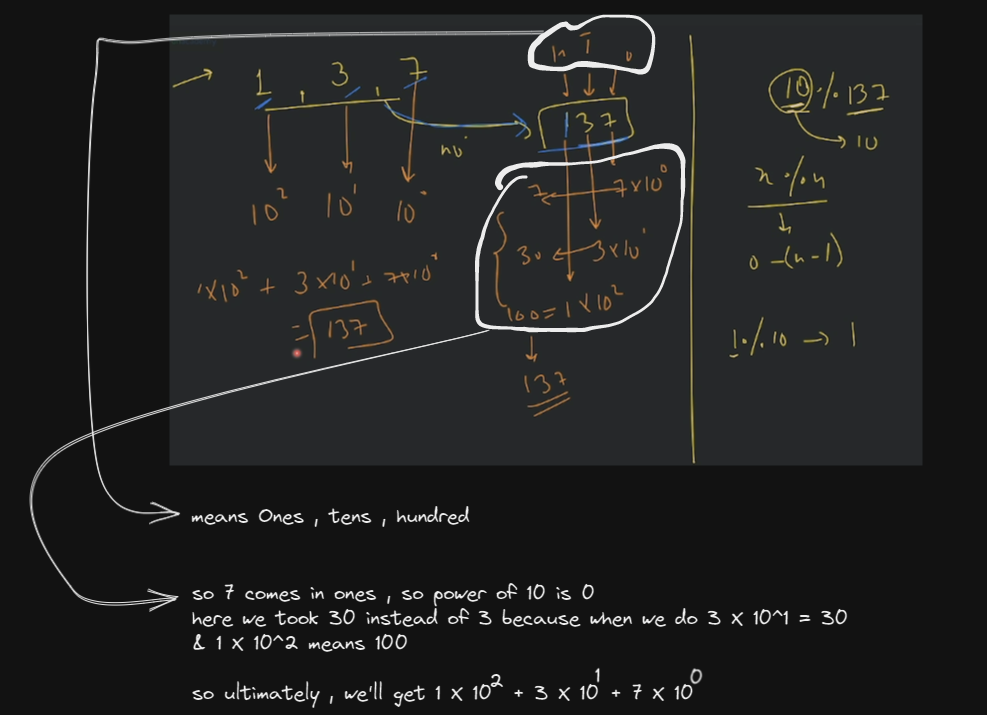

# Programming basics 3 

## lecture 3.2 - Love babbar course purchased

- we'll see operator precedence , associativity & binary into decimal & vice versa ✔️✔️✔️

- `operator precedence & associativity 🔥` : 
    - operator precedence : 
        - let's say we have `int ans = 2 * 3/4 + 5` , now how computer will know that which operation it should do first  
            so how to evaluate an operation , we'll know via precedence of that operator 💡💡💡
        - operator precedence chart ✅ : https://discuss.codechef.com/t/operator-precedence-table/14545 💡💡💡
        - so to remove the ambiguity (means when we solve the expression then we'll get different answers) 💡💡💡   
            so we can use parenthesis like this `int ans = (2 * (3/4)) + 5` then we'll get correct answer 5
    - associativity : 
        - so like in brackets operator precedence , brackets is evaluated from left to right  
            so as we go from left to right then associativity also increase based on operator precedence
        - but we don't need to remember table , because remember `BODMAS` rule & to remove confusion use brackets 💡💡💡
        - when associativity role comes : 
            - let's say we have this (10/10 & 10) , so divide & multiple both have same precedence  
                so which should we need to evaluate , so we'll get the answer from associativity  
                in multiplicate , first `*` come & then `/` & then `%` , so left to right associativity is increasing 💡💡💡
            - so we can use parenthesis like this `((10/10) * 10)` = 1 * 10 = 10 💡💡💡

- `binary to decimal conversion or Decimal to binary conversion` : 
    - `B to D` : let's say we have binary 101 , it'll converted into decimal i.e 5  
        & `D to B` : then we have a number in decimal , let'say `6` , so convert it into binary i.e 110
    - after this knowing which one is binary & which is decimal , let's say another concept  
        let's say we have `n = 137` , now we need to take out each digit individually from this integer number 💡💡💡👍  
        
        - `Code with use case of while loop 🔥` :
            
            - & we're getting individual number in reverse why ? because we're taking out the digit from right to left 💡💡💡
            - so this way we can take out the individual digit from a integer number like this
            
            
            - here we're using  `n != 0` condition because when we divide a number again & again by 10  
                then at the end we'll get `0` , even if you take `n = 0` then you'll not enter in while loop like this 💡💡💡
                
            - so whenever we do a `number % n` then answer is always comes b/w `0 to n - 1` 💡💡💡
        - & we'll get the quotient in decimal number but we're using `int` datatype , so `int` datatype  
            will always take number before decimal point like this 
            
        - if we do with negative integer number then we'll get answer all digit in negative like this
            
        - so here we learned that how to take out the digit individually from a integer number 
        - `Ques ✅` : now let's say we have 1 , 3 , 7 in individual digit then how you'll get this 137 💡💡💡
            - if we divide `10%137` then we'll get 10 only like if we divide `1 % 10` then we'll get `1` itself   
                because `x % y` , answer comes b/w `0 to (n - 1)`
            

- `decimal to binary` : 
    - we already seen that 5 is 101 , 2 is 10 , 6 is 110 & 4 is 100 , but how do we know 
    - & here those 2 concept will be used  
        i.e how to get a digit from an integer number & how combine all those digit to make a number
    

