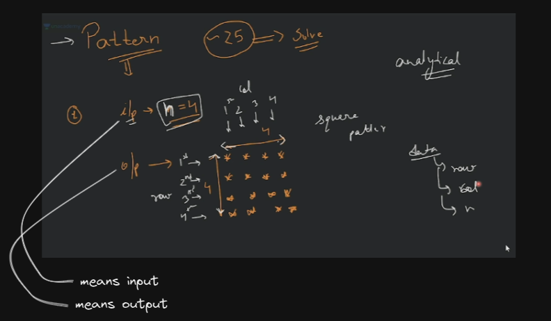
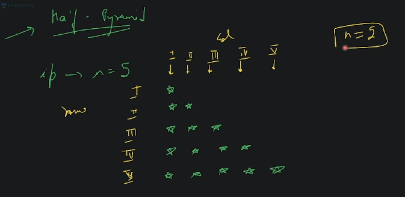

# Pattern Solving - basics 4

## lecture - 4 : love babbar paid course

- square pattern
    - Eg : to solve the pattern problem , we need a little bit analytical mindset    
        - & the data which're available we have i.e `row` , `col` & `n`
        
        - so in `1st row` : we have 4 stars <br>
            `2nd row` : we have 4 starts <br>
            `3nd row` : we have 4 starts <br>
            `4nd row` : we have 4 starts 
    - so we can make no. of rows & columns based on that `n` value like this 
        ```cpp
        #include <iostream>
        using namespace std;

        int main() {
            int n = 4 ; 
            for (int row = 1; row <= n; row++) {
                // for each row , print n stars or we have n col
                for (int col = 1; col <= n; col++) {
                    cout << "*";
                }
            }
        }
        ```    
        - if we just do this then we'll get output or not , So answer is No , because after every row <br>
            we're printing on new line , so we need `endl` 💡💡💡
        ```cpp
        #include <iostream>
        using namespace std;

        int main() {
            int n = 4 ; 

            // for rows
            for (int row = 1; row <= n; row++) {
                // for each row , print n stars or we have n col
                for (int col = 1; col <= n; col++) {
                    cout << "* ";
                }
                cout << endl; // cout << '\n';
            }
        }
        ```    
        - so for each row , we're printing stars from 1 to 4

- half pyramid
    - so input is for `n` is 5 & we can represent the half pyramid like this
        

