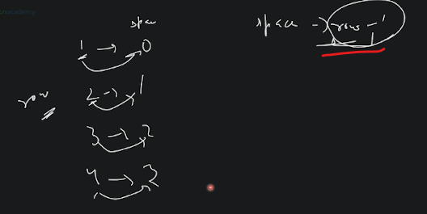

# Pattern Solving - basics 4

## lecture - 4 : love babbar paid course

- square pattern
    - Eg : to solve the pattern problem , we need a little bit analytical mindset    
        - & the data which're available we have i.e `row` , `col` & `n`
        
        - so in `1st row` : we have 4 stars <br>
            `2nd row` : we have 4 starts <br>
            `3nd row` : we have 4 starts <br>
            `4nd row` : we have 4 starts 
    - so we can make no. of rows & columns based on that `n` value like this 
        ```cpp
        #include <iostream>
        using namespace std;

        int main() {
            int n = 4 ; 
            for (int row = 1; row <= n; row++) {
                // for each row , print n stars or we have n col
                for (int col = 1; col <= n; col++) {
                    cout << "*";
                }
            }
        }
        ```    
        - if we just do this then we'll get output or not , So answer is No , because after every row <br>
            we're printing on new line , so we need `endl` 💡💡💡
        ```cpp
        #include <iostream>
        using namespace std;

        int main() {
            int n = 4 ; 

            // for rows
            for (int row = 1; row <= n; row++) {
                // for each row , print n stars or we have n col
                for (int col = 1; col <= n; col++) {
                    cout << "* ";
                }
                cout << endl; // cout << '\n';
            }
        }
        ```    
        - so for each row , we're printing stars from 1 to 4

- left half pyramid
    - so input is for `n` is 5 & we can represent the half pyramid like this
        
    - for first outer loop will run 5 times , now we need to under for each row what we need to do 💡💡💡 <br>
        so here for 1st row , only 1 star printing <br>
        for 2nd row , only 2 star printing <br>
        for 3rd row , only 3 star printing <br>
        for 4th row , 4 star printing 
    - so that's why star count = row number 💡💡💡 , so loop will run from column 1 to row no.
    ```cpp
    #include <iostream>
    using namespace std;

    int main() {
        int n = 4 ; 

        // for rows
        for (int row = 1; row <= n; row++) {

            // for each row , print stars based on row number
            for (int col = 1; col <= row; col++) {
                cout << "* ";
            }

            // after every row
            cout << endl; // cout << '\n';
        }
    }
    ```

- inverted left half pyramid
    - so for 1st row , we're printing 4 stars , so formula is `(n - row) + 1` 
        
        
    - so that's why based on this , we can make a formula i. `(n - row) + 1`
        
    - `Note ✅` : here in formula , why we took `+ 1` because we run `row from 1 to n` but if we run row from 0 to n <br>
        then we don't need that `+ 1` in formula like this
        
    - but if you don't want to apply this formula , then you can use counter so on each row counter is decrementing like this 
         
        - so we can run logic for `row` based on `n` like this 
         
    ```cpp
    #include <iostream>
    using namespace std;

    int main() {

        int n ;
        cin >> n ;
         
        for (int row = 1; row <= n; row++) {
            for (int col = 1; col <= ((n - row) + 1); col++) {
                cout << "* " ;
            }    
            
            cout << endl;
        }

        return 0;
    }
    ```

- right half pattern 
    ```
            * 
          * * 
        * * * 
      * * * * 
    * * * * * 
    ```
    - so in 1st row , we have 3 space then 1 star <br>
        in 2nd row , we have 2 spaces then 2 star <br>
        in 3rd row, we have 1 space then 3 star <br>
        & we don't have any space
    - so from 1st to 3rd row , we're printing two things in each row i.e space & star , <br>
        so we'll get that triangle which we already did like this 
        
        
        
    - so eg : in 1st row , we need 3 spaces , so how you'll make 3 i.e `n = 4` & row is 1st , <br>
        so if we do `n - row` , we'll get `3` like this 💡💡💡 <br>
        
    - so you need to observe & game is over 👍
    ```cpp
    #include <iostream>
    using namespace std;

    int main() {

        int n ;
        cin >> n ;
         
        for (int row = 1; row <= n; row++) {
            // for each row

            // spaces
            for (int col = 1; col <= n-row; col++) {
                cout << " " ;
            }    

            // stars
            for (int col = 1; col <= row; col++) {
                cout << "* " ;
            }    

            // after each row
            cout << endl ;
        }

        return 0;
    }
    ```

- right inverted half pattern
    
    - so previously , we did those triangles pattern <br>
        
    - so first count , in 1st row , how much space & stars do you have & same with other rows like this 
        
    - so we can see that whatever row number is decrementing by `1` to get the spaces , 💡💡💡 <br>
        so space formula is `row - 1` like this <br>
        
    - for finding star , we'll have this formula i.e `n - row + 1` like this 💡💡💡 <br>
        
    ```cpp
    #include <iostream>
    using namespace std;

    int main() {

        int n ;
        cin >> n ;
         
        for (int row = 1; row <= n; row++) {
            // for each row

            // spaces
            for (int col = 1; col <= row-1; col++) {
                cout << " " ;
            }    

            // stars
            for (int col = 1; col <= (n-row)+1; col++) {
                cout << "* " ;
            }    

            // after each row
            cout << endl ;
        }

        return 0;
    }
    ```
    - so after this we can have multiple approaches to solve this problem or any particular problem in programming <br>
        & we can optimize it more 
    - `Note` : if we use <= or any conditional based operator then at the end , it'll converted into true or false 💡💡💡 
    - so till yet we saw these patterns
        

- homework 
    - print solid diamond pattern like this 
        
        - so we need to divide each pattern into 4 parts to solve it
        - we just need to find the formula for inner loops condition
    - hollow left inverted half pyramid , inverted solid full pyramid , hollow full pyramid
        

- to make formula, just wrote the things that you have available like row , value of n & whatever is available <br>
    & observe how to make formula

- full solid pyramid
    - `Note ✅` : if you'r starting loop from 0(zero) < n then put formula i.e `n - row` <br>
        but if you're starting from `n - row + 1` 💡💡💡
        - but you're starting loop from 1 to n then put `1 <= n` then you have to use `n - row + 1` formula 💡💡💡
    - so this pattern , we need to print & it's half part looks like previous pattern i.e right half pattern like this 
        
    - approach to make formula , write down all rows , count spaces & starts in each row like this 💡💡🔥
        
    - so first outer loop , will run row from 1 to n , & for space n - row & for star 1 to row
    - so ultimately game lies here i.e finding formula for condition 💡💡💡<br>
        
        - so here first inner loop is to find space & second inner loop is to print stars
        - to find formula for condition , just use approach like we have `row = 1` & `n = 4` & need to make 3 <br>
            so how you'll make i.e `n - row` , so same way row is 1 & star is 1 in 1st row of pyramid star pattern 💡💡💡
    ```cpp
    #include <iostream>
    using namespace std;

    int main() {

        int n = 5;         

        for (int row = 1; row <= n; row++) {

            // for each row
                // spaces
                for (int col = 1; col <= n-row; col++) {
                    cout << " " ;
                }    

                // stars
                for (int col = 1; col <= row; col++) {
                    cout << "* " ;
                }    

                // after each row
                cout << endl ;
        }

        return 0;
    }
    ```

- homework : full inverted star pyramid 
    ```
      * * * * *
       * * * *
        * * *
         * *
          *
    ```
    
    
    ```cpp
    #include <iostream>
    using namespace std;

    int main() {

        int n = 4 ;
        
        for (int row = 1 ; row <= n ; row++) {
            
            // for each row 
                // for spaces
                for (int col = 1 ; col <= row-1 ; col++) {
                    cout << " ";
                }
                
                // for stars
                for (int col = 1 ; col <= (n-row)+1 ; col++) {
                    cout << " *";
                }
            cout << endl;
        }
        
        return 0;
    }
    ```

- hollow left inverted half pyramid
    ```
    *****
    *  *
    * *
    **
    *
    ```
    - approach to solve hollow left inverted half pyramid 💡💡💡
        
        
    - why we're handling that 1st row & last row separately because we're getting that pattern like this 
        
        - so we have 2 spaces then 1 space then 0 space & then 0 space which is not creating any pattern 
        - that's why we're dividing our logic on 2 parts 
    - logic of code 💡💡💡
        
    - now we need of find out formula 
        - for first row & last row , Eg : we have `row = 1` & `n = 5` & you need to make `5` <br>
            so how you gonna make i.e `n - row + 1` i.e `3 - 1 + 1` 💡💡💡 like this
            
        - now for middle , we need to find out formula , Eg : in 2nd row i.e `row = 2` & `n = 5` <br>
            we need to print 2 spaces i.e `n - row - 1` & you can check for 100% that it's working for every situation or not <br>
            so formula will be this 
            
    ```cpp
    #include <iostream>
    using namespace std;

    int main() {

        int n = 6;

        for (int row=1; row<=n; row++) {

            // for first & last row
            if (row == 1 || row == n) {
                // stars
                for(int col=1; col<=n-row+1; col++) {
                    cout <<"*";
                }

            // for middle rows
            } else {
                cout << "*";
                // space
                for(int col = 1 ; col <= (n - row) + 1 ; col++) {
                    cout <<" ";
                }
                cout << "*";
            }

            // after each row
            cout << endl;
        }

        return 0;
    }
    ```

- `note` : in pattern problems, game always stuck on finding formula for conditions 👨‍🏫

- homework 
    - in first diagram , numbers half left pyramid , we're just printing column number 
        
    
    - divide this diamond pyramid in two parts <br>
        
    - numbers pattern <br>
        
        
    - pascal triangle <br>
        
    - divide this pattern in four parts to solve or you can divide it into major 2 parts <br>
        
    - butterfly pattern , you can divide this into 4 parts or into 2 parts <br>
        
    - star pattern
        ```
          *********
           *******
            *****
             ***
              *
        ```

## lecture - Love babbar YT video

- number pattern <br>
    
    
    
    
    
- characters pattern <br>
    
    
    
    
    
    
    
    
- number pattern <br>
    
    
- star + number pattern <br>
    

## lecture - kunal khushwaha

- patterns which is not inside love babbar course
    ```
     * * * * *
      * * * *
       * * *
        * *
         *
         *
        * *
       * * *
      * * * *
     * * * * *
    ```
    ```
           *
          * *
         *   *
        *     *
       *********
    ```
    ```
        *********
         *     *
          *   *
           * *
            *
    ```
    ```
              1
            1   1
          1   2   1
        1   3   3   1
      1   4   6   4   1
    ```
    ```
           1
          212
         32123
        4321234
         32123
          212
           1
    ```
    ```
       ****
       *  *
       *  *
       *  *
       ****
    ```
    ```
           *      *
         *   *  *   *
       *      *      *
    ```
    ```
       *        *
       **      **
       * *    * *
       *  *  *  *
       *   **   *
       *   **   *
       *  *  *  *
       * *    * *
       **      **
       *        *
    ```
    ```
          *****
         *   *
        *   *
       *   *
      *****
    ```
    ```
      1 1 1 1 1 1
      2 2 2 2 2
      3 3 3 3
      4 4 4
      5 5
      6
    ```
    ```
        1 2 3 4  17 18 19 20
          5 6 7  14 15 16
            8 9  12 13
              10 11
    ```
    ```
            1
          2 1 2
        3 2 1 2 3
      4 3 2 1 2 3 4
    5 4 3 2 1 2 3 4 5
    ```
    ```
         4 4 4 4 4 4 4  
         4 3 3 3 3 3 4   
         4 3 2 2 2 3 4   
         4 3 2 1 2 3 4   
         4 3 2 2 2 3 4   
         4 3 3 3 3 3 4   
         4 4 4 4 4 4 4 
    ```
    ```
       a
       B c
       D e F
       g H i J
       k L m N o
    ```
    ```
       E D C B A
       D C B A
       C B A
       B A
       A
    ```
    ```
       1      1
       12    21
       123  321
       12344321
    ```

- in interview , no one is going to asking pattern topics questions <br>
    these questions are important if you're starting programming first time then it'll build the foundation 👍

- prerequisite : loop

- `how to approach a pattern problem` : ✅
    - `STEP 1` : run the outer loop for that number of rows 
        - so no. of lines = no. of rows = no. of times outer loop will run
    - `STEP 2` : identify for every row number
        - `1` : how many number of cols are there
        - `2` : type of elements in each columns
    - `STEP 3` : what do you need to print like star or numbers

- solving Pattern Question :  
    ```
    *
    **
    ***
    ****
    *****
    ****
    ***
    **
    *
    ```
    - solution : 
        
        
        - & outer loop will run 2 times that's why 2 * n
        - so code is <br>
            
        - but we'll get wrong output like this <br>
            
        - problem is inside the formula ✅
            
            - then we'll get correct output
        - so we solve this pattern by using only one inner loop , but in love babbar , <br>
            we solved by using two inner loop

- Note : whenever you're dealing with pattern numbers , then start loop from `1` , not 0
