# Programming Basics 4 

## lecture 5 - love babbar (paid course)

- leetcode question : https://leetcode.com/problems/number-complement/
    - so in this question , we need to get the complement like this 
        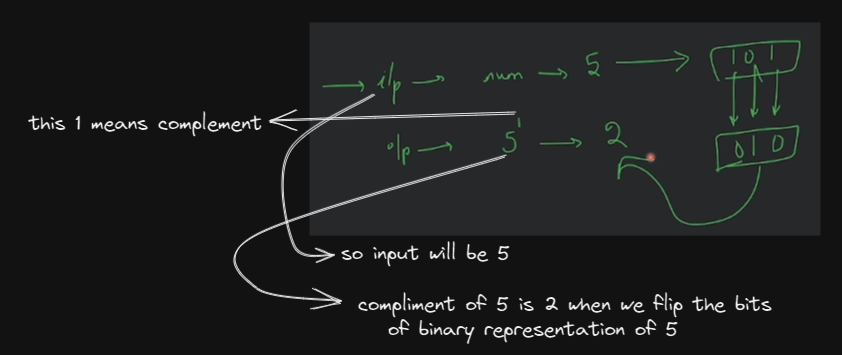
    - Eg : input is 1 & binary representation is 1 , so complement will be 0
    - now we don't need to worry about code , we understand the question Yes or NO
    - Examples : 
        - let's say you have input as `6` , binary representation of it is `110` , complement of binary `6` is `001` <br>
            & then complement of `6^1` is `001` now decimal representation of `001` is `1`
        - Eg : input is `3` , binary representation is `11` , complement of `3^1` is `00` now decimal representation is `0`
        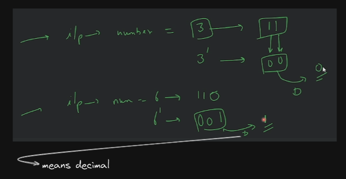
    - brainstorming : 
        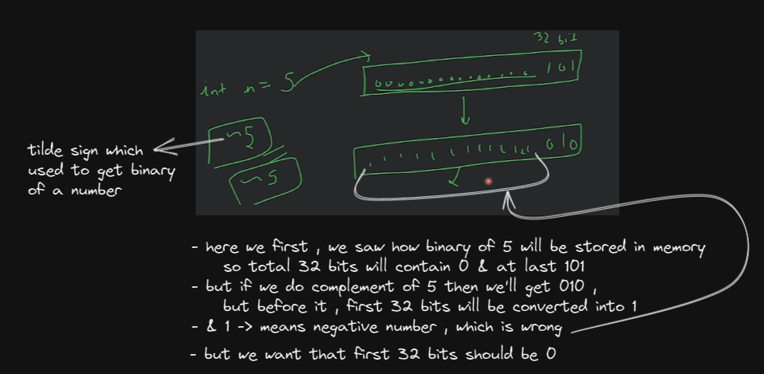
        - so we're able to get the complement of a number via `~` tilde sign <br>
            but how we can convert that first 32 bits from 1 into `0` 💡💡💡
        - so we can do mask like this <br>
            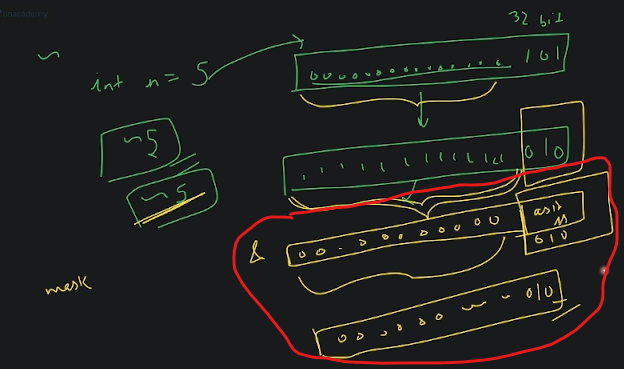
        - output 
            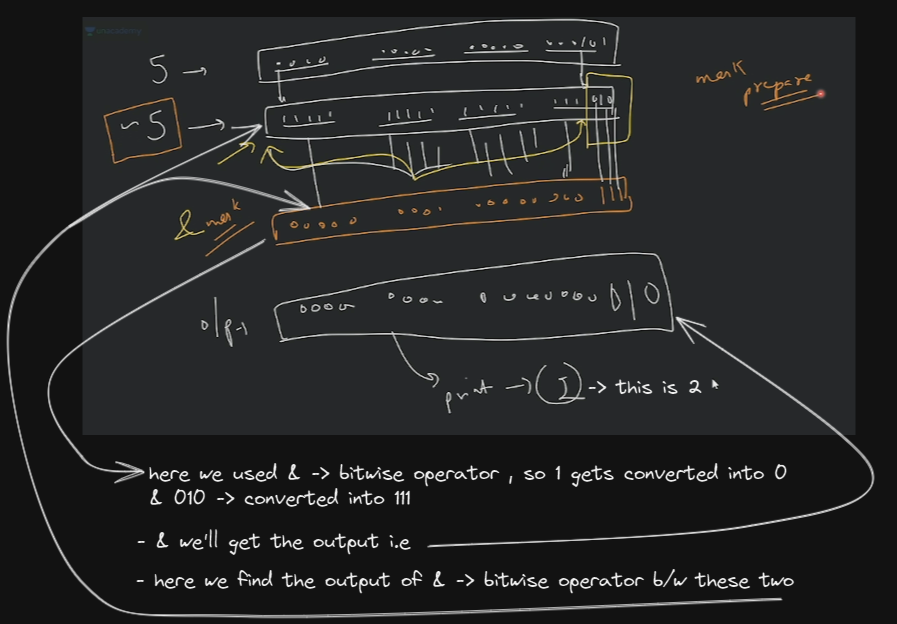
        - so we're flip all the bits via `~` tilde sign & then we're using `&` with a mask. so we need to prepare the mask <br>
            so how we can create a mask ? 
            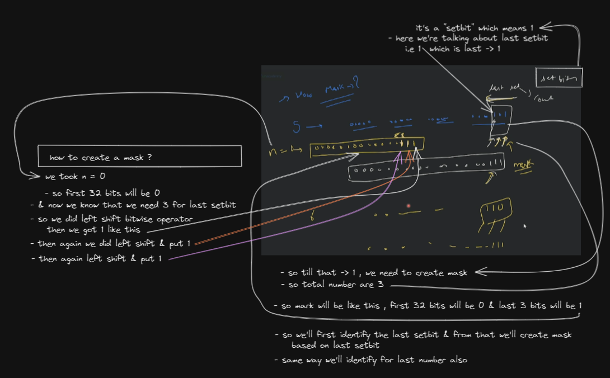
    - code 
        ```cpp
        class Solution {
            public : 
                int findComplement(int num) {
                    int mask = 0; // by-default , at starting mask will be 0

                    // mask < num , means we want to add 1 inside the mask until mask is less than number
                    while(mask < num) {
                        // here in order to add 1 inside the mask 
                            // first : we need to shift 1bit via left shift bitwise operator
                            // second : then add 1 via OR bitwise operator
                        mask = (mask << 1) | 1;
                            // mask << 1 --> this means leftmost bit will be removed 
                                // & then on rightmost bit , 0 -> will be added
                            // mask | 1 -> means OR bitwise operator 
                                // so bit is 0 , then it'll become 1
                                // if bit is 1 , then it'll become 0 💡💡💡
                    }

                    // now to get the answer , we used tilde sign -> ~ means flip all the bits 
                        // but we don't want to flip the bits of last setbit that's why we created mask 💡💡💡
                        // then we add the mask at last after total 32 bits via AND bitwise operator -> & 
                    int ans = (~num) & mask;
                    return ans;
                }
        } 
        // input : 10
        // output : 5

        /* Another Solution
        class Solution {
            public : 
                int findComplement(int num) {
                    int mask = 0;

                    // creation of a mask
                    while(mask < num) {
                        // left shift 
                        mask = (mask << 1) ;
                        // OR bitwise operator with 1
                        mask = mask | 1;
                    }

                    int ans = (~num) & mask;
                    return ans;
                }
        } 
        */
        ```
        - `Advice to build logics` : 
            - then after writing logic , try to run this logic on different test case like on 3 , 5 & 10 , so on <br>
                in order to know whether our logic is working or not 
        - Note - `mask = (mask << 1) | 1;` ✅
            - `mask << 1` - this means leftmost bit will be removed & then on rightmost bit , 0 -> will be added
            - then `mask | 1` - means OR bitwise operator 
                - so bit is 0 , then it'll become 1
                - if bit is 1 , then it'll become 0 💡💡💡
            - `(~num) & mask` 
                - here `~num` means we converted that first 32 bits which are 0 into 1
                - then `& mask` means we converted `0 into 1` & `1 into 0` <br>
                    in order to convert that `111` by using `&` bitwise operator
    - explanation : thought process of code 
        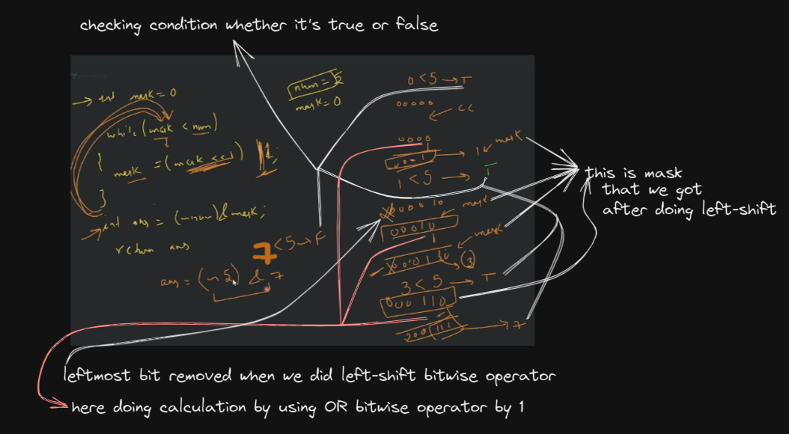
        - let's see of `ans = (~5) & 7`
            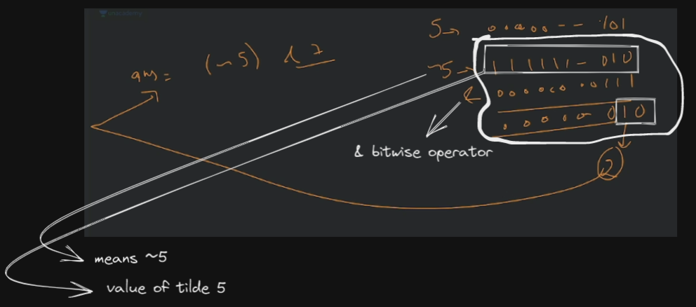
        - why we didn't did this `while(mask <= num)` 
            - here why we didn't use `<=` because loop will run again & we'll get wrong output
            - so it's condition based on setbit of mask that we created <br>
            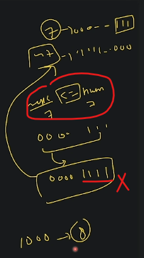
            - that's why we didn't put `<=` on condition & you can check via dry run
        - how do we able to know the logic ? 
            - at first time , we just know `~5` tilde will give the binary of 5 but first 32bits will be `1` <br>
            - so in right most bit , we want to get binary number ast it is from last set-bit which has 1 <br>
                & convert that first 32bits into 1 like this 
                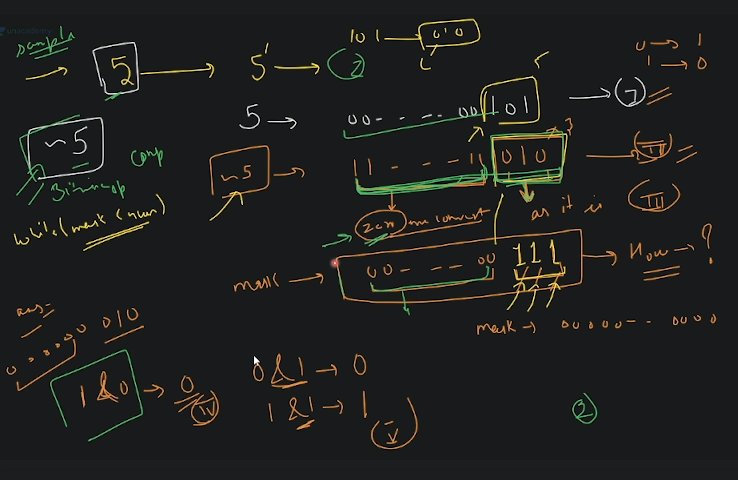
            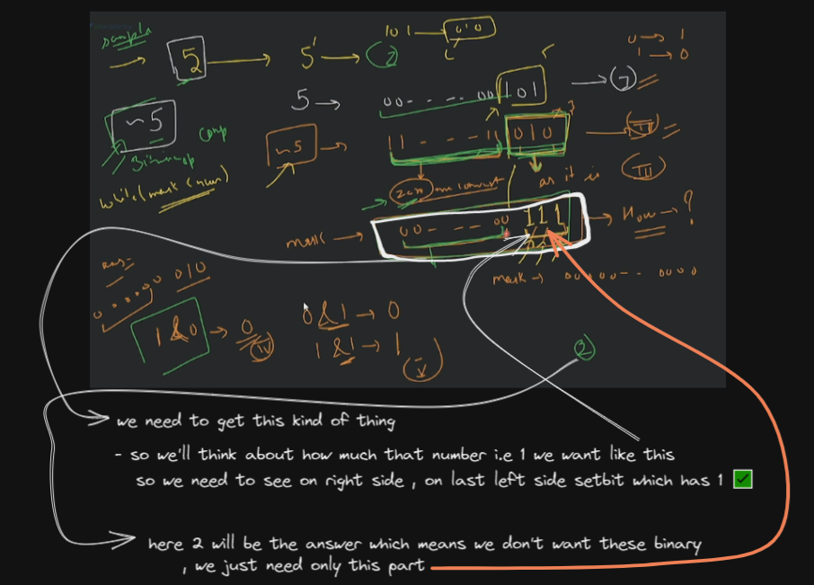
    - another solution we can do 
        - we can use counter like this 
            ```
            while (counter--) {
                mask <<
                something...
            }
            ```
        - to find the counter , next question we'll do based on counter

- leetcode Question : https://leetcode.com/problems/power-of-two/
    - understanding question : 
        - Eg : we have `n = 16` & so `2^4 = 2 * 2 * 2 * 2 = 16` , so return true <br>
            but if we have number which is not divisible by power of 2 like `n=15` -> `2^x` , so return false  
        - but you'll say that is it like odd & even number , so answer is NO , because <br>
            eg : `n=6` , so we can't represent `6` via power of 2 , so return false 💡
        - `2^0 = 1` , `2^1 = 2` , `2^2=4` , `2^3=8` , `2^4=16` & so on...... <br> 
            so if value of `n` is one of this number , we'll return true otherwise false 💡💡
        - how to identify whether a number is power of 2 or not <br>
            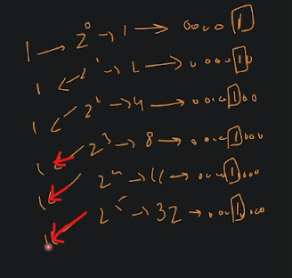
            - so when we find the binary representation of those number (which is got after doing power of 2) 
            - then we can see what is the `set-bit` , so in binary of representation of each number have `1` <br>
                so everyone has only time `1`
            - so value of `n` is equal-to the count of set-bit i.e 1 , then it's a number of power of 2 , otherwise not 💡💡💡 
        - `set-bit` means `1` 💡💡💡
    - approach of a problem 
        - `STEP 1` : if you get the number as a input , then count the number of set-bit
        - `STEP 2` : & check if count == 1 , then return true otherwise false
    - think about edge cases
        - if assume that x has a positive value , if we do `2^x` , then will you get a negative by doing power of 2 <br>
            so answer is No
        - but if value of `n` has a negative number , then we can put check `if (n<=0) return false`
    - how to count set-bit ✅
        - steps of counting the set-bit i.e `1`
            - `STEP 1` : let's say we have `5` , so assume that binary representation will be 0000000101
            - `STEP 2` : now we'll get last right most set-bit i.e 1 like this 
                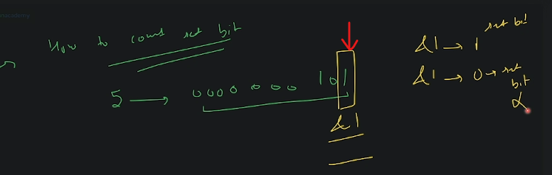
            - `STEP 3` : & then if we do `&1` by using AND bitwise operator 
                - so if we do `&1` , & got `1` then we'll count it as set-bit , if we do `&1` , & got `0` then it's a not set-bit
            - `STEP 4` : & after finding the last right most set-bit, then we don't need that bit 
                - so remove it by `>>` right shift bitwise operator
                - so we'll get 00000010
            - `STEP 5` : then check again the last rightmost set-bit by using `&1` like this 
                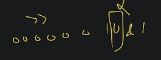
                - & again if we don't get the `1` after doing `&1` , 
                - so remove it by using `>>` ,then we'll get 0000001
            - `STEP 6` : now again check the last rightmost set-bit by using `&1` like this  
                - & remove it if we don't get `1` by using `>>` like this
                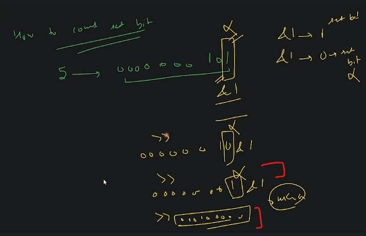
                - when to stop , so stop when every bits becomes `0`
        - so basically , we need to count only `1` , means how many number of `1` we have in the binary 
            - so we can take the last rightmost set-bit & do `n&1`
            - & if we get answer `1` via `n&1` then increment count `count++` <br>
                if we get `0` then do nothing
        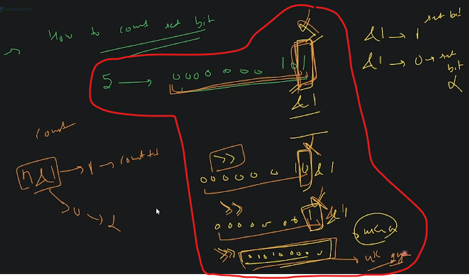
        - left shift vs right shift bitwise operator
            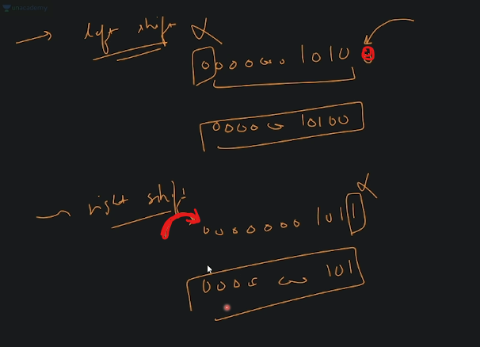
        - how to check last rightmost set-bit 
            - so we do `n & 1` like this <br>
            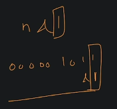
        - how do we know that bits comes `0`
            - so we can do `n >> 1` means we're doing right shift by 1bit
            - & the movement `n == 0` , means we can compare 
    - another approach to solve the problem ✅
        - `1st approach` : 
            - let's say we have the number which comes in power of 2 like this `2^0` , `2^1` , `2^2` , `2^3`
            - Eg : `2^3 = 8` , so binary of 8 is 1000 , so we have the formula i.e `n & (n-1)` , <br>
                means `8 & 7` , so 8 is 1000 & 7 is 0111 , when we do calculation , <br>
                so if we get the answer of `n & (n-1)` as 0 , then means n is equal-to 2^n which is true otherwise false like this
                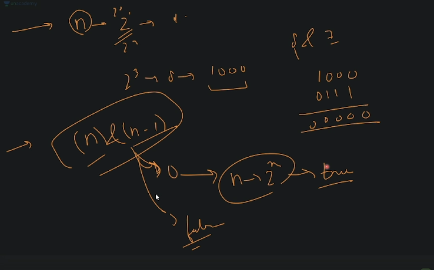
            - so whenever you want to check whether value of n is equal-to power of 2 , then use `(n) & (n - 1)` <br>
                & if we got answer `0` then it's true otherwise false 💡💡💡
                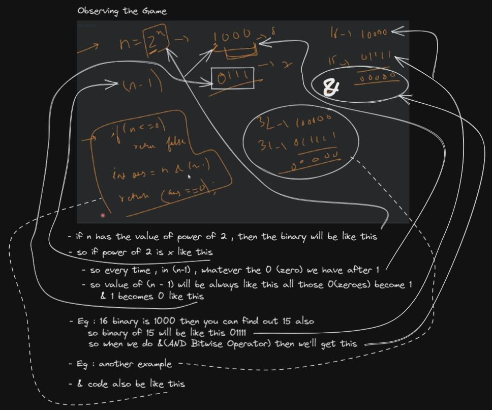
        - `2nd approach` 
            - we can solve without binary also , so we need to use loop like this
                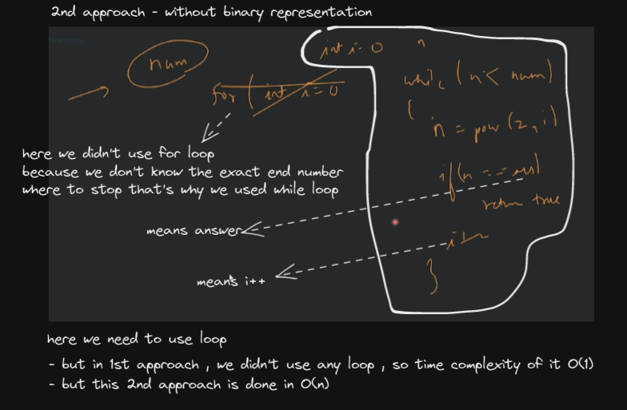
    - writing code 

