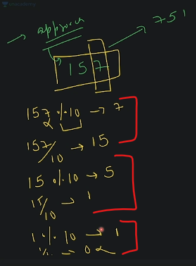

# Programming Basics 4 

- leetcode questions that we're going to do : 
    - https://leetcode.com/problems/number-complement/
    - https://leetcode.com/problems/power-of-two/
    - https://leetcode.com/problems/reverse-integer/

## lecture 5 - love babbar (paid course)

- leetcode question : https://leetcode.com/problems/number-complement/
    - so in this question , we need to get the complement like this 
        
    - Eg : input is 1 & binary representation is 1 , so complement will be 0
    - now we don't need to worry about code , we understand the question Yes or NO
    - Examples : 
        - let's say you have input as `6` , binary representation of it is `110` , complement of binary `6` is `001` <br>
            & then complement of `6^1` is `001` now decimal representation of `001` is `1`
        - Eg : input is `3` , binary representation is `11` , complement of `3^1` is `00` now decimal representation is `0`
        
    - brainstorming : 
        
        - so we're able to get the complement of a number via `~` tilde sign <br>
            but how we can convert that first 32 bits from 1 into `0` 💡💡💡
        - so we can do mask like this <br>
            
        - output 
            
        - so we're flip all the bits via `~` tilde sign & then we're using `&` with a mask. so we need to prepare the mask <br>
            so how we can create a mask ? 
            
    - code 
        ```cpp
        class Solution {
            public : 
                int findComplement(int num) {
                    int mask = 0; // by-default , at starting mask will be 0

                    // mask < num , means we want to add 1 inside the mask until mask is less than number
                    while(mask < num) {
                        // here in order to add 1 inside the mask 
                            // first : we need to shift 1bit via left shift bitwise operator
                            // second : then add 1 via OR bitwise operator
                        mask = (mask << 1) | 1;
                            // mask << 1 --> this means leftmost bit will be removed 
                                // & then on rightmost bit , 0 -> will be added
                            // mask | 1 -> means OR bitwise operator 
                                // so bit is 0 , then it'll become 1
                                // if bit is 1 , then it'll become 0 💡💡💡
                    }

                    // now to get the answer , we used tilde sign -> ~ means flip all the bits 
                        // but we don't want to flip the bits of last setbit that's why we created mask 💡💡💡
                        // then we add the mask at last after total 32 bits via AND bitwise operator -> & 
                    int ans = (~num) & mask;
                    return ans;
                }
        } 
        // input : 10
        // output : 5

        /* Another Solution
        class Solution {
            public : 
                int findComplement(int num) {
                    int mask = 0;

                    // creation of a mask
                    while(mask < num) {
                        // left shift 
                        mask = (mask << 1) ;
                        // OR bitwise operator with 1
                        mask = mask | 1;
                    }

                    int ans = (~num) & mask;
                    return ans;
                }
        } 
        */
        ```
        - `Advice to build logics` : 
            - then after writing logic , try to run this logic on different test case like on 3 , 5 & 10 , so on <br>
                in order to know whether our logic is working or not 
        - Note - `mask = (mask << 1) | 1;` ✅
            - `mask << 1` - this means leftmost bit will be removed & then on rightmost bit , 0 -> will be added
            - then `mask | 1` - means OR bitwise operator 
                - so bit is 0 , then it'll become 1
                - if bit is 1 , then it'll become 0 💡💡💡
            - `(~num) & mask` 
                - here `~num` means we converted that first 32 bits which are 0 into 1
                - then `& mask` means we converted `0 into 1` & `1 into 0` <br>
                    in order to convert that `111` by using `&` bitwise operator
    - explanation : thought process of code 
        
        - let's see of `ans = (~5) & 7`
            
        - why we didn't did this `while(mask <= num)` 
            - here why we didn't use `<=` because loop will run again & we'll get wrong output
            - so it's condition based on setbit of mask that we created <br>
            
            - that's why we didn't put `<=` on condition & you can check via dry run
        - how do we able to know the logic ? 
            - at first time , we just know `~5` tilde will give the binary of 5 but first 32bits will be `1` <br>
            - so in right most bit , we want to get binary number ast it is from last set-bit which has 1 <br>
                & convert that first 32bits into 1 like this 
                
            
    - another solution we can do 
        - we can use counter like this 
            ```
            while (counter--) {
                mask <<
                something...
            }
            ```
        - to find the counter , next question we'll do based on counter

- leetcode Question : https://leetcode.com/problems/power-of-two/
    - understanding question : 
        - Eg : we have `n = 16` & so `2^4 = 2 * 2 * 2 * 2 = 16` , so return true <br>
            but if we have number which is not divisible by power of 2 like `n=15` -> `2^x` , so return false  
        - but you'll say that is it like odd & even number , so answer is NO , because <br>
            eg : `n=6` , so we can't represent `6` via power of 2 , so return false 💡
        - `2^0 = 1` , `2^1 = 2` , `2^2=4` , `2^3=8` , `2^4=16` & so on...... <br> 
            so if value of `n` is one of this number , we'll return true otherwise false 💡💡
        - how to identify whether a number is power of 2 or not <br>
            
            - so when we find the binary representation of those number (which is got after doing power of 2) 
            - then we can see what is the `set-bit` , so in binary of representation of each number have `1` <br>
                so everyone has only time `1`
            - so value of `n` is equal-to the count of set-bit i.e 1 , then it's a number of power of 2 , otherwise not 💡💡💡 
        - `set-bit` means `1` 💡💡💡
    - approach of a problem 
        - `STEP 1` : if you get the number as a input , then count the number of set-bit
        - `STEP 2` : & check if count == 1 , then return true otherwise false
    - think about edge cases
        - if assume that x has a positive value , if we do `2^x` , then will you get a negative by doing power of 2 <br>
            so answer is No
        - but if value of `n` has a negative number , then we can put check `if (n<=0) return false`
    - how to count set-bit ✅
        - steps of counting the set-bit i.e `1`
            - `STEP 1` : let's say we have `5` , so assume that binary representation will be 0000000101
            - `STEP 2` : now we'll get last right most set-bit i.e 1 like this 
                
            - `STEP 3` : & then if we do `&1` by using AND bitwise operator 
                - so if we do `&1` , & got `1` then we'll count it as set-bit , if we do `&1` , & got `0` then it's a not set-bit
            - `STEP 4` : & after finding the last right most set-bit, then we don't need that bit 
                - so remove it by `>>` right shift bitwise operator
                - so we'll get 00000010
            - `STEP 5` : then check again the last rightmost set-bit by using `&1` like this 
                
                - & again if we don't get the `1` after doing `&1` , 
                - so remove it by using `>>` ,then we'll get 0000001
            - `STEP 6` : now again check the last rightmost set-bit by using `&1` like this  
                - & remove it if we don't get `1` by using `>>` like this
                
                - when to stop , so stop when every bits becomes `0`
        - so basically , we need to count only `1` , means how many number of `1` we have in the binary 
            - so we can take the last rightmost set-bit & do `n&1`
            - & if we get answer `1` via `n&1` then increment count `count++` <br>
                if we get `0` then do nothing
        
        - left shift vs right shift bitwise operator
            
        - how to check last rightmost set-bit 
            - so we do `n & 1` like this <br>
            
        - how do we know that bits comes `0`
            - so we can do `n >> 1` means we're doing right shift by 1bit
            - & the movement `n == 0` , means we can compare 
    - another approach to solve the problem ✅
        - `1st approach` : 
            - let's say we have the number which comes in power of 2 like this `2^0` , `2^1` , `2^2` , `2^3`
            - Eg : `2^3 = 8` , so binary of 8 is 1000 , so we have the formula i.e `n & (n-1)` , <br>
                means `8 & 7` , so 8 is 1000 & 7 is 0111 , when we do calculation , <br>
                so if we get the answer of `n & (n-1)` as 0 , then means n is equal-to 2^n which is true otherwise false like this
                
            - so whenever you want to check whether value of n is equal-to power of 2 , then use `(n) & (n - 1)` <br>
                & if we got answer `0` then it's true otherwise false 💡💡💡
                
        - `2nd approach` 
            - we can solve without binary also , so we need to use loop like this
                
    - writing code via two different approach 
        - Binary approach
            ```cpp
            class Solution {
                public: 
                    bool isPowerOfTwo(int n) {
                        if (n <= 0) 
                            return false;

                        int ans = (n & (n-1));

                        if (ans == 0)
                            return true;
                        else 
                            return false;
                    }
            }
            // OR another solution 
                /* 
                class Solution {
                    public: 
                        bool isPowerOfTwo(int n) {
                            if (n <= 0) 
                                return false;

                            int ans = (n & (n-1));

                            return (ans == 0);
                        }
                }
                */
            // OR another solution 
                /* 
                class Solution {
                    public: 
                        bool isPowerOfTwo(int n) {
                            if (n <= 0) 
                                return false;

                            return ((n & (n-1)) == 0);
                        }
                }
                */
            ```
        - counter approach
            
            ```cpp
            class Solution {
                public: 
                    bool isPowerOfTwo(int n) {
                        if (n <= 0)
                            return false;

                        int count = 0;

                        // to count number of set bits
                        while(n != 0) {
                            // now we need to check how many bits are equal-to 1 
                                // so we need to check the last from right side 💡💡💡
                            // from rightmost , checking the last bit step by step 
                                // whether last bit is 1 or not
                            if (n & 1) {
                                count++ ;
                            }

                            // after checking bit, just remove it from n -> here n means number 
                            n = n >> 1; // so remove it , we used right shift bitwise operator 💡💡💡
                        }

                        if (count == 1) 
                            return true;
                        else 
                            return false;
                    }
            }
            // OR another way
            /* class Solution {
                public: 
                    bool isPowerOfTwo(int n) {
                        if (n <= 0)
                            return false;

                        int count = 0;

                        while(n != 0) {
                            if (n & 1) {
                                count++ ;
                            }

                            n = n >> 1; 
                        }

                        return (count == 1) ;
                    }
            } */
            ```
            - here we're not converting any thing , we're just checking the last bit from right most side
    - dry run explanation
        
        - while loop code section explanation
            
        - Why does Left Shift multiply by 2? 💡💡💡
            ```
            Description. Shifts bits to the left. The number to the left of the operator is shifted the number of places specified 
            by the number to the right. Each shift to the left doubles the number, therefore each left shift multiplies the original number by 2.
            ```
            
        - Why does right shift divide by 2? 
            ```
            When shifting right with a logical right shift, the least-significant bit is lost and a 0 is inserted on the other end. 
            For positive numbers, a single logical right shift divides a number by 2, throwing out any remainders.
            ```
            - for more : https://www.folkstalk.com/2022/09/left-shift-vs-multiple-by-2-with-code-examples.html

- leetcode Question : https://leetcode.com/problems/reverse-integer/
    - overview of the question 
        - for positive number 
            - input : x = 123 
            - output : 321
        - for negative number 
            - input : x = -123 
            - output : -321
        - another example  
            - input : x = 120 
            - output : 21
        - constraints : if we're revering a number & after reversing that number goes outside of this range `[-231, 231 - 1]` then return 0
        
    - mindset advice 
        - you just did only 2 question , so don't rush & don't fight that competitor which is way more experience than you
        - take a pause understand the concept , maybe you'll stuck on logic , only half of the concept you understand
        - like you did 100 questions , you're still not able to build the logic then we can say it's a problem <br> 
            but right now we're starting 
        - like people did 5000 question , but they don't have confidence in interview , <br>
            but some people did 180 , 250 , 200 , 220 questions , & if put them in interview , they have the confidence
        - confidence = consistency + discipline & confidence will take time don't worry about it right now 
    - understanding question 
        - only two things question wants from us to do
        - `1` : reverse the integer number & return that reversed integer 
        - `2` : if you go out of the range then return 0
    - approach 
        - earlier , we work with this formula i.e `ans = (10 * ans) + digit` <br>
            & we used this formula to create number by taking digits step by step <br>
            Eg : let's say we have the digits i.e 3 , 2 , 1 & we use that formula & we'll get the output 321
        - `STEP 1` : Let's say we have `157` , so we can take out last digit i.e `7` digit by using `%` modulus operator 💡💡💡 <br>
            like this `157 % 10` , so whenever you want to take out last digit from the number then use `% 10` 💡💡💡 
        - `STEP 2` : now we need to remove that last digit i.e `7` from the number 
            - so we'll use `/` divide operator like this `157/10` then we'll get 15 💡💡💡 
        - `STEP 3` : & same process goes with till left last digit of the number like this <br>
            
            - & we'll stop when we get `0` after dividing `1/10`
        - how we'll get `0` when we divide `1/10` 💡 <br>
            
            ```
            If a is less than b then a%b is always ‘a’ else a%b is the remainder of a/b.
            Here, 1%10 will be 1 and 1/10 will be 0. 💡💡💡
            ```
            - for more : https://www.quora.com/What-is-1-10-and-1-10-in-C-programming
        - so to get the last digit number , we do modulus `% 10` & to remove that last digit number we divide `/ 10` 💡💡💡
    - testing approach via test cases 
        
        - & we need to stop when we number becomes equal-to 0 <br>
            & after getting the digits & creating a number by those digits , we'll use that formula
        - thinking about the range
            - right now this code will not check that range , but it's the basic structure 
            - so what is the part of your code which will break or which will go outside the range i.e `ans * 10`
            - so if 10 * ans goes greater than INT_MIN or 10 * ans goes less than INT_MAX 💡💡💡
            - doing simple if else check like this for the range
            
        - why we divide 10 by min & max integer <brDE>
            
        - why range will get overflow & underflow 💡
            
        - understand `ans = (ans * 10) + digit` formula
            
    - Questions asked from ourself while thinking about approach
        - `1` : why we used `%` & `/` operator
        - `2` : we created range condition to stop overflow & underflow of the integer
        - `3` : why we created that range condition
        - `4` : how that formula derived

- advice (you're noob & solving leetcode questions first time)
    - if you get `TLE` means time limit exceeded which means the approach that you wrote is very slow
    - so in this case what you'll do , you can optimize it but right now you're noob <br>
        so you the discussion forum of that leetcode question , in order to see other people's code/solution 💡💡💡
