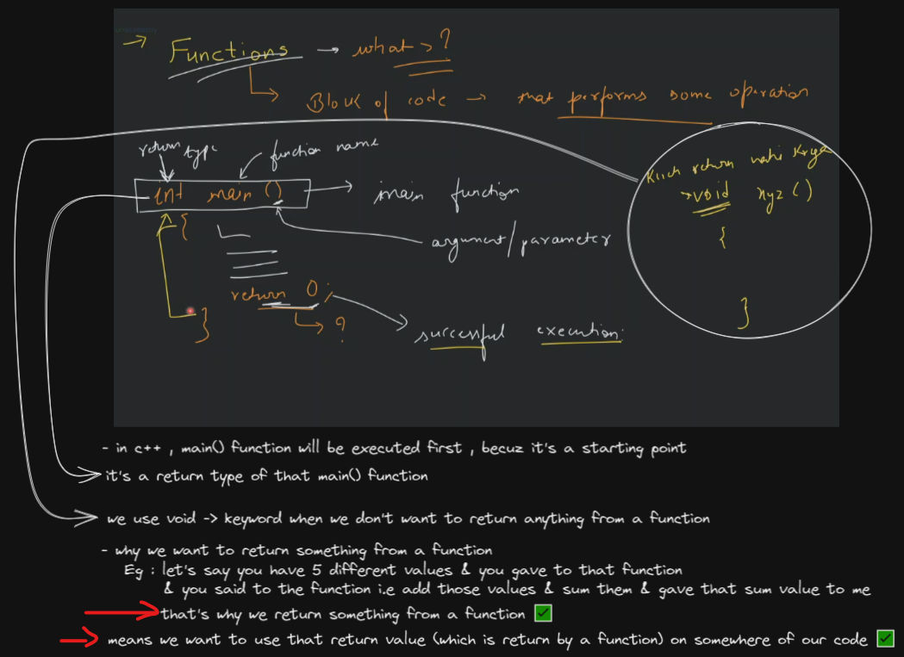
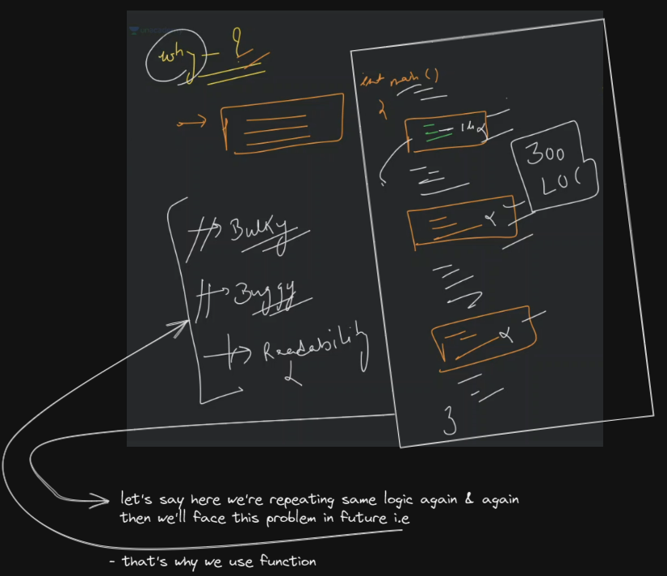
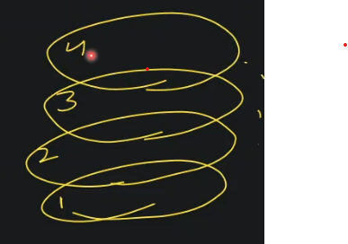
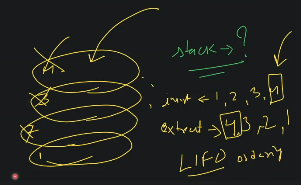
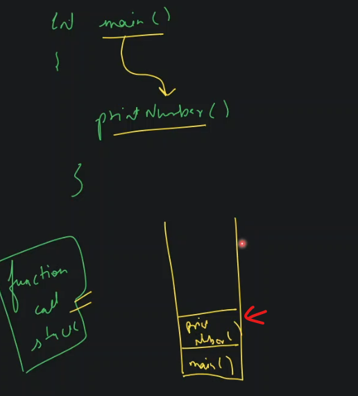
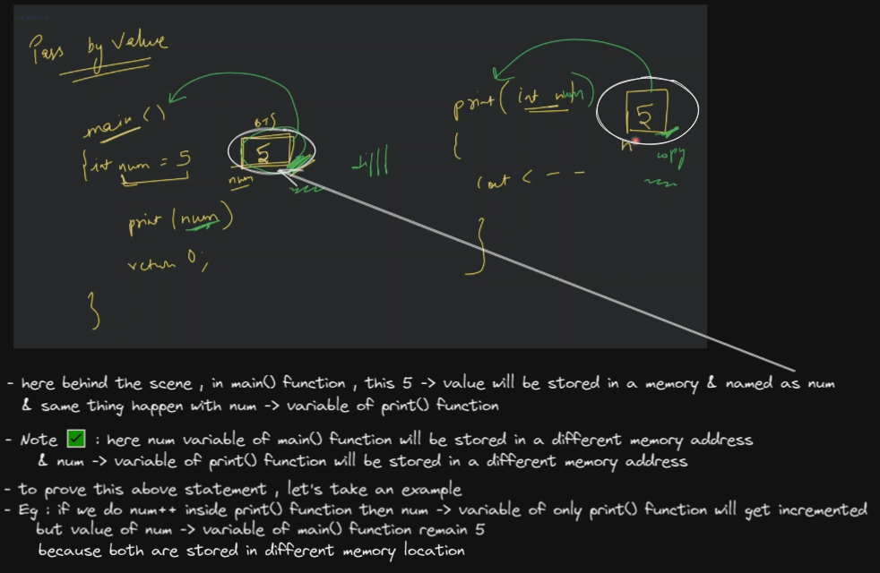
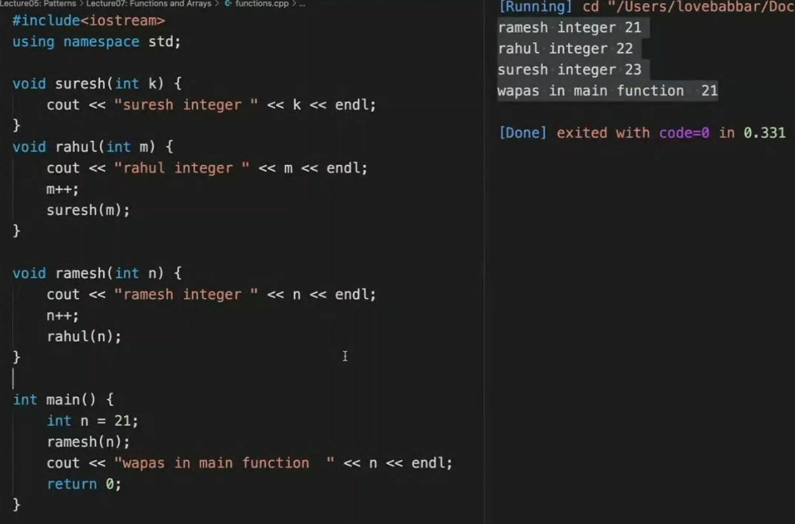
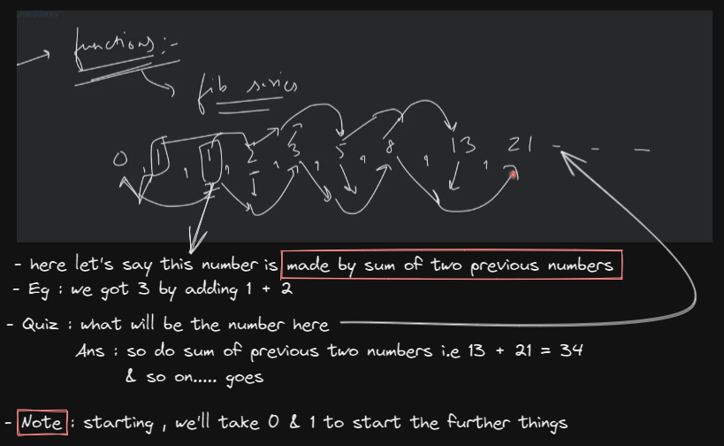
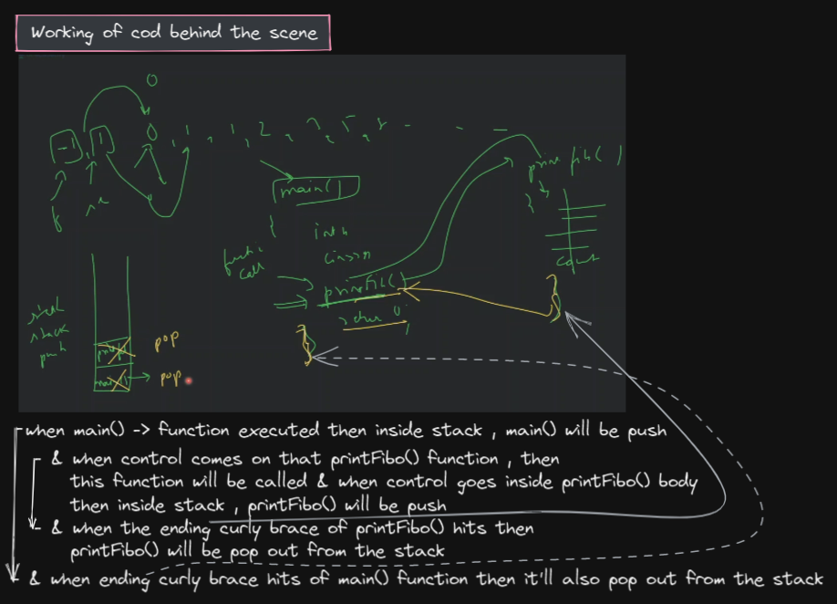
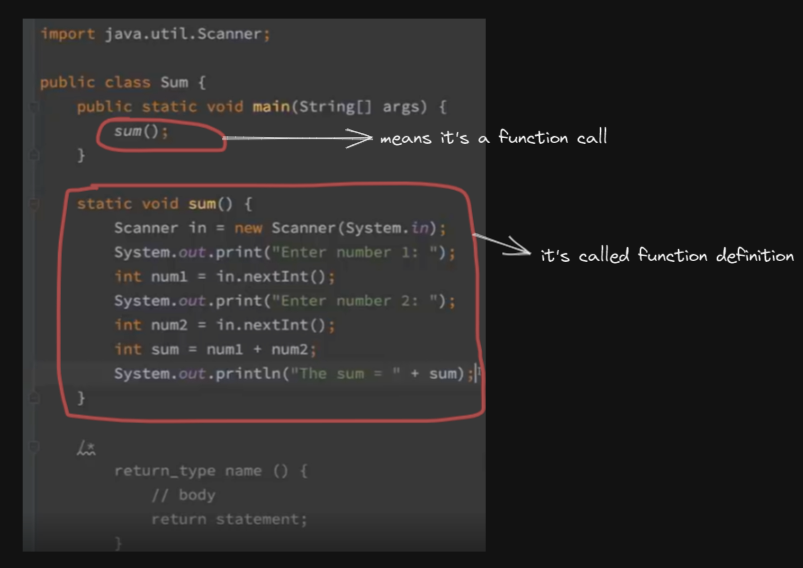

# functions in cpp

## lecture 6 - love babbar (paid course) - function

- function
    - about function & why we return the value from a function
        

    - why we use function 
        - avoid repetition
        - reuse
        - modular approach / code clean
        - save time
        - maintainability
        - easy to understand
        - easy testing
        - remove redundancy
        - readability
        

    - what is modular approach means in function
        - means different task we separated into their own function <br>
            & then we combine them into one function like a component in reactjs 
        - due to this readability increased

    - what is function call stack 💡
        - before knowing about it , first know about what is stack data structure 💡💡💡
            - let's take example of shaadi in order to understand stack ,
            - now there're many plates like this  
                
            - now when you take the plate , then first plate you'll pick i.e 4th one
            - so when plates were inserted like this first 1 then 2 then 3 , 4 , 5 <br>
                & when you extract/take then first plate will come 4 , 3 , 2 then 1 <br>
                so in stack that last one will be picked/extracted first i.e called LIFO (last in first out) orderly like this
                
        - how function call stack works 
            ```cpp
            void printNumber() {
                cout << "Haaaa";
            }

            int main() {
                printNumber()
            }
            ```
            - so we have the stack already i.e function call stack & inside of it , first main() function will be created inside of it 
            - now main() function is calling printNumber() function , so on top of the main() function <br>
                printNumber() function will be created like this 
                
            - now control will go inside printNumber() function body , now this function is just printing <br>
                so we'll get the message as a output 
            - now that ending curly braces of printNumber() function hit , then means printNumber() function is over <br>
                so printNumber() function will be pop out from function call stack 💡💡💡
            - now control goes inside main() function & the movement curly braces of main() function hit <br>
                then main() function will also pop out from the function call stack , now code is over

    - why we need arguments & parameters in a function - understanding it via analogy example  
        - Let' say we want to say function that print sum of 5 numbers <br>
            then we need to send/gave that 5 numbers , then that function able to give sum 
        - & how that function will give the result , it'll give the output via `return` statement
        - parameters are like input arguments , just like props concept in reactjs

    - pass by value & pass by reference ✅
        - pass by value
            
            - so here scope concept also come but in `pass by reference` concept , scope concept will not come
            - in pass by value , a variable's value will be get copied
            - & a memory block doesn't have name like `num` , a memory block has only attach with a address <br> 
                so here just assume that memory block has name as `num` 💡💡💡
            - keep `function call stack` concept in mind in order to understand the scope concept 💡
            - examples 
                ```cpp
                // pass by value
                #include <iostream>
                using namespace std;

                void printNumber(int num) {
                    num = 10 ;
                    cout << "Printing number" << num << endl;
                }

                int main() {

                    int num = 5;

                    // this is function call
                    printNumber(num) ;
                    
                    cout << "in main function" << num << endl;
                    return 0;
                }
                // output 
                    // Printing number 10
                    // in main function 5
                ```
                - another example 
                    
        - pass by reference
            - check array data structure

    - questions in function 
        - `1` : print all even number till n
        - `2` : print all squares till n
            - Eg : 1 , 4 , 9 , 16 , 25 , 36 <br>
                so 1^1 is 1 , 2^2 = 4 , 3^2 = 9 , 4^2 = 16 , 5^2 = 25 , 6^2 = 36 💡💡💡
            ```cpp
            void printSquares(int n) {
                for (int i = 1; i <= n; i++) {
                    cout << i*i << ", ";
                }
            }

            int main() {
                int n = 21;
                
                printSquares(n);
                return 0;
            }

            // Note : 
            /* 
                int main() {
                    int n = 21;
                    
                    printSquares(n);
                    return 0;
                }    

                void printSquares(int n) {
                    for (int i = 1; i <= n; i++) {
                        cout << i*i << ", ";
                    }
                }
                -- here we'll get error on this line ->  printSquares(n);
                    because we're calling the function before initialization/creating
            */
            ```
        - `3` : find factorial of n (eg : 5! = 5  * 4 * 3 * 2 * 1)
            ```cpp
            int getFactorial(int n) {
                int ans = 1; // here we took 1 , why not 0 ? because if we multiple 0 with any number we'll get 0
                    // that's why we didn't took 0
                    // & if we try to find factorial of 0 then we'll get 1 

                for (int i = n; i >= 1; i--) {
                    ans = ans * i;
                }

                return ans;
            }

            int main() {
                int n = 21 ;

                int fact = getFactorial(6);
                cout << fact << endl;
            }
            ```
            - Note : this code will only be able to find the factorial from 1 to 12 <br>
                but we'll get wrong output if we find 13 to any above number than 12 <br>
                because integer is getting overflow integer datatype has the range i.e `[-2^31, 2^31 - 1]` 💡💡💡 

    - Advice : 
        - to improve maths or programming , it's just about practice , so practice multiple questions as much as you can <br>
            then you'll be able to make it 
        - & don't mug it

    - Homework
        - pass by value , pass by reference & call by value , call by reference MCQs
            - do this from gfg/codestudio/interviewBit
            - https://www.codingninjas.com/codestudio/library/call-by-value-and-call-by-reference 
        - questions 
            - why return 0 , instead of return 1 inside the main() function : https://www.geeksforgeeks.org/return-0-vs-return-1-in-c
            - why we didn't use `void main() { }`, instead of `int main() {}`
                ```cpp
                void main() { 
                    // void means that , this function won't return anything 
                    // so we can write simply return; & that's it writing return -> keyword is optional
                }

                int main() {
                    // a function which as return type int 
                        // then means it'll return a value as int type
                        // that's why we need to write return -> keyword with 1 or 0 
                    return 0;
                }
                ```
                - https://www.geeksforgeeks.org/is-it-fine-to-write-void-main-or-main-in-c-cpp
            - can we put parameters inside `int main()` function & if we can then why we can  
    
    - so we understand what , why & how about function 👍

- Doubts in functions 
    - Question : fibonacci series/numbers ✅
        - understanding what is it
            
        - approach
            - `STEP 1` : we'll initialize 2 variables which store 0 & 1
            - `STEP 2` : then create loop from `1` to `<=n`
            - `STEP 3` : inside that loop , do addition of that first & second value like this 
                ```cpp
                void printFibonacci(int n) {
                    int first = 0;
                    int second = 1;

                    for (int i = 1; i <=n; i++) {
                        int sum = first + second
                        cout << sum
                    }
                }
                ```
            - `STEP 4` : now we want that first element to second element & second element to third element 
                - so code will be like this 
                    ```cpp
                    void printFibonacci(int n) {
                        int first = 0;
                        int second = 1;

                        for (int i = 1; i <=n; i++) {
                            int sum = first + second
                            cout << sum

                            // shifting the previous two values
                            first = second
                            second = sum
                        }
                    }
                    ```
                - so after getting the sum of 2 previous values then we shifted the value
            - `STEP 5` : running `n - 2` loop
                - 1st approach
                    ```cpp
                    void printFibonacci(int n) {
                        int a = 0;
                        int b = 1;
                        cout << a << " " << b << " " ;

                        for (int i=0; i<n-2; i++) {
                            int sum = a + b;
                            cout << sum << " ";
                            a = b;
                            b = sum;
                        }
                    }

                    int main() {
                        int n;
                        cout << "Enter the value of n" << endl;
                        cin >> n;

                        printFibonacci(n);

                        return 0;
                    }
                    ```
                - 2nd approach
                    ```cpp
                    void printFibonacci(int n) {
                        int a = -1;
                        int b = 1;
                        //cout << a << " " << b << " " ;

                        // here we didn't did n-2 because our first number is starting from -1
                        for (int i=0; i<n; i++) {
                            int sum = a + b;
                            cout << sum << " ";
                            a = b;
                            b = sum;
                        }
                    }

                    int main() {
                        int n;
                        cout << "Enter the value of n" << endl;
                        cin >> n;

                        printFibonacci(n);

                        return 0;
                    }
                    ```
                - this 2nd approach is better because easy to understand <br>
                    when we do `-1 + 1` , we'll get `0` & when we do `1 + 0` we'll get 1 💡💡💡
        - understanding code flow behind the scene 
            

## lecture 11 - kunal kushwaha YT

- in programming , there's a DRY concept , so that's why use functions 
    
- in C++ & java , whatever the return type of that function has , we'll return that return type from that function also
    - means if you're function has return type is int , then we should return only integer value also , not other datatype value 

