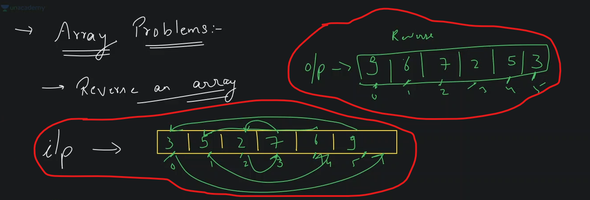
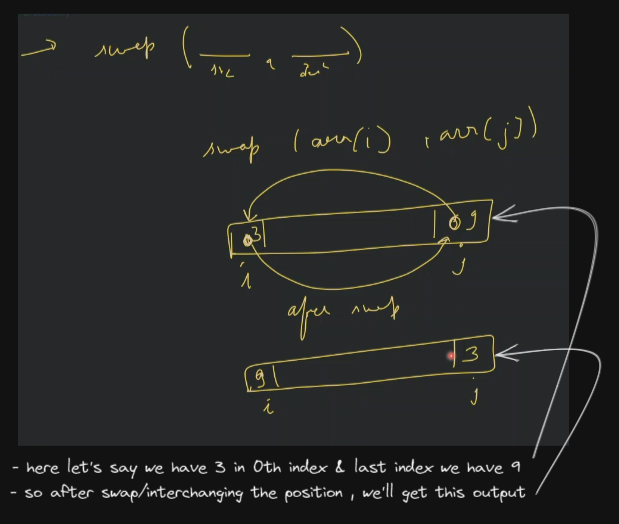
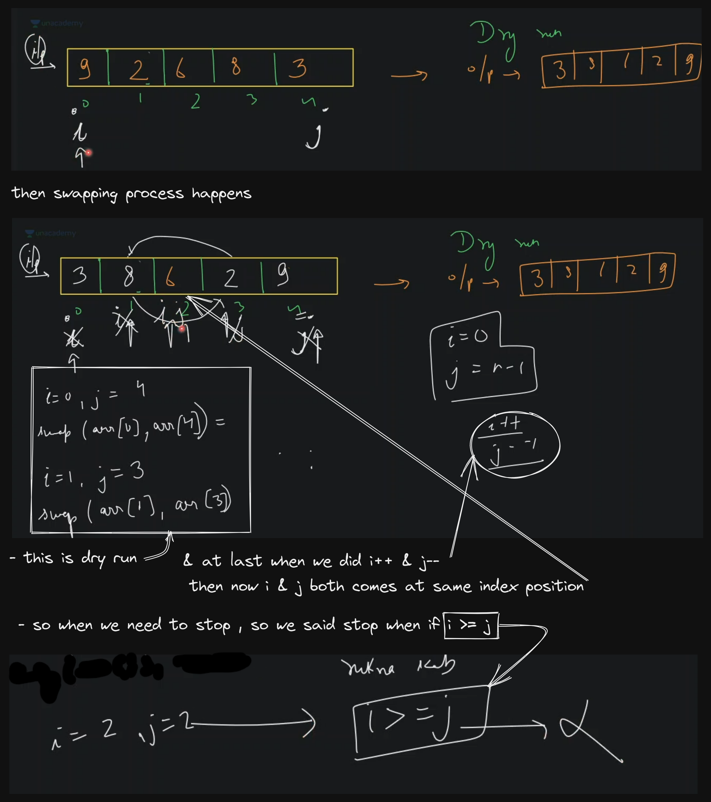
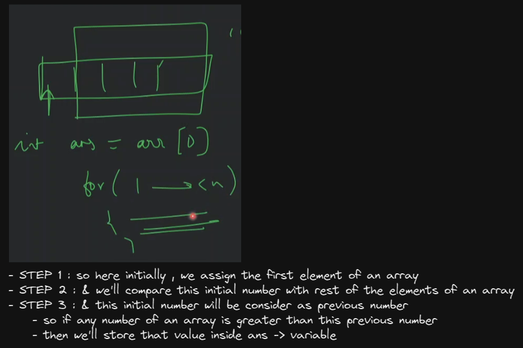
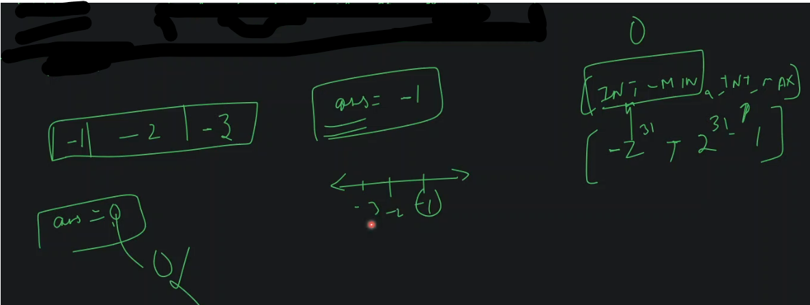
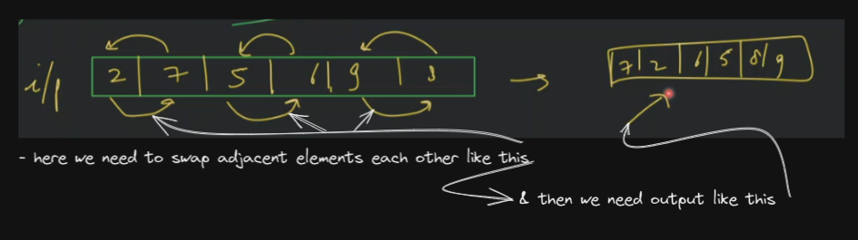

## Array problems - questions

## lecture 8 - love babbar (paid course) - Array problems 

- `2nd Ques` : reverse an array
    - understanding the question
        - input : `[3, 5, 2, 7, 6, 9]`
        - output : `[9, 6, 7, 2, 5, 3]`
        - here we're just changing the position of elements of an array like this
            
    - approach 
        - so let's say i putted `i` index at 0 index & `j` on last index i.e `n - 1` 
        - & now we just need to swap & we need to do this till `i < j` , so we need to run loop like this
            
    - code 
        ```cpp
        void reverseArray(int arr[], int n) {
            int i = 0 ;
            int j = n - 1;

            while(i < j) {
                swap(arr[i], arr[j]) ;
                i++ ; 
                j-- ;
            }
        }

        int main() {
            int arr[] = {3, 5, 2, 7, 6, 9}

            reverseArray(arr, 6)

            // print the array
            for (int i=0; i<arr.length; i++) {
                cout << arr[i] << " ";
            }

            cout << endl;
        }
        ```
    - what is swap ? <br>
        
        - we can also do swapping via `XOR` bitwise operator or we can use `+` & `-` arithmetic operator 💡
    - dry run code 💡💡💡
        
        - so here we can see that middle element doesn't get swapped & middle element stays on same place <br>
        - so we're just swapping elements together which are left & right side of that middle element
        - & let's say we don't have swap in-build function <br>
            then we can write the code like this
            ```cpp
            // swapping code
            int a = 2 ;
            int b = 3 ;
            int temp = a ;
            a = b ;
            b = temp;
            ```
        - & if we can do `i <= j` also in while condition <br>
            because that middle number will be swapped by itself , but it doesn't make any sense that's why we didn't did 💡💡💡 
    - Extra Question : 
        - `1` : find max number in an array ?
            - input : `[3, 12, 7, 18, 17, 16]`
            - O/p : 18
            - understanding 
                - initially , we'll assignment a min number in order to compare with each elements of an array like this
                    
                - but we can make our own max function like this
                    ```cpp
                    int getMax(int a, int b) {
                        if (a > b) {
                            return a;
                        } else {
                            return b;
                        }
                    }
                    ```
            - code 
                ```cpp
                                //   array      size of the array
                int getMaxFromArray(int arr[], int n) {
                    int ans = INT_MIN;

                    for (int i=0; i<n; i++) {
                        ans = max(ans, arr[i]) // max() function is a pre-defined function in c++
                    }

                    return ans;
                }

                int main() {
                    int arr[] = {3, 5, 7, 6, 9, 2, 5} ;

                    reverseArray(arr, 7);
                    cout << "Maximum value is " << getMaxFromArray(arr, 7) << endl ;
                }
                ```
                - if error `not defined` comes for `INT_MIN` then , just use `#include <limits.h>` <br>
                    before `using namespace std` statement
            - code dry run
                
                - so here we're doing linear search
            - Note : why we initialize `ans` variable as INT_MIN -> `int ans = INT_MIN` , ✅
                - because let's say if we take `0` then we're not able to check <br>
                    what if in array all numbers are in negative , then our answer will be `0` like this 💡💡💡
                    
                - so here max number is `-1` inside that array , so let's say if we initialize `ans = 0` 
                - then here in this situation i.e we have negative elements inside of an array <br>
                    then our answer gets wrong , that's why we're taking `INT_MIN` , instead of `0` or any number 💡💡💡
            - in c++ , integer has a range i. `-2^31` -> for INT_MIN & `2^31 - 1` for INT_MAX 💡💡💡 
        - `2` : find a min number from an array ?
            - what we need to change in code 
                - `STEP 1` : use `INT_MAX` for ans -> variable
                - `STEP 2` : change max() into min() function where we used it
            - code 
                ```cpp
                int getMaxFromArray(int arr[], int n) {
                    int ans = INT_MAX;

                    for (int i=0; i<n; i++) {
                        ans = min(ans, arr[i])
                    }

                    return ans;
                }

                int main() {
                    int arr[] = {3, 5, 7, 6, 9, 2, 5} ;

                    reverseArray(arr, 7);
                    cout << "Maximum value is " << getMaxFromArray(arr, 7) << endl ;
                }
                ```
        - `3` : swap alternate or adjacent elements of array
            - input : `[2, 7, 5, 6, 9, 8]`
            - O/P : `[7, 2, 6, 5, 8, 9]`
            - understanding 
                - let's say we have an array `[2, 7, 5, 6, 9, 8]`
                    
            - approach
                


