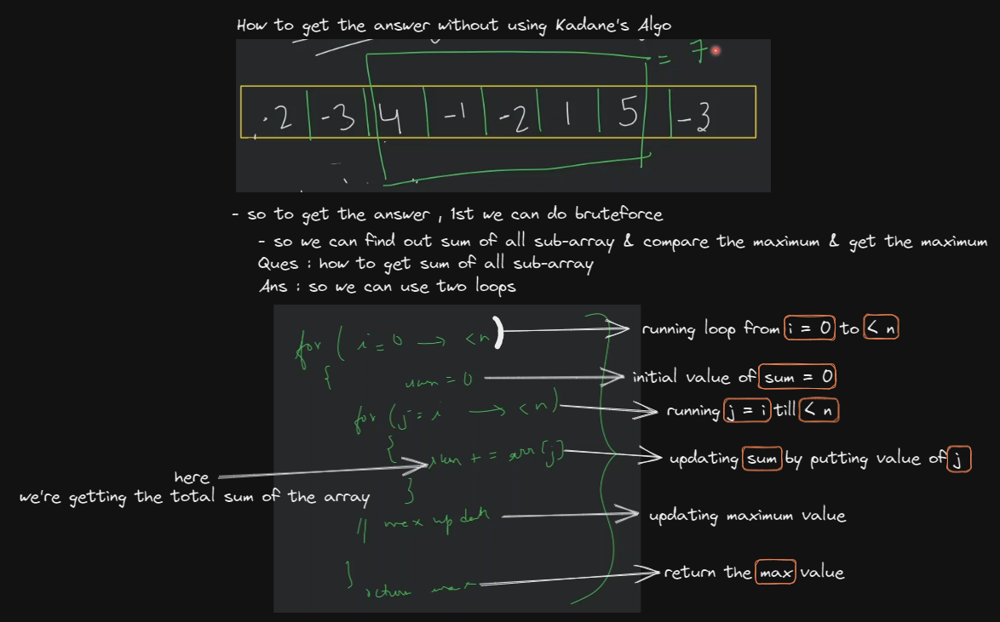

# Array problems - questions

## lecture 8 - love babbar (paid course) - Array problems 

- `2nd Ques` : reverse an array
    - understanding the question
        - input : `[3, 5, 2, 7, 6, 9]`
        - output : `[9, 6, 7, 2, 5, 3]`
        - here we're just changing the position of elements of an array like this
            
    - approach 
        - so let's say i putted `i` index at 0 index & `j` on last index i.e `n - 1` 
        - & now we just need to swap & we need to do this till `i < j` , so we need to run loop like this
            
    - code 
        ```cpp
        void reverseArray(int arr[], int n) {
            int i = 0 ;
            int j = n - 1;

            while(i < j) {
                swap(arr[i], arr[j]) ;
                i++ ; 
                j-- ;
            }
        }

        int main() {
            int arr[] = {3, 5, 2, 7, 6, 9}

            reverseArray(arr, 6)

            // print the array
            for (int i=0; i<arr.length; i++) {
                cout << arr[i] << " ";
            }

            cout << endl;
        }
        ```
    - what is swap ? <br>
        
        - we can also do swapping via `XOR` bitwise operator or we can use `+` & `-` arithmetic operator 💡
    - dry run code 💡💡💡
        
        - so here we can see that middle element doesn't get swapped & middle element stays on same place <br>
        - so we're just swapping elements together which are left & right side of that middle element
        - & let's say we don't have swap in-build function <br>
            then we can write the code like this
            ```cpp
            // swapping code
            int a = 2 ;
            int b = 3 ;
            int temp = a ;
            a = b ;
            b = temp;
            ```
        - & if we can do `i <= j` also in while condition <br>
            because that middle number will be swapped by itself , but it doesn't make any sense that's why we didn't did 💡💡💡 

- `3rd question` : 
    - `3.1 ques` : find max number in an array ?
    - input : `[3, 12, 7, 18, 17, 16]`
    - O/p : 18
    - understanding 
        - initially , we'll assignment a min number in order to compare with each elements of an array like this
            
        - but we can make our own max function like this
            ```cpp
            int getMax(int a, int b) {
                if (a > b) {
                    return a;
                } else {
                    return b;
                }
            }
            ```
    - code 
        ```cpp
                        //   array      size of the array
        int getMaxFromArray(int arr[], int n) {
            int ans = INT_MIN;

            for (int i=0; i<n; i++) {
                ans = max(ans, arr[i]) // max() function is a pre-defined function in c++
            }

            return ans;
        }

        int main() {
            int arr[] = {3, 5, 7, 6, 9, 2, 5} ;

            reverseArray(arr, 7);
            cout << "Maximum value is " << getMaxFromArray(arr, 7) << endl ;
        }
        ```
        - if error `not defined` comes for `INT_MIN` then , just use `#include <limits.h>` <br>
            before `using namespace std` statement
    - code dry run
        
        - so here we're doing linear search
    - Note : why we initialize `ans` variable as INT_MIN -> `int ans = INT_MIN` , ✅
        - because let's say if we take `0` then we're not able to check <br>
            what if in array all numbers are in negative , then our answer will be `0` like this 💡💡💡
            
        - so here max number is `-1` inside that array , so let's say if we initialize `ans = 0` 
        - then here in this situation i.e we have negative elements inside of an array <br>
            then our answer gets wrong , that's why we're taking `INT_MIN` , instead of `0` or any number 💡💡💡
    - in c++ , integer has a range i. `-2^31` -> for INT_MIN & `2^31 - 1` for INT_MAX 💡💡💡 
    - `3.2 ques` : find a min number from an array ?
        - what we need to change in code 
            - `STEP 1` : use `INT_MAX` for ans -> variable
            - `STEP 2` : change max() into min() function where we used it
        - code 
            ```cpp
            int getMaxFromArray(int arr[], int n) {
                int ans = INT_MAX;

                for (int i=0; i<n; i++) {
                    ans = min(ans, arr[i])
                }

                return ans;
            }

            int main() {
                int arr[] = {3, 5, 7, 6, 9, 2, 5} ;

                reverseArray(arr, 7);
                cout << "Maximum value is " << getMaxFromArray(arr, 7) << endl ;
            }
            ```
    - code to print min & max both from a function, then we can use pair in C++
        ```cpp
        pair<int, int> getMaxMinFromArray(int arr[], int n) {
        	int maxi = INT_MIN ;
        	int mini = INT_MAX ; 
        	
        	for (int i=0; i<n; i++) {
        		maxi = max(maxi, arr[i]) ;
        		mini = min(mini, arr[i]) ;
        	}
        	
        	pair<int, int> p = make_pair(maxi, mini) ;
        	return p;
        }
        ```

- `4th question` : swap alternate or adjacent elements of array
    - input : `[2, 7, 5, 6, 9, 8]`
    - O/P : `[7, 2, 6, 5, 8, 9]`
    - understanding 
        - let's say we have an array `[2, 7, 5, 6, 9, 8]`
            
    - approach
        
        - code approach
            
        - here wee took `i+1` i.e `i+1 < n` condition because let's say `i` is on last index of your array <br>
            & then we did `i + 1` which doesn't exist in the array & we're saying to do swap like this <br>
            then code will not work , so top stop the loop from moving forward that's why we used `i + 1 < n`
            
            
    - code 
        - 1st approach 
            ```cpp
            void swapAlternates(int arr[], int n) {
                int i = 0;

                while(i < n) {
                    if (i+1 < n) {
                        swap(arr[i], arr[i+1]) // using pre-defined swap() function in c++
                    }
                    i = i + 2;
                }
            }

            int main() {
                int arr[] = {3, 5, 7, 6, 9, 2, 5};

                swapAlternates(arr, 7);

                // print elements of the array
                for (int i=0; i<8; i++) {
                    cout << arr[i] << " " ;
                }

                return 0;
            }
            // output : 5 3 6 7 2 9 5
            ```
        - 2nd approach 
            ```cpp
            void swapAlternates(int arr[], int n) {
                int i = 0;

                while(i+1 < n) {
                    swap(arr[i], arr[i+1]) // using pre-defined swap() function in c++
                    i = i + 2;
                }
            }

            int main() {
                int arr[] = {3, 5, 7, 6, 9, 2, 5};

                swapAlternates(arr, 7);

                // print elements of the array
                for (int i=0; i<8; i++) {
                    cout << arr[i] << " " ;
                }

                return 0;
            }
            // output : 5 3 6 7 2 9 5
            ```
        - so here 3 & 5 swap each other & same happen with other adjacent elements <br> 
            but here `5` element doesn't have it's adjacent element , so it remain as it is 💡
        - both code approach is great but 1st approach is better to understand the logic
                
- `5 ques` : sort an array of 0's , 1's & 2's
    - what is sort
        - Eg : let's say you have numbers like `3, 5, 2, 1, 7`
        - so sorting means order , means put these numbers in increasing order or decreasing order 💡💡💡
        - so in increasing order , these numbers will be `1, 2, 3, 5, 7`
    - understand the question
        - let's say we have an array of combination of those 3 numbers `[1, 0, 2, 2, 0 , 1, 1]` <br>
            so let's say this is input -> `[1, 0, 2, 2, 0 , 1, 1]`
        - & we want output `[0, 0, 1, 1, 1, 2, 2]`
    - approach 
        
        - so actually those 3 variables , we made in order to count those no. of values <br>
            & after finding them , you put those no. of zeroes inside the array & so on with 1 & 2
        - problem with this code approach ✅
            - this code is not optimized , there's a concept i.e `three pointer approach` , so via this , we can optimized the code <br>
                we'll talk about optimize approach when we do sliding window & discuss about two pointer
            - let's say we don't know the numbers , so right now we're just taking about those 3 numbers <br>
                but if numbers grows like 50 numbers then this approach will not work 
            - you can use sorting technique instead of doing counter approach
        - another approach
            - we can use `sort() function` in c++ like this
                ```cpp
                int main() {
                    int arr[] = {1, 0, 2, 2, 0 , 1, 1}
                    int sizeOfArr = arr.length - 1; // here we can't write 7 -> as size , becuz it's hard coded value
                    sort(arr, sizeOfArr)
                    
                    for (int i=0; i<sizeOfArr; i++) {
                        cout << arr[i] << " " ;
                    }
                }
                ```
    - code 
        ```cpp
        void sortZeroOneTwo(int arr[], int n) {
            int one = 0; zero = 0; two = 0 ;

            // count all numbers
            for (int i=0; i<n; i++) { // traversing the complete array
                if (arr[i] == 0) 
                    zero++ ;
                else if (arr[i] == 1) 
                    one++ ;
                else 
                    two++ ;
            }

            int i = 0 ;
            // put zero
            while(zero--) { // here zero-- means zero != 0
                // means run the while till if zero != 0 & same with those 2 bottom while loop 💡💡💡


                arr[i] = 0; // saying put all the no. of zero inside the array
                    // here we don't need to worry about whether we're pushing 0 or 1 or 2 first
                    // see the code first we're pushing no. of zeroes 💡💡💡
                i++ ;
            } 

            // put one 
            while(one--) {
                arr[i] = 1;
                i++ ;
            }

            // put two 
            while(two--) {
                arr[i] = 2;
                i++ ;
            }
        }
        ```

- `Ques` : Check whether an array is palindrome or not
    - so we already did question i.e -> reverse an array , so here same approach we'll apply 💡💡💡
    - what is palindrome means
        - if you have an array , so when you read from `left to right` or `right to left` , then we'll get same answer
        - Eg : we have string "madam" , so if you read it from left to right or right to left , we'll get same output <br>
            so that is palindrome 
        - Eg : OYO , LOL, `DALDA` is not palindrome because first letter is `D` & last is `A`
    - understanding the question
        - Eg : we have `[1, 2, 3, 3, 2, 1]` , so if we traverse over it from left to right or right to left , we'll get same output <br>
            so this array is palindrome
    - approach 
        - we can divide this array `[1, 2, 3, 3, 2, 1]` into half
            
        - this code can run for characters also & for even + odd number also
    - code 
        ```cpp
        bool checkPalindrome(int arr[], int n) {
            // starting index
            int i = 0 ;
            // ending index
            int j = n - 1;

            // compare left half with right half
            while (i < j) {
                if (arr[i] == arr[j]) {
                    // if match , then check the remaining array
                    i++ ;
                    j-- ;
                }
                else {
                    // if no match , then return false
                    return false ;
                }
            }
            // entire array is traversed , so it's palindrome
            return false ;
        }

        int main() {
            int arr[] = {1, 2, 3, 3, 2, 1} ;
            
            cout << "Palindrome or not " << checkPalindrome(arr, 7) << endl ;

            return 0;
        }
        // output : Palindrome or not 1 -> here 1 means true
        // if we give {1, 2, 3, 3, 4, 2, 1} -> then we'll get output 0 -> which is false
        ```

- find union & intersection of 2 sorted arrays
    - what is union & intersection
        - Union : means unique elements , duplicate will be counted only as one time
    - understanding 
        - for finding UNION , in question , already mention that both arrays are sorted , so take 2 array 
            
        - the approach we used for finding UNION , there are faults
            - `1` : now let's say , in one of the array or both array , duplicate values exist <br>
                then in Union array , that duplicate value also come
                - so if we have duplicates inside an array & to check the previous element of an array <br> 
                    then we can do `i` is current index , to check previous , we can do `i - 1` 💡💡💡 <br>
                    then you can use condition i.e `i - 1 >= 0`
            - solution : we can use `set` in c++ , which used to gives the only unique values from duplicate values <br>
                we'll see about `set` when we do tree data structure
        - & same condition will goes with intersection
        - here question is not about unsorted array , so no need to worry about it
    - approach 
        - another way : we can use hashmap

- Homework Question 2 
    
    - in this every questions are very important 
    - Advice : tak hint , see editorial , see discussion forum , see other people's code , read article , take help of babbar bhaiya
    - in opposite side , question is can be done in that platform

- `Ques` : move all negative numbers to one side of array
    - understanding question
        - Eg : let's say we have array & that array contain positive as well as negative numbers `[3, -1, 2, -4, -6, -4, 5]` <br>
            so in input we have this array
        - we want output : `[-1, -4, -6, -4, 3, 2, 8]`
    - approach 
        - we can do sort , but if question say , we need to maintain the order then sort approach will not work <br>
            but question is just saying that we just need to put all negative numbers to one side then sort will work 
        - here we need to do swap via comparing negative with positive number
             <br>
            here we used only two pointer i.e `i` & `j` , so kind-of we can say two pointer approach
        - & if first element is a negative number then both `arr[i]` & `arr[j]` will be swapped itself <br>
            because let's say both i & j are -1 then both will be swapped by itself 💡💡💡
        - doubts
            - what is sub-array ? 💡💡💡
                - means inside an array , we're telling from this range to this i.e sub-array
                - example of sub array
                
            - what is sub-sequence in array ? 💡💡💡
                
            - what is pair in c++ 
                - Eg : `pair<int, int> p = make_pair(1,2) ;`
                - means inside one block of memory , we can put 2 values at the same time <br>
                    & that memory named as `p` , 1st block is called first & 2nd block is called second <br>
                    first block contain `1` value second block contain `2` value like this 
                    
                - so we can make pair of two different datatype like this `pair<int, char>`
                - this we'll see in STL
            - what is vector ? 
                - we learned about array , so vector is like array <br>
                    but vector concept comes in dynamic array
                - Eg : let's say we have array of 4 size & the moment size of the array gets full <br>
                    then size of that array gets doubled & let's say again that size of array fulled <br>
                    then dynamically , size of array again gets doubled 💡💡💡

- `Ques` : find duplicate in an array of (N+1) integer ? 
    - understanding the question
        - Eg : let's say you have an array as a input `[1, 2, 3, 3, 4]` 
            
    - approach
        - another example
            
        - so how they're cutting <br>
            - for input array : so basically we get the sum of each elements of an input array 
            - for that another array : eg : we already did in maths , so let's say we have `1, 2, 3, 4 ...... N` <br> 
                & we need to find the sum of it , so we can do `(n * (n + 1)) / 2` , so we'll get sum individually of both array    
            - & we'll get answer by doing `ans = sum1 - sum2`
        - code approach
            
            - we can't find duplicate if we have `[2, 2, 2, 2, 2]` because this question is saying <br>
                values always from 1 to N & only any one number will repeat , so this input array is wrong
        - fault on this code approach
            - if `sum > range` then we'll get error , so range of integer we already know 

- `Ques` : Kadane's Algo `google | very most imp` 🔥
    - what is Kadane ? 
        - Kadane means largest sum contiguous sub-array
        - & we already know what is sub-array
    - understanding
        - so we need to find max sum from a sub array
        
    - approach
        - what is brute-force  
            - means time consuming way
            - very basic way or adhoc way
            - not optimize solution based on time & space complexity 
        - approach without using kadane's algo i.e called brute-force
            
            - means find sum of every sub-array like this 
                ```
                find every sub-array
                    - sum1 
                    - sum2 
                    - sum3 
                    - sum4

                - & then find the largest/maximum from these different sum 
                ```
        - approach via Kadane's algo
            - this game over in 3 conditions
            - so to optimize , let's say we want to do single traversal , so here comes kadane's Algo ✔️
            - how Kadane algo works ✅
                
        - code 
            ```cpp
            #include <limits.h>
            int getMaxSubarraySum(int arr[], int n) {
                int ans = INT_MIN ; // means maxSF or max_so_far
                int maxAbtak = 0 ; // means maxEH or max_ending_here

                for (int i=0; i<n; i++) {
                    // include current element
                    maxAbtak = maxAbtak + arrp[i] ;

                    // update the ans
                    ans = max(ans, maxAbtak) ;

                    // if max ending hre is 0, them don't include
                    if (maxAbtak < 0) {
                        maxAbtak = 0;
                    }
                }
                return ans;
            }

            int main() {
                int arr[] = {-2, -3, 4, -1, -2, 1, 5, -3} ;

                cout << "Max Subarray sum is " << getMaxSubarraySum(arr, 8) << endl;

                return 0;
            } 
            // output : Max Subarray sum is 7
            ```
            - so here we just used 3 conditions to solve this problem
        - code DRY RUN explanation via kadane's algo ✅
            - so we need largest sum of a sub-array from an array
                
                - Note : why we're doing 2nd step i.e `ans = max(INT_MIN, sum)` ✅ 
                    - because in each window , we're getting update value of `sum`
                    - so we need to track which one is maximum answer <br>
                        just like we find the max number from an array & we check again & again <br>
                        so same here we're doing to track 💡💡💡
            - DRY RUN steps 
                
    - homework : kadane's algo 
        - read article (GFG) , why we made this algo , how to use kadane's algo
        - alternative of kadane's algo , different optimization 
            

- `Notes ✅`: what kind-of questions can be formed on array : 
    - related to maths , how to find whether that question using kadane's algo or not , searching , sorting , bit manipulation , 2D array , sliding window , etc...

- after doing all those questions , then we're done with 25+ questions on array