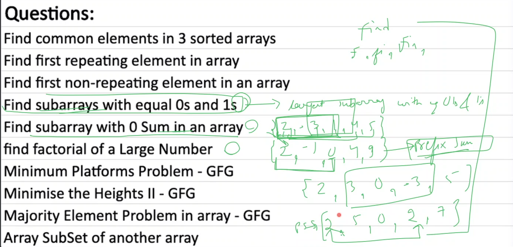

# Array problems - questions

## lecture 9 - love babbar (paid course) - Array problems + time + space complexity
  
- array homework questions
    
    - `ques` : find subarrays with equal 0s and 1s `difficult one | good ques`  
        but before doing this question , first we need to do question i.e largest sub-array with equal 0s and 1s 
    - `ques` : `find sub-array with 0 sum in an array` 
        - understanding 
            - situation when we if have `0` at starting index 
                - an array contain negative or positive numbers or both like this `[2, -3, 1, 4, 5]`
                - if we find the `prefix sum` , so to get the `prefix sum` these are the steps 
                    - like this first element comes as it is in 0 index 
                    - if we do 2 + (-3) = -1 , so we'll get `[2, -1]` 
                    - now if we add 2 + (-3) + 1 = 2 + (-2) , then we'll get 0 , so `[2, -1, 0]`
                    - again, we take elements from input array like this 2 + (-3) + 1 + 4 , so we'll get 4 , so `[2, -1, 0, 4]`
                    - & now , we'll take elements from input array i.e 2 + (-3) + 1 + 4 + 5 , so we'll get `[2, -1, 0, 4, 9]`
                - now we got the prefix sum i.e `[2, -1, 0, 4, 9]` ,  
                    so now we can see , here we got the `0` , so when we did sum from 2 to 0 i.e 2 , -1 & 0 ,  
                    which means we're getting `0` , so we'll print this much array elements i.e `[2, -1, 0]`
                - conclusion : this question is based on prefix sum  
                - what is `prefix` means ? 
                    - Eg : let's say you have a string "find"  
                    - so prefix will be `f` - this is 1st prefix , `fi` - 2nd prefix , `fin` - 3rd prefix & so on... 
            - let's understand when we have `0` in the middle
                - Eg : `[2, 3, 0, -3, 5]`
                - so here you can see that part of input array i.e `[3, 0, -3]` is creating `0` sub-array
                - so prefix sum of that input array will be like this `[2, 5, 0, 2, 7]`  
                    here we can see that there's one number is repeating i.e `2` 
                - so when any number is repeating 2 times then means middle elements is giving 0 sum i.e `[2, 5, 0, 2]`
            - conclusion : there are 2 cases
                - if you get the `0` then that index block (which has `0`) is the 0 sum  
                    or if any number is repeating 2 times , then middle of them is the `0` sub-array sum
                - so complete logic is dependent on prefix sum
    - `Ques` : find factorial of a large number `Imp ques 🔥`
        - understanding 
            - by solving this problem we can find the factorial of any bigger number like 100  
                previously , we wrote the code to find the factorial but it's only able to find till 12  
                but when we try to find factorial of `13!` then we got integer out of range error 
            - Eg : if we find factorial of `100` then total digits in 100 i.e 158 digits & this can't be handle by integer datatype  
                so that's why we use array to find the factorial
        - approach : how to find factorial of large number by using array
            
            - little bit more explanation
                
                - here we're just multiplying 
            - doubts :
                - what we're doing inside the array ? : we're just storing `2187` output as single digit  
                    in each block of the array . so actually , we're storing the value of `digit` variable inside the array 💡💡💡
    - `Ques` : find common elements in 3 sorted arrays
        - understanding
            - let's say we have 3 different arrays
            - so first , we can find intersection of first 2 arrays & whatever the answer we got  
                with that answer & 3rd array , we'll find the intersection 
    - `Ques` : find first repeating element in array
        - understanding 
            - you can do this question via using hashmap
    - `Ques` : find first non-repeating element in an array
        - understanding 
            - you can do this question via using hashmap
    - `Ques` : minimum platforms problem - GFG
        - understanding 
            - you can do this question via doing sort & then do count
    - `Ques` : minimum the heights 2 - GFG
        - understanding 
            - here this question will be solved after finding a formula
    - `Ques` : majority element problem in array - GFG
        - understanding 
            - this is sliding window question
    - `Ques` : array subset of another array or not 
        - understanding 
            - this will be done by using hashmap & right now we only know 2 things to do with hashmap i.e insert & extract/get things

- Advice + tips + doubt session
    - if you're taking 2-3hr in `find subarrays with equal 0s and 1s` question then it's fine becuz it's difficult & it's good ques  
        & this question `majority element problem in array - GFG` is little bit difficult & every question are easy
    - & all those i.e   
        
        - these will take 6-7hrs
    - maintain the standard i.e 
        - easy ques : give 30min (after that , take hints)
        - medium ques : 1hr
        - hard level : 12-13hr
        - this should be target of per day & you have to do 3-4 or 6-8 questions daily
    - Advice : giving too much time on question to optimize the time complexity ? what to do
        

- Advice : based on story
    - a girl right now BTech CS , 4th year & did little bit DSA 
    - problem she is facing
        - 1 : consistency becuz already doing internship 9 to 6 , so how to take out the time
            - ans : 400 - 500 questions is a good target
                - in reality , means you should do `300` questions of good better variety questions of different topics
                - you can do 450 questions cracker sheet
        - 2 : she know approach means did standard algo eg : kadane's algo
            - so she think this algo work on sub-array
            - & when she pick different question & she got to know that the question is based on sub-array  
                & she's mind say that question can be done via kadane's but kadane's algo doesn't able to apply ,  
                due to this , time waste happen 
            - Ans : inside sub-array questions , majority questions related to sliding window
                - check love babbar YT channel to know what're the types of questions
        - 3 : off-campus company gave 4 questions & complete in 1:50 hr
            - 2 ques - easy & 2 ques : hard
            - how much time you take to complete easy questions
                - she said 20 minutes & you did too much practice
            - Ans : easy questions means you should complete in 3 - 5 min with implementation
                - so if you're taking 20min , then you need much more practice
                - if you're writing `Dijkstra algo` then you'll stuck
                - let's say you know kadane's , topological , Dijkstra ,  
                    so if you know something then you shouldn't take more than 2-3min with implementation
                    - if you're taking 15min then means you're trying to recall in your mind which is bad 💡💡💡
    - easy means : you'll understand the questions in 5min & solve 2-5min  
        medium means : take time in understanding but implement in 2-10 min  
        hard questions : take 15-25min with implementation 
        - & if you're not able to do in that time based on difficulty level of questions   
            then so practice daily + do weekly contest
    - Advice : power of basics/foundation
        - love babbar did C++ & android in java & when he placed in amazon then he don't know webdev = 0  
            so by learning & doing he able to know 
            - because you're basics are very strong
        - bhaiya said there's one guy who was doing work on C++ & his basics are very strong  
            right now he's managing department of the ML of instagram

- note : about hashmap data structure ✅
    - we can store data in key value pairs inside hashmap data structure
    - & when we get the value of that key then time complexity is O(1) always 
    - article about hashmap : https://www.geeksforgeeks.org/internal-working-of-hashmap-java/

