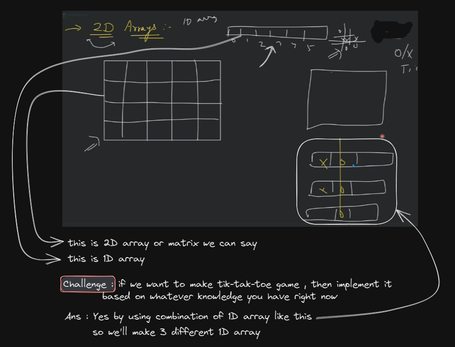
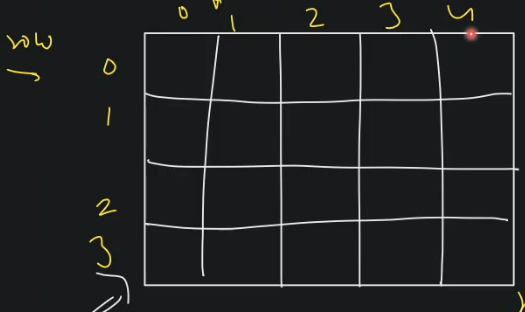
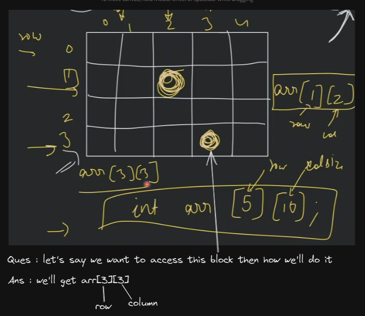
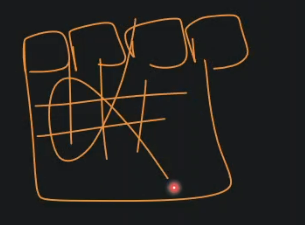
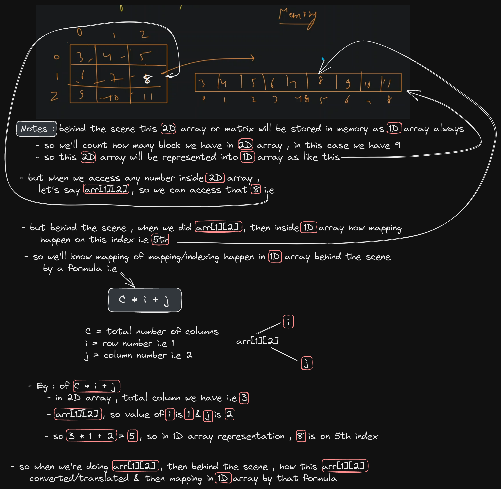
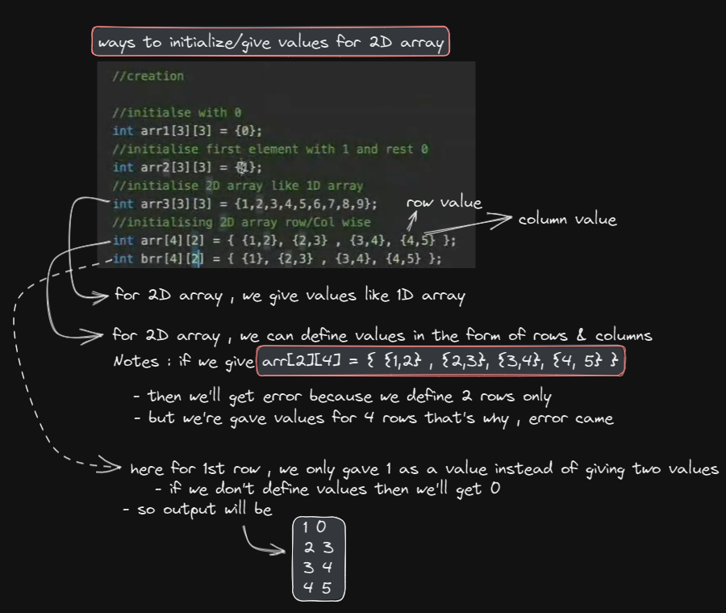

# Two Dimensional Array

## lecture 10,-,,lo,ve babbar (paid course) - 2D array

- what is 2D array & why we need it 
    - what is 2D array 
        
    - why we need 2D array instead of 1D array
        - right now we just made matrix of `3 row X 3 column`  
        - now let's say , we need 1000 rows & 1000 columns , so will you write code 1000 times <br> 
            so here we can use 2D array

- how to visualize 2D array or matrix in 1D array
    - so if we do via combination of 1D array then becomes difficult to visualize <br>
        so actually we want that , we solved the question in 2D array & behind the scene things done in 1D array
    - so we can do `int arr[5][10];` means `[5]` is row & `[10]` is column , <br>
        `Notes ✅` : first we access row & then column 💡💡💡 , rows are in horizontal & columns are vertical 💡💡💡<br>
        so we created 2D array based on this one line of code
    - `Ques` : make 1000 rows & 1000 columns
        - ans : `int arr[1000][1000];`
    - index will start from `0` whether it's a row or a column in 2D array also , same as we're doing in pattern question like this
        
        

- how 2D array is stored in memory 
    - in memory , there's are blocks in linear or continuous stream of block , it's not like this <br>
        
    - `imp Note 🔥` : when we do `arr[1][2]` in 2D array , 
        - then how `arr[1][2]` is translated & mapping with 1D array behind the scene
        
        
- while doing code , we'll see these points
    - creation of 2D array or matrix 
    - how to access a block of 2D array or matrix 
    - create a function for simple 2D operation

- creation of 2D array or matrix
    ```cpp
    int arr[3][3] ; // no error will come if we do this 
    ```
    - printing elements of 2D array which has no value like this
        ```cpp
        int main() {
            
            // creation
            int arr[3][3] ;
            int n = 3;
            
            // print entire 2D matrix
            for (int i=0; i<n; i++) {

                //for entire row
                for(int j=0; i<n; j++) {
                    cout << arr[i][j] << " " ;
                }
                cout << endl;
            }

            return 0;
        }

        // output : garbage value we'll get because inside 2D array there's no value 
            // garbage means anything
        ```

- insertion values inside 2D array
    ```cpp
    int main() {
        
        // creation
        int arr[3][3] ;
        int n = 3;
        
        // input 
        for(int i=0; i<n; i++) {

            // for entire row
            for(int j=0; j<n; j++) {
                cin >> arr[i][j] ;
            }
        }

        // print entire 2D matrix
        for (int i=0; i<n; i++) {

            //for entire row
            for(int j=0; i<n; j++) {
                cout << arr[i][j] << " " ;
            }
            cout << endl;
        }

        return 0;
    }
    // we gave this input 
        // 123
        // 321
        // 443
    
    // output : 
        // 123
        // 321
        // 443
    ```
    - putting `0` value inside 2D array
        ```cpp
        int main() {
            
            // creation
            int arr[3][3] = {0} ;
            int n = 3;
            
            // print entire 2D matrix
            for (int i=0; i<n; i++) {

                //for entire row
                for(int j=0; i<n; j++) {
                    cout << arr[i][j] << " " ;
                }
                cout << endl;
            }

            return 0;
        }

        // output : if we give only 0 as a value then we'll get 0 value everywhere inside that 2D array
            // 0 0 0
            // 0 0 0
            // 0 0 0

        // but if we do this -> int arr[3][3] = {1} ;
            // then we'll get 1 only in 1st row & 1st column as a output & everything will be 0 like this
            // 1 0 0
            // 0 0 0
            // 0 0 0
        ```

- different ways to define values/elements inside 2D array
    

- `Ques` : find the target value inside 2D array
    - target value = 13
    - output : return true or false
    ```
    5 1 3
    4 6 8
    10 9 11
    ```
    - understanding 
        - here we need to do linear search 
        - so time complexity will be O(n^2) because we have the exact value presented
    - code 
        ```js
        function checkTargetValue(targetValue) {
            let isTargetValue ;

            let arr[3][3] = [
              [5, 1, 3],
              [4, 6. 8],
              [10, 9, 11],
            ]

            for (let i=0; i < arr.length; i++) {
                for (let j=0; j < arr.length; j++) {
                    if (targetValue === arr[i][j]) {
                        isTargetValue = true
                    } else {
                        isTargetValue = false
                    }
                }
            }

            return isTargetValue
        }

        console.log(checkTargetValue(13))
        ```
        - C++ code
            ```cpp
            bool search(int arr[4][2], int target, int row, int col) {
                for (int i=0; i<row; i++) {

                    // for each row
                    for (int j=0; j<col; j++) {
                        if (arr[i][j] == target) {
                            return true ;
                        }
                    }
                }

                // complete 2D array traversed & target nahi mila
                return false;
            }
            
            int main() {
                int arr[4][2] = { {1,2}, {2, 3}, {3, 4}, {4, 5} } ;

                cout << "searching 13 -> " << search(arr, 5, 4, 2) << endl;
                cout << "searching 5 -> " << search(arr, 5, 4, 2) << endl;

                return true ;
            }

            // output : searching 13 -> 0 
                // 0 -> means false
             
            // output : searching 5 -> 1 
                // 1 -> means true
            ```
            - `Note ✔️` : if we do this `bool search(int arr[][], int target, int row, int col)`
                - here we while calling this function , we're didn't define size of row & column inside the `arr`
                - so we'll get the error i.e incomplete array
            - `Note ✔️` : if we give only column like this `bool search(int arr[][2], int target, int row, int col)`
                - then we'll get the proper output 
            - `Note ✔️` : if we give only row size like this `bool search(int arr[4][], int target, int row, int col)`
                - then we'll get error
            - conclusion : 
                - so basically , at-least we need to tell size/value of the column if we're not define size of row <br>
                    then we'll get proper output ✔️✔️✔️
            - `reason` : what benefit if we do this `int arr[][sizeOfColumn]` & why do we need 
                - when we're learning about pass by value & pass by reference 
                - then in pass by reference , when we pass 1D array without size as parameter of a function <br>
                    like this `function print(int arr[])` , 
                - then whole array will not be copied , only base address of that array will be copied 💡💡💡
                - why we didn't define the size of the array here `function print(int arr[])`
                    - 
                 
