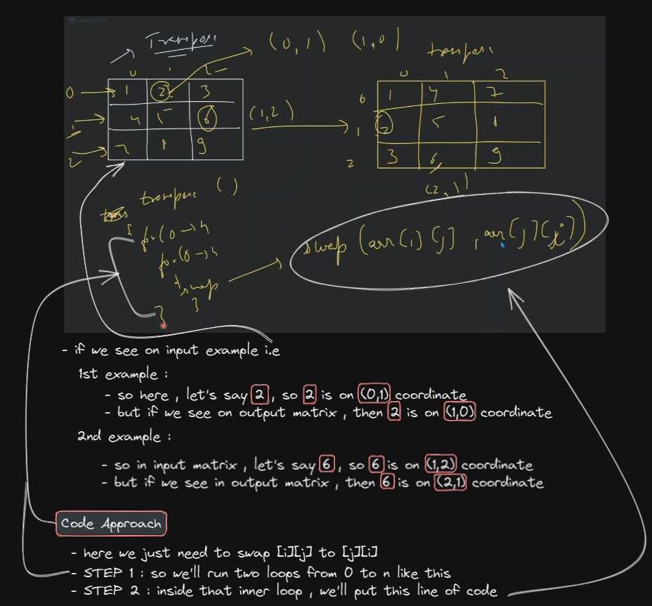

# Two Dimensional Array

## lecture 10 - love babbar (paid course) - 2D array

- what is 2D array & why we need it 
    - what is 2D array 
        
    - why we need 2D array instead of 1D array
        - right now we just made matrix of `3 row X 3 column`  
        - now let's say , we need 1000 rows & 1000 columns , so will you write code 1000 times <br> 
            so here we can use 2D array

- how to visualize 2D array or matrix in 1D array
    - so if we do via combination of 1D array then becomes difficult to visualize <br>
        so actually we want that , we solved the question in 2D array & behind the scene things done in 1D array
    - so we can do `int arr[5][10];` means `[5]` is row & `[10]` is column , <br>
        `Notes ✅` : first we access row & then column 💡💡💡 , rows are in horizontal & columns are vertical 💡💡💡<br>
        so we created 2D array based on this one line of code
    - `Ques` : make 1000 rows & 1000 columns
        - ans : `int arr[1000][1000];`
    - index will start from `0` whether it's a row or a column in 2D array also , same as we're doing in pattern question like this
        
        

- how 2D array is stored in memory 
    - in memory , there's are blocks in linear or continuous stream of block , it's not like this <br>
        
    - `imp Note 🔥` : when we do `arr[1][2]` in 2D array , 
        - then how `arr[1][2]` is translated & mapping with 1D array behind the scene
        
        
- while doing code , we'll see these points
    - creation of 2D array or matrix 
    - how to access a block of 2D array or matrix 
    - create a function for simple 2D operation

- creation of 2D array or matrix
    ```cpp
    int arr[3][3] ; // no error will come if we do this 
    ```
    - printing elements of 2D array which has no value like this
        ```cpp
        int main() {
            
            // creation
            int arr[3][3] ;
            int n = 3;
            
            // print entire 2D matrix
            for (int i=0; i<n; i++) {

                //for entire row
                for(int j=0; i<n; j++) {
                    cout << arr[i][j] << " " ;
                }
                cout << endl;
            }

            return 0;
        }

        // output : garbage value we'll get because inside 2D array there's no value 
            // garbage means anything
        ```

- insertion values inside 2D array
    ```cpp
    int main() {
        
        // creation
        int arr[3][3] ;
        int n = 3;
        
        // input 
        for(int i=0; i<n; i++) {

            // for entire row
            for(int j=0; j<n; j++) {
                cin >> arr[i][j] ;
            }
        }

        // print entire 2D matrix
        for (int i=0; i<n; i++) {

            //for entire row
            for(int j=0; i<n; j++) {
                cout << arr[i][j] << " " ;
            }
            cout << endl;
        }

        return 0;
    }
    // we gave this input 
        // 123
        // 321
        // 443
    
    // output : 
        // 123
        // 321
        // 443
    ```
    - putting `0` value inside 2D array
        ```cpp
        int main() {
            
            // creation
            int arr[3][3] = {0} ;
            int n = 3;
            
            // print entire 2D matrix
            for (int i=0; i<n; i++) {

                //for entire row
                for(int j=0; i<n; j++) {
                    cout << arr[i][j] << " " ;
                }
                cout << endl;
            }

            return 0;
        }

        // output : if we give only 0 as a value then we'll get 0 value everywhere inside that 2D array
            // 0 0 0
            // 0 0 0
            // 0 0 0

        // but if we do this -> int arr[3][3] = {1} ;
            // then we'll get 1 only in 1st row & 1st column as a output & everything will be 0 like this
            // 1 0 0
            // 0 0 0
            // 0 0 0
        ```

- different ways to define values/elements inside 2D array
    

- `Ques` : find the target value inside 2D array
    - target value = 13
    - output : return true or false
    ```
    5 1 3
    4 6 8
    10 9 11
    ```
    - understanding 
        - here we need to do linear search 
        - so time complexity will be O(n^2) because we have the exact value presented
    - code 
        ```js
        function checkTargetValue(targetValue) {
            let isTargetValue ;

            let arr[3][3] = [
              [5, 1, 3],
              [4, 6. 8],
              [10, 9, 11],
            ]

            for (let i=0; i < arr.length; i++) {
                for (let j=0; j < arr.length; j++) {
                    if (targetValue === arr[i][j]) {
                        isTargetValue = true
                    } else {
                        isTargetValue = false
                    }
                }
            }

            return isTargetValue
        }

        console.log(checkTargetValue(13))
        ```
        - C++ code
            ```cpp
            bool search(int arr[4][2], int target, int row, int col) {
                for (int i=0; i<row; i++) {

                    // for each row
                    for (int j=0; j<col; j++) {
                        if (arr[i][j] == target) {
                            return true ;
                        }
                    }
                }

                // complete 2D array traversed & target nahi mila
                return false;
            }
            
            int main() {
                int arr[4][2] = { {1,2}, {2, 3}, {3, 4}, {4, 5} } ;

                cout << "searching 13 -> " << search(arr, 5, 4, 2) << endl;
                cout << "searching 5 -> " << search(arr, 5, 4, 2) << endl;

                return true ;
            }

            // output : searching 13 -> 0 
                // 0 -> means false
             
            // output : searching 5 -> 1 
                // 1 -> means true
            ```
            - `Note ✔️` : if we do this `bool search(int arr[][], int target, int row, int col)`
                - here we while calling this function , we're didn't define size of row & column inside the `arr`
                - so we'll get the error i.e incomplete array
            - `Note ✔️` : if we give only column like this `bool search(int arr[][2], int target, int row, int col)`
                - then we'll get the proper output 
            - `Note ✔️` : if we give only row size like this `bool search(int arr[4][], int target, int row, int col)`
                - then we'll get error
            - conclusion : 
                - so basically , at-least we need to tell size/value of the column if we're not define size of row <br>
                    then we'll get proper output ✔️✔️✔️
            - `reason` : what benefit if we do this `int arr[][sizeOfColumn]` & why do we need 
                - when we're learning about pass by value & pass by reference 
                - why we didn't define the size of the array here `function print(int arr[])`
                    - because in pass by reference , when we pass 1D array without size as parameter of a function <br>
                        like this `function print(int arr[])` , 
                    - then whole array will not be copied , only base address of that array will be copied 💡💡💡
                    - & if we update any values inside the array then , that same array will be updated                 

- how to pass 2D array as a parameter inside 
    - there are 3 ways but major we have 2 ways i.e 
        - 1st way : `func getData(int arr[3][5])` 
        - 2nd way : `func getData(int arr[][5])` -- defining size of the column is mandatory

- `Ques` : print column wise sum by using 2D array
    - understanding + approach
        
        - so ultimately output will be `[15, 14, 20, 5]`
        - `Ques` : after finding column wise sum , then print the max column wise sum , eg : 20 is maximum
    - code 
        ```cpp
        void colSum(int arr[4][5], int row, int col) {
            for (int i=0 ; i<col; i++) {

                // for each col
                int sum = 0 ; 
                for (int j=0; j<row; i++) {
                    sum = sum + arr[i][j] ;
                }
                cout << sum << " " ;
            }
            cout << endl;
        }

        int main() {
            // arr
            int arr[4][2] = { {1,2}, {2,3}, {3,4}, {4,5} } ;
            colSum(arr, 4, 3) ;
        }

        // output : 8 12
        ```
        - so we're getting wrong answer , brainstorming & dry run why we're getting wrong answer 
            
        ```cpp
        void colSum(int arr[4][5], int row, int col) {
            for (int i=0 ; i<col; i++) {

                // for each col
                int sum = 0 ; 
                for (int j=0; j<row; i++) {
                    sum = sum + arr[j][i] ; 
                    // here we change the position of j & i , so j -> is changing & i -> is not changing 
                }
                cout << sum << " " ;
            }
            cout << endl;
        }

        int main() {
            // arr
            int arr[4][2] = { {1,2}, {2,3}, {3,4}, {4,5} } ;
            colSum(arr, 4, 3) ;
        }

        // output : 10 14
        ```
    - explanation of code 💡💡💡
        - if we do `[i][j]` then how we're traversing horizontal
            
        - if we do `[j][i]` then means we're doing traversing vertically <br>
            means first , 0th column will run from 0th row till end row & so on.. each column
    - Ques : finding max number also after doing column wise sum
        ```cpp
        void colSum(int arr[4][5], int row, int col) {
            int maxi = INT_MIN ; 

            for (int i=0 ; i<col; i++) {

                // for each col
                int sum = 0 ; 
                for (int j=0; j<row; i++) {
                    sum = sum + arr[j][i] ; 
                    // here we change the position of j & i , so j -> is changing & i -> is not changing 
                }
                cout << sum << " " ;
            }

            return maxi;

            cout << endl;
        }

        int main() {
            // arr
            int arr[4][2] = { {1,2}, {2,3}, {3,4}, {4,5} } ;
            colSum(arr, 4, 3) ;
        }

        // output : 10 14
        ```
    - `Ques` : doing row wise sum
        ```cpp
        void rowSum(int arr[4][2], int row, int col) {
            for (int i=0 ; i<col; i++) {

                // for each col
                int sum = 0 ; 
                for (int j=0; j<row; i++) {
                    sum = sum + arr[j][i] ; 
                }
                cout << sum << " " ;
            }
            cout << endl;
        }
        ```
    
- `ques` : rotate a 2D array by 90 degree `most most imp 🔥`
    - input : we have a 2D array
    - reference video : 
        - https://www.youtube.com/watch?v=SoxrXQbhCPI&a&ab_channel=pepcoding
        - https://www.youtube.com/watch?v=ykT63NoQWLI
        - https://www.javatpoint.com/rotate-matrix-by-90-degrees-in-java
    - understanding : 
        - in matrix maths chapter , we rotate matrix by doing transpose , `transpose` means we'll make that row into column <br>
            means changing row into column like this 💡💡💡
            
    - approach
        - DRY RUN brainstorming
            
            - then there's one thing we need to do i.e we need to reverse each row as per our output like this
                
        - so ultimately , output will be this
            
        - so we can solve this question in 2 parts i.e 
            - `STEP 1` : call the custom transpose() function 
            - `STEP 2` : then call reverse() function
            - then we'll get the output
        - time complexity of this code will be 
            - for transpose , will be O(n^2)
            - for reverse , will be O(n^2)
            - so ultimately , O(n^2) + O(n^2) = `O(n^2)`
        - space complexity is O(1)
        - we have second approach to solve this problem , so explore it
    - code 
        - transpose code
            ```cpp
            void transpose(int arr[3][3], int row , int col) {
                for (int i=0; i<row; i++) {
                    for (int j=0; j<col; j++) {
                        swap(arr[i][j], arr[j][i])
                    }
                }
            }

            int main() {
                int arr[3][3] = {1, 2, 3, 4, 5, 6, 7, 8, 9} ;

                transpose(arr, 3, 3);

                // print entire 2D matrix 
                for (int i=0; i<3; i++) {
                    for (int j=0; j<3; j++) {
                        cout << brr[i][j] << " " ;
                    }
                    cout << endl;
                }
            }
            /* output :  
                        1 2 3
                        4 5 6
                        7 8 9
            */
            ```
            - we're getting wrong transpose answer because , let's say we have this matrix 💡💡💡
                
                - so things again got same as it was before as a input
            - so we can do is `j<i` instead of `j<col` like this
                ```cpp
                void transpose(int arr[3][3], int row , int col) {
                    for (int i=0; i<row; i++) {
                        for (int j=0; j<i; j++) {
                            swap(arr[i][j], arr[j][i])
                        }
                    }
                }

                int main() {
                    int arr[3][3] = {1, 2, 3, 4, 5, 6, 7, 8, 9} ;

                    transpose(arr, 3, 3);

                    // print entire 2D matrix 
                    for (int i=0; i<3; i++) {
                        for (int j=0; j<3; j++) {
                            cout << brr[i][j] << " " ;
                        }
                        cout << endl;
                    }
                }
                /* output :  
                            1 4 7
                            2 5 8
                            3 6 9
                */
                ```
        - DRY RUN of transpose code
            - that outer loop will run for each row
            - & now inner loop , j=0 & `j<i` , so behind the scene , you're traversing like this  
                
                - so when we're traversing this half-triangle 
                - so due to this , each element will be swapped only 1 time , not 2 times 💡💡💡
            - but in inner loop , if we do `j<n` then we're swapping same element 2 times <br>  
                so we'll get output will be back to input which we got as a question
                
                - this is bad code because we're coming back to our original input matrix is coming
            - but if we do `j<i` , then inside matrix , <br>
                we're swapping bottom half triangle elements with upper half triangle 💡💡💡 
    - `Ques`
        - do reverse by yourself , you can mold this question like do 180 degree rotate 
        - rotate a 2D array by 90 degree in anti-clockwise
        
- `ques` : wave print from 2D matrix
    - understanding
        

- `ques` : spiral matrix `asked by - ADOBE , amazon , OYO , expedie` `very very imp ques 🔥🔥🔥`
    - understanding 
        
    - approach + logic
        
        - now how to avoid duplicate elements , so in the picture we already know that <br>        
            after printing the starting row , then we increment <br>
            after printing starting column , then we increment by 1 <br>
            after printing ending row , then we decrement by 1 , so that we come to previous row <br>
            after printing ending column , then we decrement & we came back to previous column by 1 ✔️✔️✔️
        - explanation logic ✅
            
            
            - we can make condition inside that while loop like this `count < total`
        - time complexity is O(n^2) because total we have `n x n` <br>
            here 1st `n` is for all the rows & 2nd `n` is for all the columns & space complexity is O(1)
        - searching + sorting concept is also used in 2D array which we'll see later
    - tip : always do DRY RUN with different test cases + edge cases also then you'll never forget things
    - visualization <br>
        
