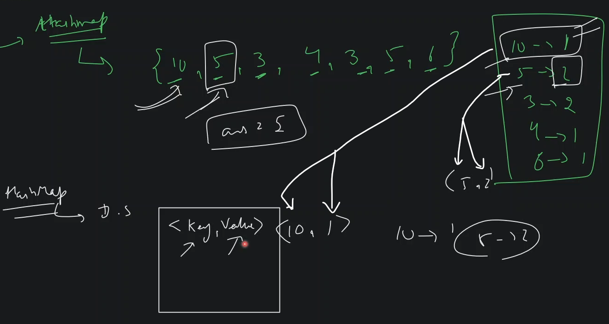
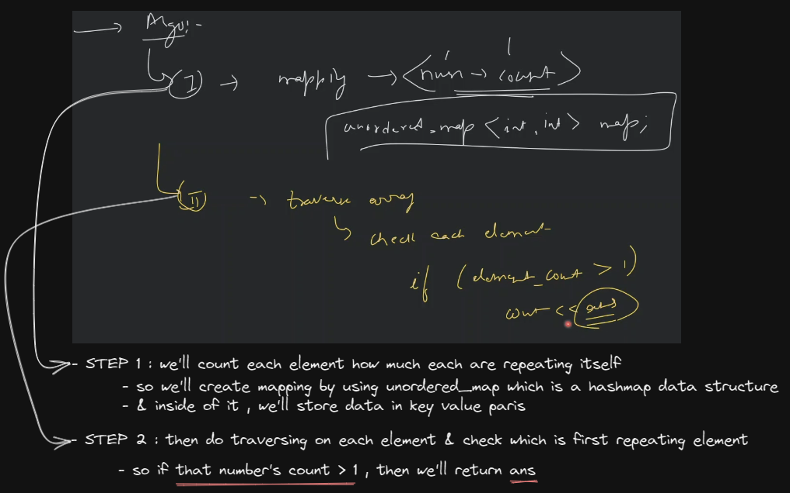

# Array Doubt Class

- `hashmap`
    - in js , we have `map` to implement hashmap & in java , we have inbuilt hashmap data structure
    - hashmap is a data structure <br>
        where we can store data in key value pairs like this 
        
    
- `ques` : find first repeating element/number in an array `hashmap ques`
    - given input : `[10, 5, 3, 4, 3, 5, 6]` & output : return that first element whose count/frequency is greater than 1
    - understanding 
        - we need to find only first element which is repeating element more than 1 time
        - so `10` is coming 1 time <br>
            `5` is coming 2 times <br>
            `3` is coming 2 times <br>
            `4` is coming 1 time <br>
            `6` is coming 1 time
        - now we'll traverse each element & check , is `10` is repeating element , so No , it's not <br>
            now `5` will be checked , so Yes , it's first element which is repeating element 
        - so we'll return that element as answer i.e `5` & stop the loop
        - `Note` : we'll not check the further those elements who are also repeating & so we'll stop the loop
    - complexity 
        - so we can solve this question in `O(n)`
    - approach
        
    - code
        ```cpp
        #include <iostream>
        #include <map>
        using namespace std;

        int firstRepeating(int arr[], int n) {
            // STEP 1 : store count of numbers
            unordered_map<int, int> count; 
            for (int i=0; i<n; i++) {
                int currentElement = arr[i] ;
                count[currentElement]++ ;
            }

            // STEP 2 : traverse array & find the ans
            for (int i=0; i<n; i++) {
                int currentElement = arr[i] ;
                if (count[currentElement] > 1) {
                    return currentElement ;
                }
            }

            return -1 ; // this line of code means , if we didn't get any answer then return -1
                // which means we didn't got any answer
        }

        int main() {
            int arr[] = {10, 5, 3, 4, 3, 5, 6} ;

            int result = firstRepeating(arr, 7)

            return 0;
        }
        ```

- understanding the hashmap syntax
    ```cpp
    #include <iostream> 
    #include <map>
    using namespace std;

    int main() {
        // creation
        map<int, int> m;
            // here first is key & second one is value
            // so we want key & value both as integer value

        // insert
        m[10] = 3; 
            // here inside square bracket notation , we store key i.e 10 as integer & 3 as a value

        // access
        cout << m[10] << endl ;;

        return 0;
    }
    ```
