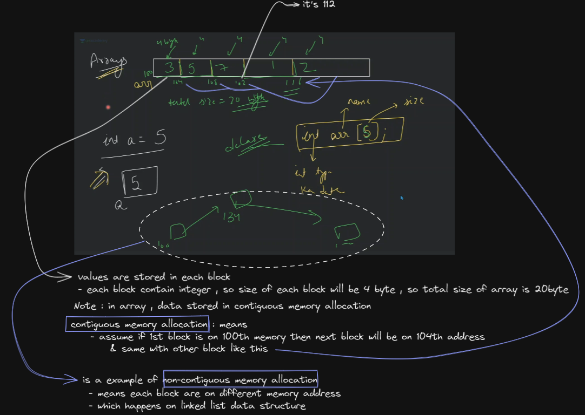
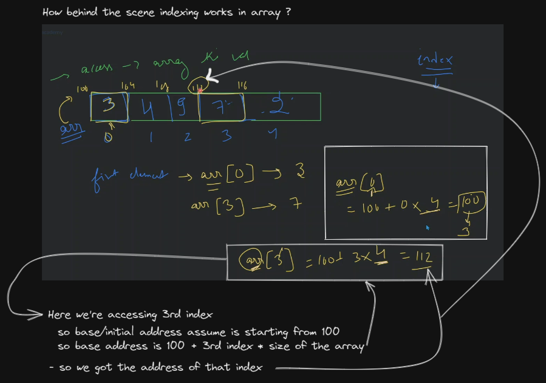
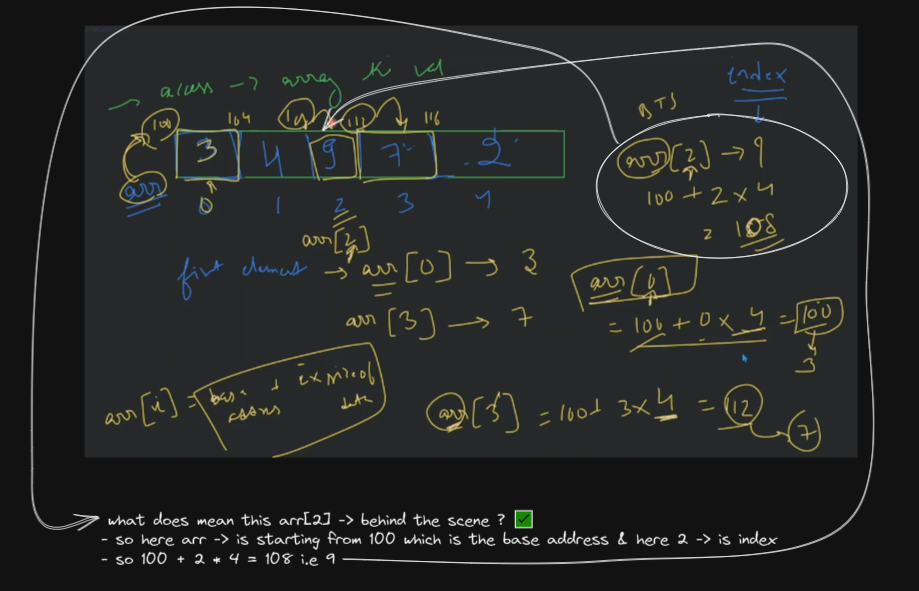
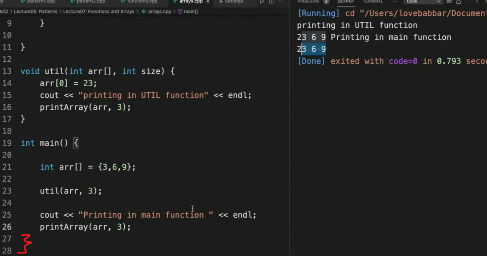
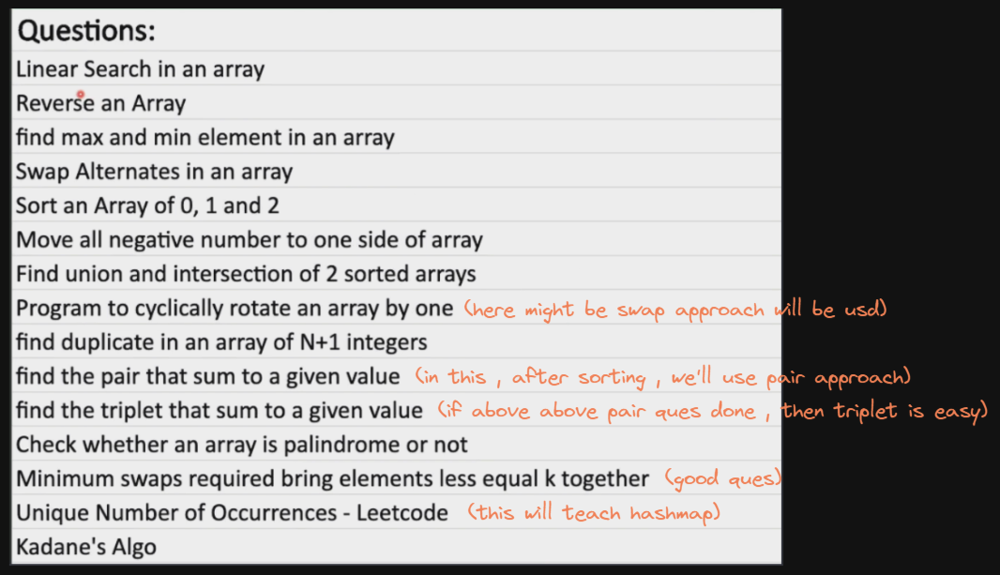

# Array data structure

## lecture 6 - love babbar (paid course) - array

- array
    - why we use array ?
        - Eg : let's say we have 3 variables , we need to find maximum so you'll use like if statement
        - now let's say you have 30000 different numbers , & you need to make variables & find max , <br>
            if you think you'll use while then it's not possible <br>
            because on which you'll apply while loop , so even we can't make 30,000 variables

    - best practices : always store stuff related to same datatype inside array
    
    - how array is stored in memory ✅
        
    
    - how to create array in C++
        ```cpp
        int arr[5] = {1, 2, 3, 4, 5}
        // OR
        int arr1[ ] = {1, 2, 3, 4, 5}
        // we can create without or with defining size of the array
        ```
        - but if we do this `int arr[5];` then inside that each 5 block contain garbage value
        - or if we do this `int arr[15] = {1, 2};` <br>
            then 15 size contiguous memory allocation will be created & first two blocks will contain 1 & 2 <br>
            but other blocks will contain garbage value or 0 which is dependent on compiler <br>
        - let's say we want to initialize `0` to each block then we can do this `int arr[25] = {0}` <br>
            that's why in most of the time , we'll get 0
        - & behind the scene , base address will be of that first element of an array 💡💡💡

    - accessing element from an array
        - Eg : so we access elements based on index like this `arr[2]` , so we'll get value of 2nd index
        - understand how this indexing working ✅
            
            - so formula is `arr[i] = base address + i * size of the array` , here `i` means index of that element
            - means behind the scene `arr[i]` works like this 
                
        - Note : whenever we're accessing an array via parameter of a function then define another parameter the size of that array

    - pass by reference ✅
        - pass by reference concept comes when we're dealing with array or object or both
        - example 
            ```js
            const arr = [3,6,9]
            const arr1 = arr
            arr1[0] = 23

            console.log(arr) // output : [23, 6, 9]
            console.log(ar1) // output : [23, 6, 9]
            ```
            - here when we did `arr1 = arr` then a new array is not created in the memory 
                - inside `arr1` , only `base/starting/initial address is stored` , assume that `arr` array is starting from 100 <br> 
                    so that base address will be 100
                - so when we said `arr1[0]` then means that formula will be applied i.e `100 + 0 * 4 = 100` <br> 
                    & inside memory , on 100th address , `3` is stored , so when we update `arr1[0] = 23` <br>
                    then that `3` will be overwritten by `23`
                - here array is not copied , only `base pointer address` is copied i.e 100 💡💡💡
                - when we say `arr1[0]` then here 2 things happening 
                    - `first` : base address will be stored inside `arr1`
                    - `second` : then we access the 0th index element & that formula will be applied behind the scene 💡💡💡
                    - here `arr[3]` , we're assuming that base/starting value is 100 , so `arr` contain that base value 💡💡💡 
            - means when we did `arr1 = arr` then `arr1` is pointing to the memory address where that array is stored 
                - & here no new value is created because when we did `arr1[0] = 23` then means <br>
                    we're updating the value based on index inside that array (which is stored inside a memory address) 💡💡💡
                - here we're not completely updating the array as a whole value like this 
                    ```js
                    let arr = [3,6,9]
                    arr = 2 // here we changed the complete array value to a value
                    ```
                    - we're updating inside that array 💡💡💡
            - in pass by value , we actually copy the exact same value inside the another variable 💡💡💡 <br> 
                & when we update the value of that another variable , then only value of that another variable will gets updated <br>
                not of that previous variable , because both variable are pointing different memory address 
                ```js
                const a = 100;
                const b = 100;
                // here both have same value , but both are stored in different memory address 
                    // so memory address is unique here 💡💡💡
                // so for both different memory address block will be created 💡💡💡
                ```
            - so when we update inside the array via index number , then computer will update that array via finding the address <br>
                of that array
                ```js
                // when we do this 
                arr[i] = 23
                // then here arr[i] --> will be converted into a memory address
                ``` 
        - so in array or object , if we change/update inside that array or object then that change will happen everywhere <br>
            where you used that array or object
        - pass by reference code 
            
            - for more : passing array as a argument to a function : https://www.youtube.com/watch?v=gNlmJ2WrZSY
        - When we pass an array to a function, how does the copy work? ✅
            - https://stackoverflow.com/questions/54098883/when-we-pass-an-array-to-a-function-how-does-the-copy-work
            - https://www.quora.com/In-C-when-I-pass-an-array-to-a-function-am-I-copying-the-value-or-the-arrays-address-to-the-function
            - https://www.geeksforgeeks.org/how-arrays-are-passed-to-functions-in-cc/

- Questions 
    
    - `1` : linear search in an array
        - `linear` : means step by step 
        - understanding the question 
            - let's say we have the array like this `[3, 6, 7, 12, 2, 4, 6]` <br>
                now find the whether we have 4 inside this array or not 
            - so right now whatever knowledge you have how you'll check i.e by using loop <br>
                & the movement you'll find `4` you'll return true otherwise you'll loop over each element & return false
            - & time complexity in worst case will be if array size is n then O(n) <br>
                so we're checking/comparing with each element inside of an array
        - Note : let's say we're creating size of array in runtime like this
            ```cpp
            cout << "Enter the size of array" << endl;
            int n ;
            cin >> n ; // runtime input

            int arr[n];
            ```
            - we're creating array based on runtime input size of the array <br>
                is that will create the array or not , so it's depends on compiler 
            - so is this good practice or bad ? -> Ans : Bad practice <br>
                because let's say the size of the array that you gave , that size of space is not available in the program <br>
                then our program will not work , it's like Bank & you don't have that amount of money <br>
                & you're requesting for it then request will be rejected 💡💡💡
        - writing the code
            ```cpp
            bool search(int arr[], int size, int target) {
                for (int i=0; i<size; i++) {
                    if (arr[i] == target) {
                        return true ;
                    }
                }

                return false;
            }

            int main() {
                int arr[100]; // here the size of the array that we defined is the max size

                cout << "Enter the number of elements" << endl;
                int n;
                cin >> n;

                // taking input in array
                for (int i=0; i<n; i++) {
                    cin >> arr[i];
                }

                if (search(arr, 5, 7)) {
                    cout << "Element found" << endl;
                } else {
                    cout << "Element not found" << endl;
                }

                cout << "Printing the elements in array" << endl;
                printArray(arr, n);
            }
            ```
    - Kadane's Algo : 
        - is made by goggle
        - mostly asked in interview + online test

- what should you know in array
    - `1` : creation
    - `2` : taking input at runtime
    - `3` : printing those elements through traversing

- homework 
    - check this `int [30] = {1};` , now think what'll be stored in each block <br>
        `[1,0,0,0,0,0,so on...]` or each block only contain 1
    - complete those questions & you can do those questions on leetcode or codestudio or gfg or interviewBit
    - advice : 
        - try those 15 question again if you're not able to do it
        - if you're not able to understand take hints , read discussion forum 
        - still not able to understand use your brain & time
- advice : 
    - you learned about who to do swimming , but if you don't do practice of it by yourself then doesn't making any difference
    - after completing the course , do specific prep based on company where you want to go (Amz|MS|Google|xyz) for 1 to 1.5 week <br>
        & see the recent interview experience
    - make DSA strong + make 1 strong project which has many real life features with recent & in-demand stack

## lecture 8 - love babbar - (paid course) Array problems


