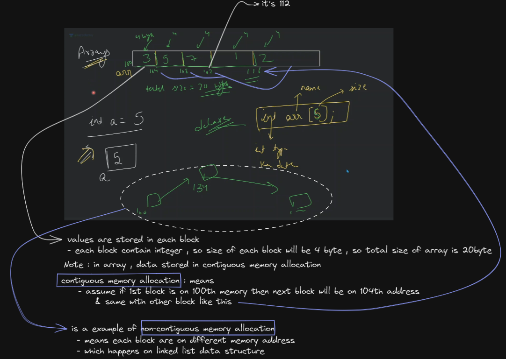

# Array data structure

## lecture 6 - love babbar (paid course) - array

- array
    - why we use array ?
        - Eg : let's say we have 3 variables , we need to find maximum so you'll use like if statement
        - now let's say you have 30000 different numbers , & you need to make variables & find max , <br>
            if you think you'll use while then it's not possible <br>
            because on which you'll apply while loop , so even we can't make 30,000 variables

    - best practices : always store stuff related to same datatype inside array
    
    - how array is stored in memory ✅
        
    
    - how to create array in C++
        ```cpp
        int arr[5] = {1, 2, 3, 4, 5}
        // OR
        int arr1[ ] = {1, 2, 3, 4, 5}
        // we can create without or with defining size of the array
        ```
        - but if we do this `int arr[5];` then inside that each 5 block contain garbage value
        - or if we do this `int arr[15] = {1, 2};` <br>
            then 15 size contiguous memory allocation will be created & first two blocks will contain 1 & 2 <br>
            but other blocks will contain garbage value or 0 which is dependent on compiler <br>
        - let's say we want to initialize `0` to each block then we can do this `int arr[25] = {0}` <br>
            that's why in most of the time , we'll get 0
        - & behind the scene , base address will be of that first element of an array 💡💡💡

    - accessing element from an array
        - Eg : so we access elements based on index like this `arr[2]` , so we'll get value of 2nd index
        - understand how this indexing working ✅
            
            

- homework 
    - check this `int [30] = {1};` , now think what'll be stored in each block <br>
        [1,0,0,0,0,0,so on...] or each block only contain 1
