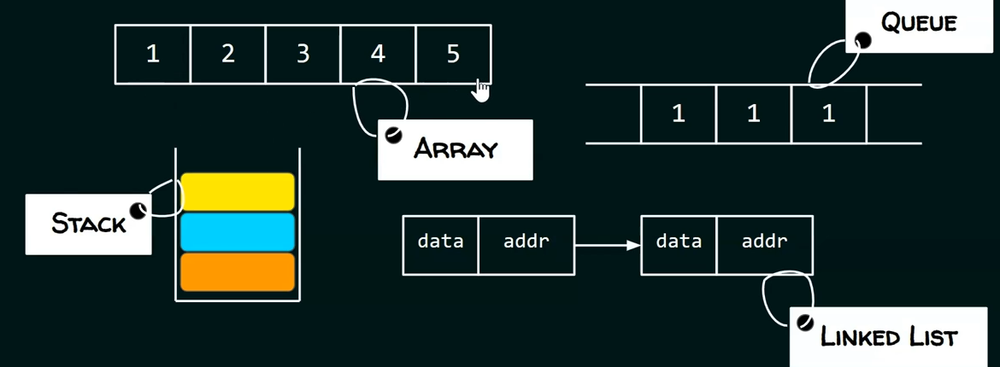
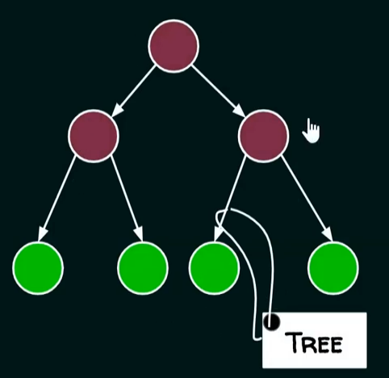
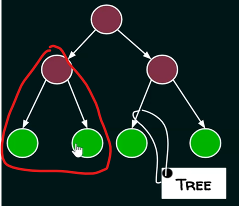

# Types of Data Structure

- 2 types of data structure 
    - `1` : Physical data structures
    - `2` : Logical data structures

## Lecture - abdul bari sir

- Physical Data Structures
    - Eg : array & linked list are two physical DS
        
        - & we can have more data structures of combination/variations of those two
        - Why we're calling them as Physical ? 💡
            - because those data structures decides/defines how the memories organize
            - means how the memories is allocated
        - & these two data structures are inbuilt/directly supported by C++ , Java , python 
    - Eg : Array data structure 
        - those complete single block is a contiguous memory locations
        - means if we have an array for 7 integers then all those 7 integers are together at one place
        - & that array have fixed size , once it's created of some size  
            then that size can't be increase or decrease . So size of an array is static 💡💡💡
        - that array can be created inside the stack or inside the heap memory (with the pointer variable inside stack) like this   
            
        - When to use Array data structure ? ✅
            - use it when you're sure about what's the maximum number of elements that you're going to store
            - means if you know the length/size of the list then you can use array 
    - Eg : linked list data structure 
        - it's completely dynamic data structure & it's a collection of nodes  
            where each node contains data & link to next node
        - the length of the list in linked list data structure , can grow & reduce dynamically so it's having variable length
        - so as per your requirement , you can go on adding more & more nodes  
            & add more elements or you can reduce the size
        - the linked list data structure is always created inside the heap memory 💡💡💡  
            & head -> will be the pointer variable (inside the stack memory) which will point that linked list
            
        - when to use Linkedin list data structure ? ✅
            - use it when we don't know the size of the list 
    - & these two comes in physical because they tell how the memory should be organized for storing the elements/data   
        so they're more related to memory 💡💡💡

- Logical Data structures 
    - logical data structures are :  
        
        - different b/w physical & logical data structures ✅
            - Physical Data structures : are actually meant for storing the data in the memory , means they'll hold the data 
            - Eg : when you have the list/array then you'll perform operations like inserting more values ,  
                deleting existing values or searching for the values & many more operations
            - now question is how you want to utilize those values  
                means how you'll be performing insertion & deletion means what discipline you'll follow
            - that discipline is defined by those logical data structures 💡💡💡
        
    - types of data structures in logical DS : `Linear DS` , `Non-Linear DS` , `linear or Tabular DS`
        - Examples are :  
            
        - `stack` works on LIFO (last in first out)  
            `queues` works on FIFO (first in first out)  
            `trees` is non-leaner DS , so it'll be organized like a hierarchy  
            `Graph` is a collection of nodes & the links b/w the nodes  
            `Hash table` is a like table 
        - so these logical data structures are actually used in applications , used in algorithms  
            & for implementing these logical data structures , we use either array or linked list or combination of both  
            or any inbuilt Data structure 💡💡💡
        - means logical data structures are implemented via those different physical data structures 💡💡💡

## Lecture - Neso Academy

- 2 types of data structures 
    - linear DS
    - Non-linear DS

- `what is linear Data structure` : 
    - means if all the elements are arranged in a linear/sequential order i.e called linear DS
    - Eg : array , queue , linked list , stack
    - or we can say that each element having one predecessor & one successor then we can say that data structure is linear DS 💡💡💡
        
        - inside this array data structure example , `4` element have one predecessor i.e `3` & one successor i.e `5` 
        - although , there's one exception inside different data structure of linear DS  
            i.e first element has no predecessor & last element has no successor 💡💡💡

- `what is Non-linear Data structure` : 
    - means when all the elements aren't arranged in a linear/sequential order .  
        means there's no linear arrangement of the elements 
    - Eg : tree data structure like this  
        
        - this data structure i.e tree is non-linear  
            because we can see that each node doesn't have one predecessor & one successor 
        - we can see that top most node has one predecessor & one successor   
            but next left node doesn't have one predecessor & one successor , it has two successors i.e 
            
    - Eg : graph

- for further information , we have `static data structure & dynamic data structure`
    - `static data structure` : 
        - in this data structures , the memory is allocated at compile time . That's why , maximum size is fixed
        - `Advantage of static DS` : we can access data very fast
        - `Disadvantage of static DS` : but we have slower insertion & deletion
        - Eg : array data structure is a static DS because before creating array , we need to defined the size of an array  
            later on , we'll see why we have that disadvantage
    - `dynamic data structure` : 
        - in this data structures , the memory is allocated at run time . That's why , maximum size is flexible
        - means when the memory is allocated at run time when user will define/decide the size  
            then we can see maximum size is flexible
        - `Advantage of static DS` : faster insertion & deletion
        - `Disadvantage of static DS` : but slower access
        - Eg : linked list
    - so data structure is bad , good data structure will depends on user requirement or problem requirement

## Lecture of other YT

- other reference YT : https://www.youtube.com/watch?v=w4LkuBGzPzs
