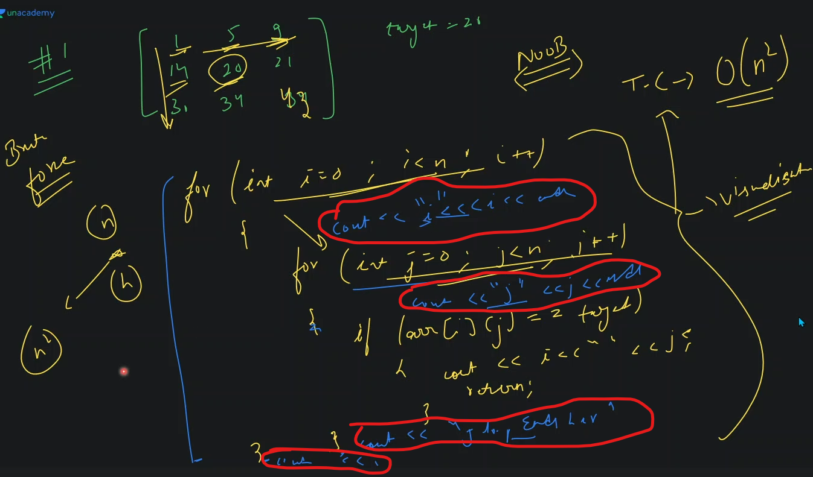

# Binary search algo problems

## lecture - love babbar (paid course)

- here we'll how to apply binary search algo in 2D array
- how do we know that what level of questions we have in binary search algo
    - `1st level` : classical questions (that you just did in 1D array)
        - if you understand those 10 questions then you completed the 1st level
    - `2nd level` : 2D array (we solve catchy questions)
    - `3rd level` : reduce search space (this concept is related to CP) & it contains questions like : 
        - book allocation 
        - Aggressive Cows <br> 
            https://leetcode.com/discuss/general-discussion/1302335/aggressive-cows-spoj-fully-explained-c
        - painter’s partition

- how to use binary search algo in 2D array
    - `ques` : find the target element in 2D array via binary search algo
        - understanding ✅
            
        - approach : we have 2 ways 
            - `1st way` : using linear search algo or brute force
                
            - `2nd way` : optimize approach i.e binary search algo
                - we already know those 2 conditions in order to apply binary search algo in 2D array <br>
                    but if the input question is not fulfilling those 2 conditions then we can't apply binary search algo in 2D array
                - so we can apply binary search algo in that 2D array input in 2 ways like this
                    
                - what will be the algo/steps
                    
            - how to find that row which contain the target value ? 👍
                
                - conclusion <br> 
                    
                    
            - so we need to apply binary search algo 2 times
            - student's doubts
                - `1` : here in above approach , we're using 2 pointer approach , but i need 1 pointer approach
                    
                - `2` : what if we apply binary search algo in each row inside 2D sorted array 
                    - then time complexity is number of rows * log of column i.e `O(n * logm)` 💡💡💡
                    - another approach to solve this question 
                        
                        - check this another approach solution on YT love babbar DSA course
        - DRY RUN
            
            
        - code
            ```cpp
            #include <iostream>
            using namespace std;

            bool search(int arr[][3], int n, int m, int target) {

            }

            int main() {
                int arr[3][3] = {1, 5, 9, 14, 20, 23, 30, 34, 43};

                int n = 3;
                int m = 3;
                int target = 34;
                cout << search(arr, n, m, target);

                return 0;
            }
            ```

- advice to become better programmer
    - after finding the approach of a question then do DRY RUN 5 times with different test cases 🔥🔥🔥 <br>
        & to visualize more , you can print those variables also like this 
        
        - so this the basic debugging if you stuck in the code
    - this practice will help you to become better & you'll be able to visualize the code in better way 


