# binary search problems 

## lecture - love babbar (paid course)

- here we'll see how to reduce the search space , so in this , if we do only 1 ques <br>
    then same strategy will be applied on every questions to write code & make approach 💡💡💡

- till yet , we did questions of binary search i.e classical ques , 2D array <br>
    & we need to do `search space reduction` ques

- eg : of search space reduction questions (which are based on binary search algo) are 
    - `1` : book allocation problem (which is already done on YT)
    - `2` : find square root via BS (which is already done on YT)
    - `3` : aggressive cows (which is already done on YT)
    - `4` : painter partition
    - `5` : EKO spoj
    - `6` : roti prata
    - & for more ques on binary search algo , check interviewBit <br>
        but if you're able to do these 6 questions by yourself then that's it <br>
        no more questions you need to do
    - these search space reduction questions are not included in paid DSA course , it's covered in CP <br>
        & these search space reduction questions are advance questions

- ques : EKO SPOJ
    - https://www.spoj.com/problems/EKO/
        - we'll do this question only then the same technique will be applied on these other questions
        - story questions are like this question  
    - understand 
        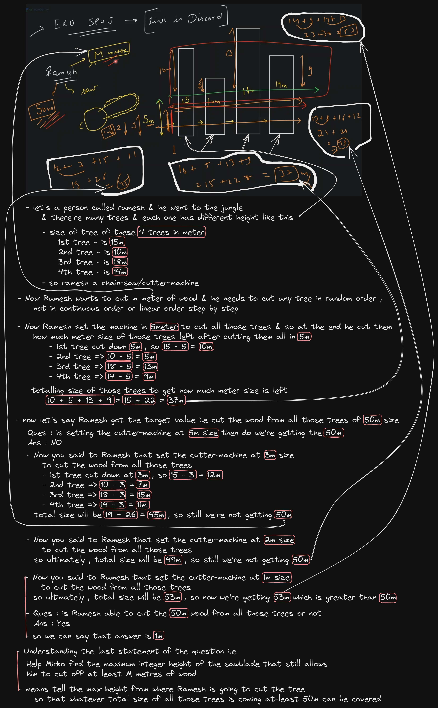 <br>
            means that person will set a particular height & cut all the trees for woods
        - questions is saying that 
            - tell the max height when that person start cutting all the trees <br>
                then that person at-least can cut `m meter` of wood 
            - means that person wants to cut all those trees for `m meter` <br>
                & that `m meter` let's say 50m which is given as input <br> 
            - so ramesh will set a height to cut all those tress on same height ,<br>  
                so questions is asking that tell the max height through which when ramesh cut all those trees <br>
                then answer at-least reach at m meter means `>= m` 💡💡💡
        - doubt : what if height of a tree is less than the height (which set for cutting all those trees) <br> 
            so answer will be `0` 
    - approach
        - `1st approach` : brute force (means doing hardwork & code not optimize)
            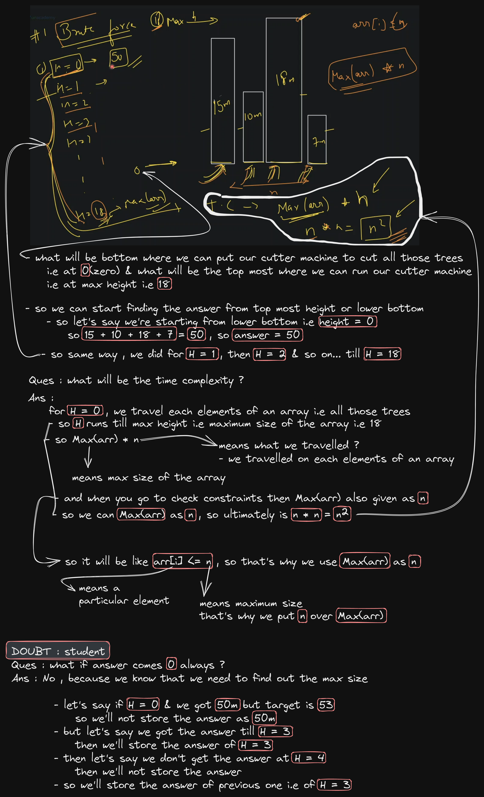 <br>
        - `2nd approach` : using binary search algo (optimizing the solution)
            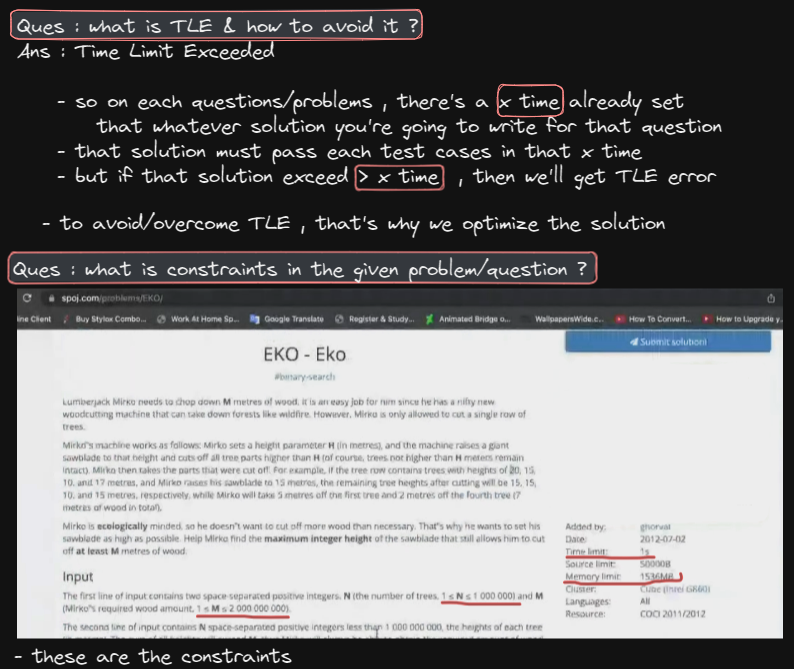 
            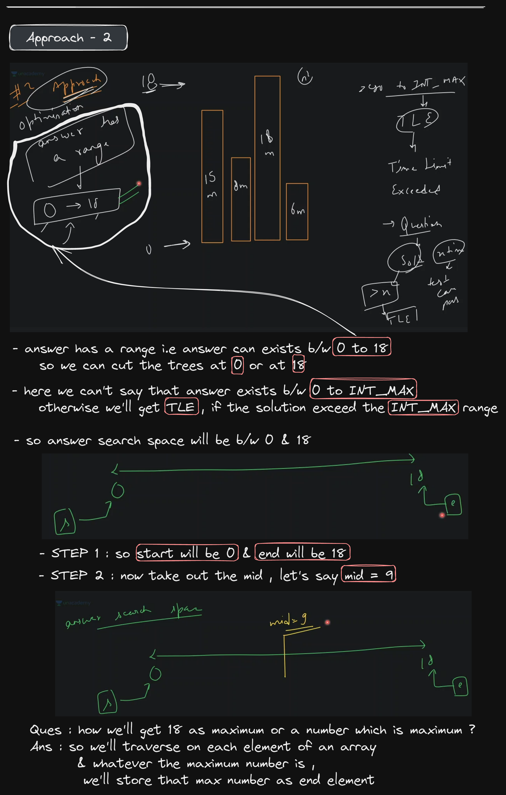 
            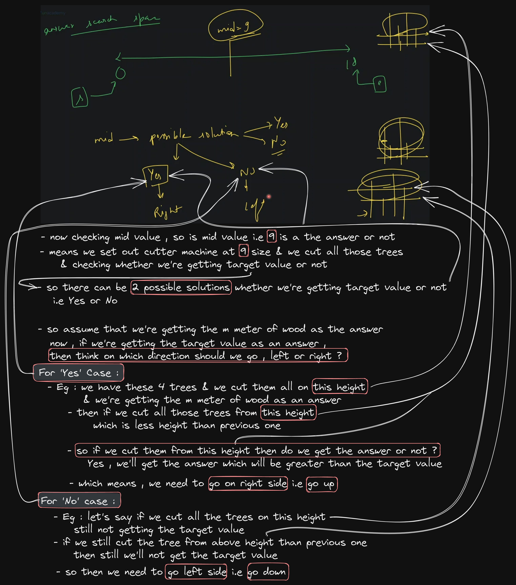 <br>
            so can we write the code like this 
            ```
            s = 0 , e = Max(arr)
            while(s <= e) {
                int mid = (s+e)/2;
                if (isPossibleSolution(mid)) {
                    ans = mid ; ---> here storing the answer
                    s = mid + 1 ; ---> for right side means going up
                } else {
                    // left means going down
                    e = mid - 1;
                }
            }

            bool isPossibleSolution(int mid, int arr[], int target) {}
            ```
            - DRY RUN with example & understanding going right & left 💡💡💡
                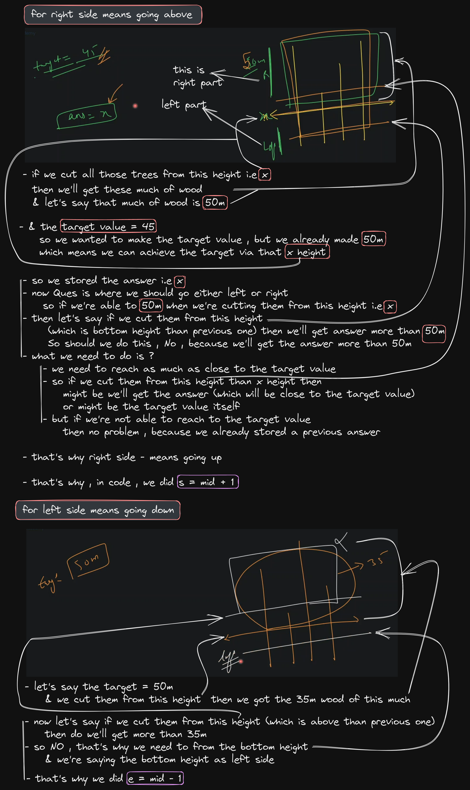 
                - checking mid value whether it's a possible answer or not
                    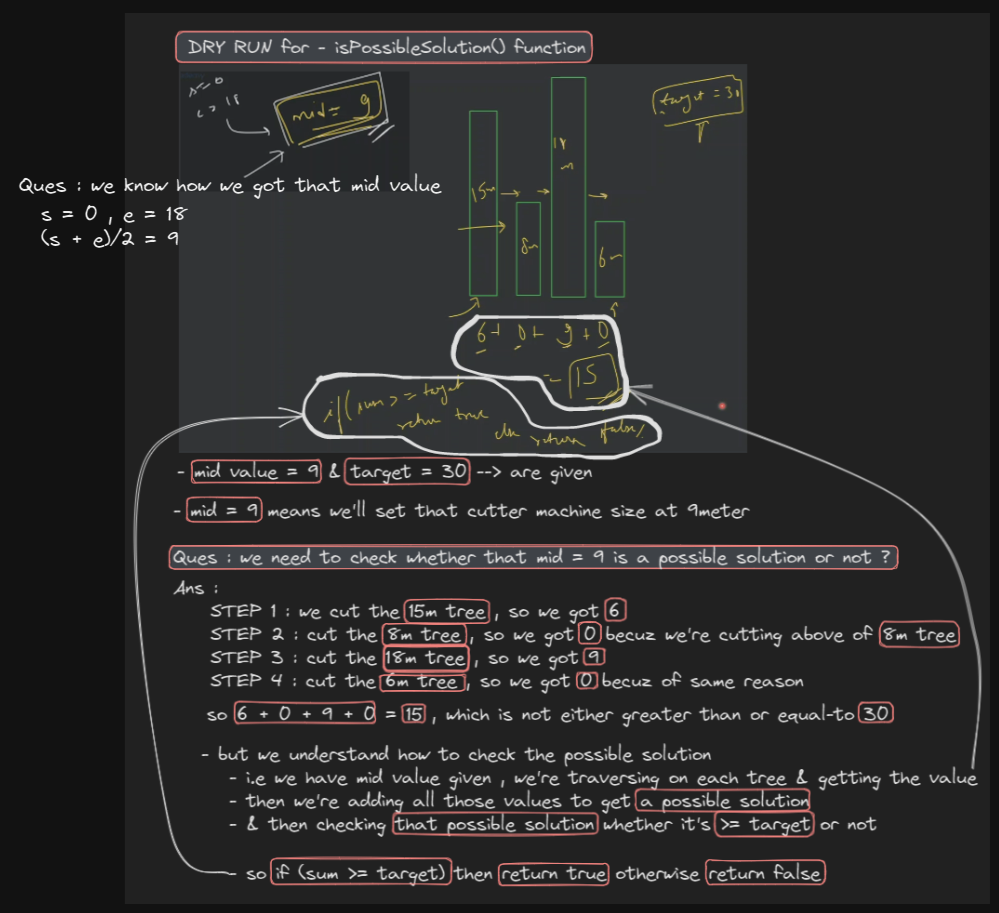 
                - basically , the game is all about right & left 
                - & most of the time `isPossibleSolution()` function is solved via brute force solution <br>
                    but if you want to optimize this also , then you can do 💡💡💡
                - if you have confusion in left & right then see this 💡
                    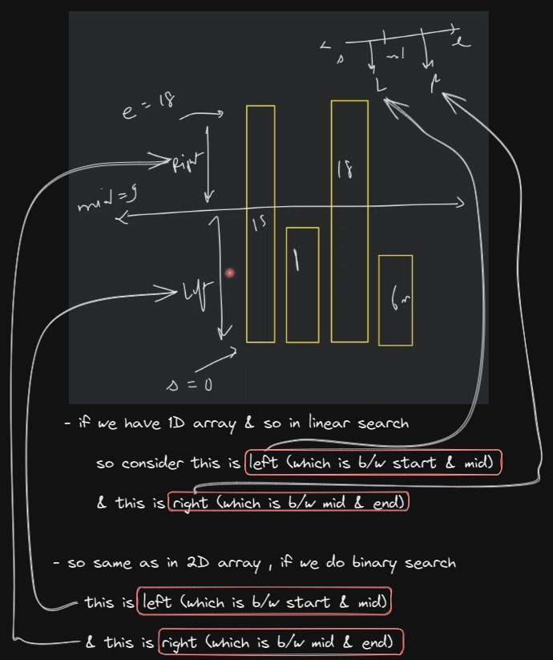 
            - working only on isPossibleSolution() function
                ```cpp
                bool isPossibleSolution(int mid, int arr[], int target) {
                    sum = 0 ; // --> this variable will calculate the sum
                    for (i -> 0 -> < n) { // --> here we're traversing on each tree
                        int difference = 0; // --> by-default we're set the difference as 0
                        if (arr[i] > mid) // ---> means if the size of a tree is bigger than the size of our cutter machine
                                            // then we'll find the difference means do subtraction 💡💡💡 
                                            // means we'll cut them & get the difference like 6 , 0 , 9 & then 0 getting in the example
                            difference = arr[i] - mid ;

                        sum = sum + difference ; // --> here we're adding all those differences which we're getting 
                                                    // like this 6 + 0 + 9 + 0 = 15
                    }

                    // -- here we're doing comparison
                    if (sum >= target)
                        return true
                    else 
                        return false
                }
                ```
                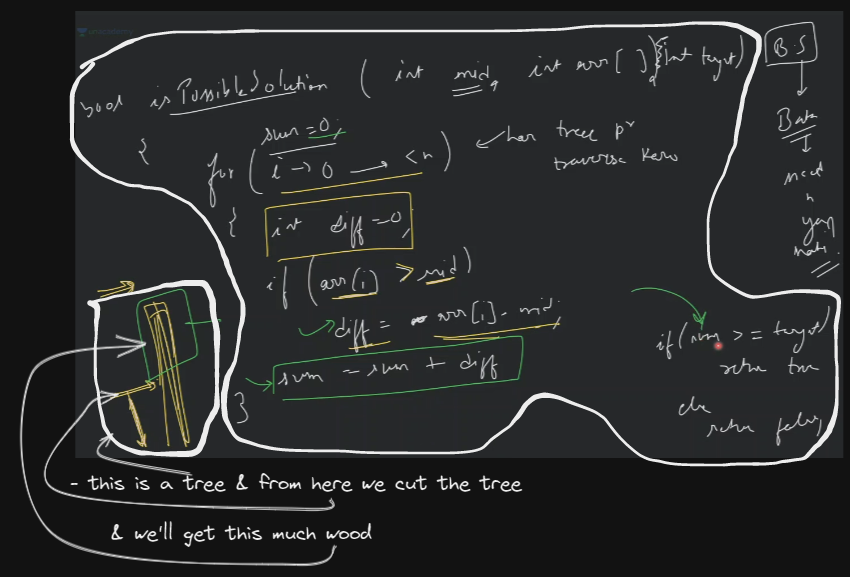 
                - & we're showing the size/height of the cutter machine through that `mid` value 💡💡💡 
    - code
        ```cpp
        #include <iostream>
        #include <algorithm>
        using namespace std;

        // here we took as bool -> for this function
            // because we're calling this function inside -> if statement
        bool isPossibleSolution(int mid, int arr[], int n, int target) {
            
            int sum = 0;
            for (int i=0; i<n; i++) {
                int diff = 0;

                if (arr[i] > mid) 
                    diff = arr[i] - mid;

                sum = sum + diff ;
            }

            if (sum >= target) 
                return true ;
            else 
                return false;
        }

        int getMaxHeightOfSaw(int arr[], int n, int target) {
            sort(arr, arr + n) ;
                // why we're sorting because while doing DRY RUN , love babbar didn't told about this ✅
                // so we're sorting because you'll say that we did becuz we're using binary search
                    // which is not , because the search space is already sorted
                    // What Love Babbar told earlier that binary search algo will be applied 
                        // on monotonic function (means either increasing or decreasing)
                    // & we're applying binary search algo on 0 to 18
                        // don't you think that 0 to 18 is already sorted or not ?
                        // so Yes , because 0 to 18 is a counting which is already sorted
                    // so we're not applying binary search algo on height of all the trees 
                        // we're applying it on 0 to 18 counting 💡💡💡
                    // but why we did sorting ? 
                        // because to get the last element as ending element that's it 

            int s = 0 ;
            int e = arr[n-1] ;

            int ans = -1;

            while(s <= e){
                int mid = s + (e-s)/2;

                if (isPossibleSolution(mid, arr, n, target)) {
                    // store ans
                    ans = mid ;
                    // move to right
                    s = mid + 1;
                } else {
                    // move to left
                    e = mid - 1;
                }
            }
            
            return ans;
        }

        int main() {
            int arr[] = {15, 8, 18, 6};
            int target = 30 ;

            cout << getMaxHeightOfSaw(arr, 4, target) << endl ;

            int ans = getMaxHeightOfSaw(arr, 4, target);
            cout << "Answer is " << ans << endl ;

            return 0;
        }

        // output : Answer is 4
        ```
    - DRY RUN of code
        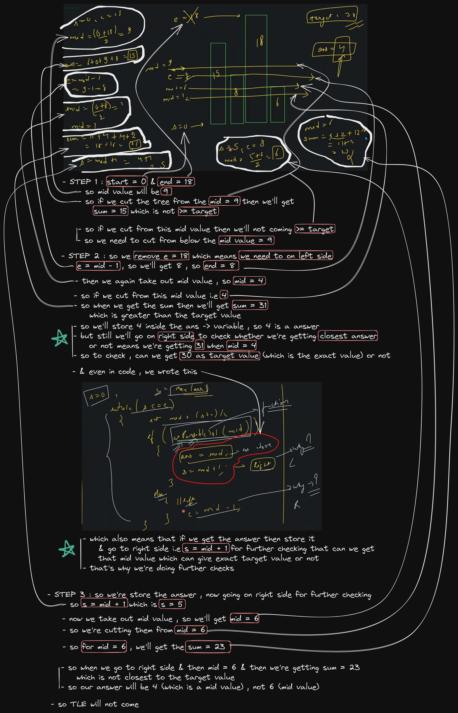 
        - & we're updating the mid value via while loop
        - here we used `sort()` function to get the max value i.e end value or <br>
            second way is we can do for loop & traverse on each element of an array & get the max value i.e end value 
    - time complexity of code
        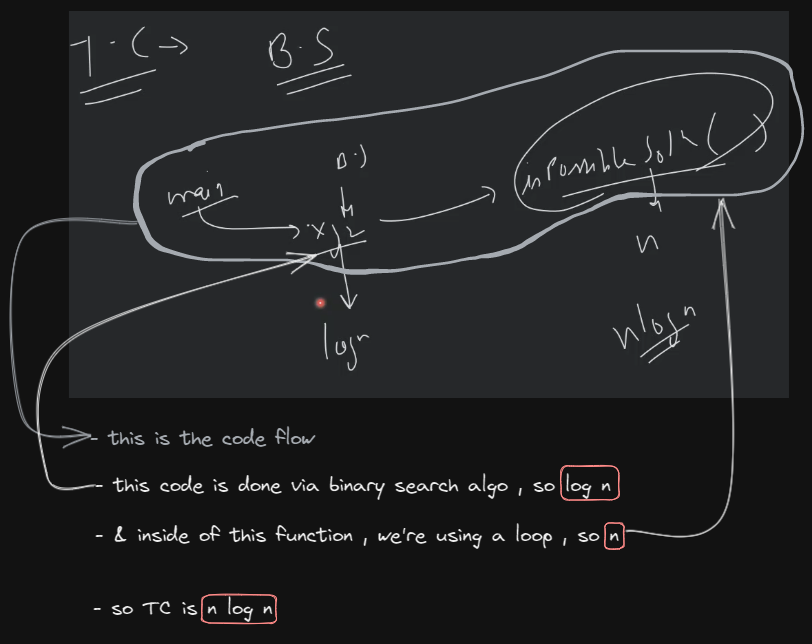 
        - & space complexity is O(1) because `1st` : we didn't took additional space except binary search <br>
            `2nd` : inside isPossibleSolution() , we took space for only variables 
        - one thing we miss i.e we used `sort()` , so it's time complexity is `n log n` , so `n log n` + `n log n` = `n log n` <br> 
            that's why we did `sort()` instead of doing linear search via loop to get the max value <br>
            so we were already know that TC will come in `n log n` , so that's why , we also did `sort()` <br>
            which doesn't create any negative impact
    - advice to do questions of search space solution
        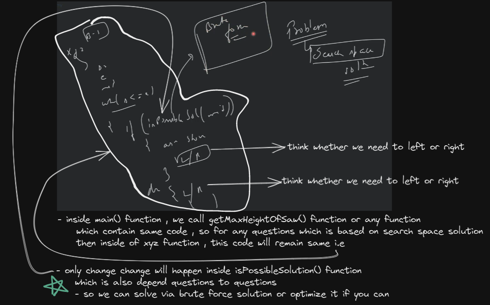 
    - if you're getting TLE , but there's no problem in the approach <br>
        so chances are integer overflow because `sum = sum + diff` & `sum` is integer type , so you can take `long` integer datatype <br> 
        then no problem will come

- ques : https://www.spoj.com/problems/PRATA
    - we can solve this ques via hashmap also 
    - understanding 
        ```
        p -> prata you need to make , p can be any value , let's say 10 prata we need to make
        L -> cooks (means we have L cooks)
                |
                +--> rank --> R 
                (means each cook have a rank, let's say babbar cook has 1st rank)
        
        - so if any cook has rank -> R then
            1st prata (will be made) in R minute 
            (so babbar has a rank i.e 1st rank , so he'll make 1st prata in Rmin)

            2nd prata -> 2Rmin (means babbar will make 2nd prata in 2 * 1 i.e in 2min he'll make)

            3rd prata -> 3Rmin (means babbar will make 3rd prata in 3 * 1 i.e in 3min he'll make)

        ques - find minimum time to get order done ? 
            means - we need to tell in how much time will take to make total P prata 
            means tell the minimum time 
        ```
        ```
        question is saying that we have total 4 cooks

        & their ranks is : 1 , 2 , 3 , 4

        total prata we need to make is 10
        ```
    - approach 
        - brute force
             
            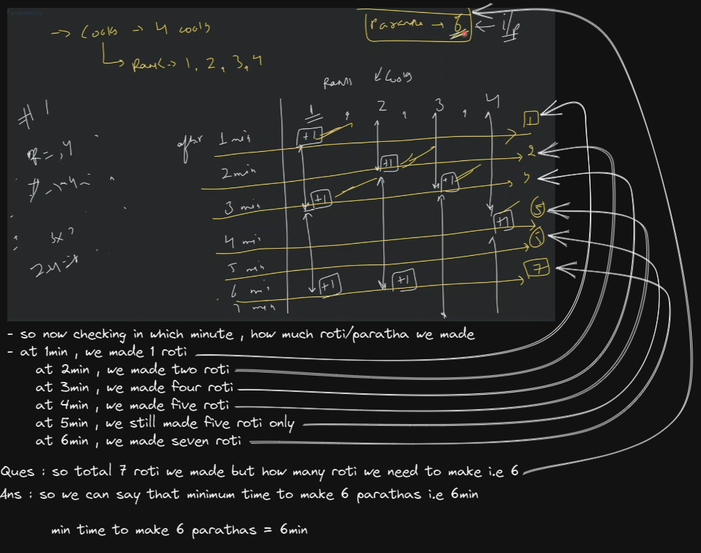 
        - optimize approach via binary search algo
             
        - code approach
            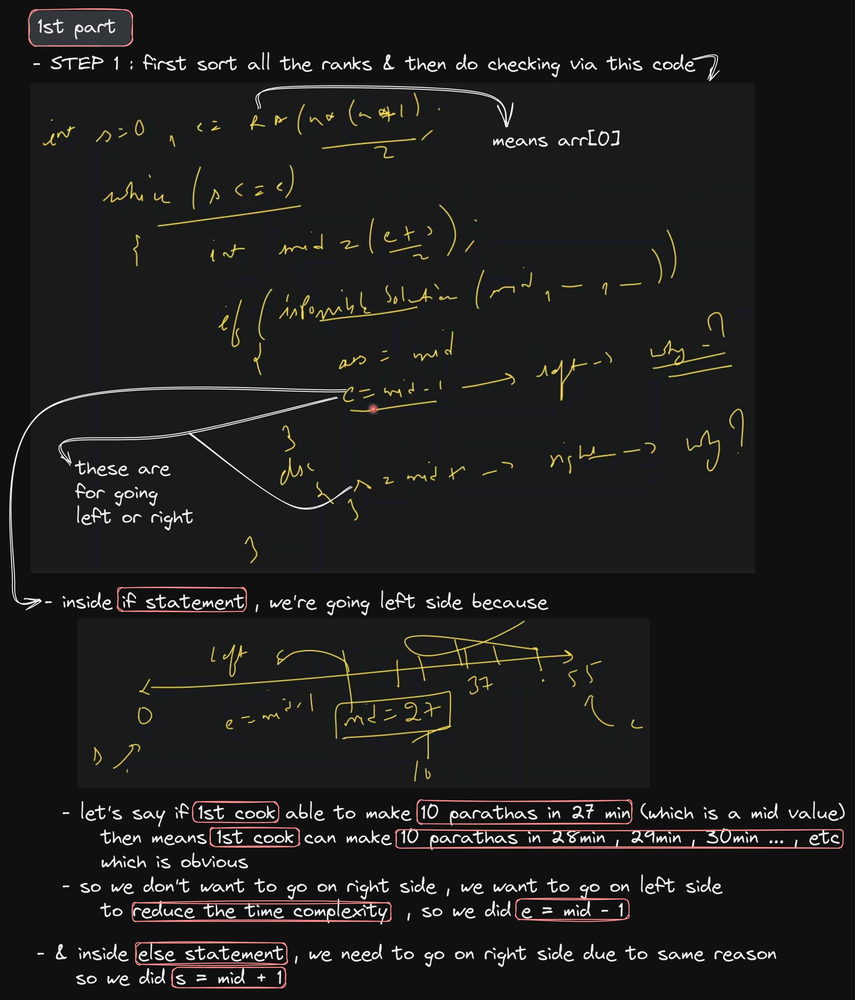 
            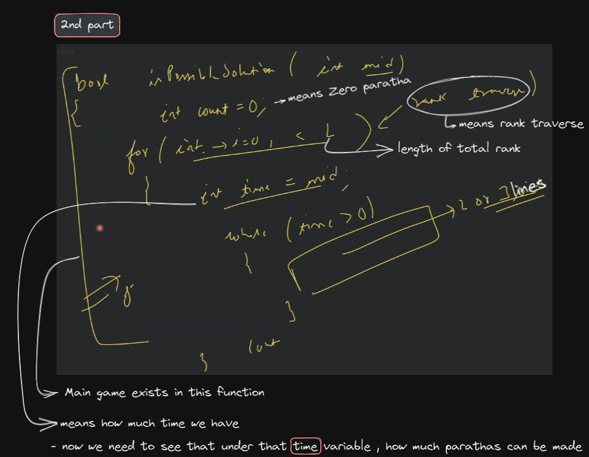 
    - code
        ```cpp
        #include <iostream>
        #include <vector>
        #include <algorithm>
        typedef long long int ll;
        using namespace std;
        bool isValid(vector<ll > v, ll p,int time) {
            ll sum = 0;
            for (ll i = 0; i < v.size(); i++)// this loop will give no. of paratha made in the specified time
            {
                int t = time;
                int count = 0,k=1;
                while (t>0) {
                    t = t - k*v[i];
                    if (t >= 0) {
                        count++;
                        k++;
                    }
                }
                sum += count;
                //cout << count << endl;
            }
            //cout << "parathas made " << sum << endl;
            if (sum < p)
                return false;

            return true;
        }

        ll check_ans(vector<ll> v, ll p)
        {
            ll s = 0, e = (v[0] * p*(p + 1)) / 2;// we can consider the maximum time taking that all th parathas are cooked by the first cook
            ll mid = (s + e) / 2;
            ll  ans;
            while (s <= e) {
                //cout << s << " " << e << " " << mid << endl;
                if (isValid(v,p,mid)) {
                    //cout << "valid"<<endl<<endl;
                    ans = mid;
                    e = mid - 1;
                }
                else {
                //    cout << "not valid" << endl;
                    s = mid + 1;
                }
                mid = (s + e) / 2;
            }
            return ans;
        }

        int main() {
            ll p, size;
            cin >> p >> size;
            vector<ll> v;
            while (size--) {
                int d;
                cin >> d;
                v.push_back(d);
            }
            sort(v.begin(), v.end());
            ll ans = check_ans(v, p);
            cout << ans << endl;

            return 0;
        }
        ```

- advice 👍
    - do DRY RUN on pen & paper to understand that problem clearly 
    - whenever you find any alternative approach that problem then don't do code directly , do these  <br>
        `1st` : understand the approach correctly <br>
        `2nd` : then DRY RUN that approach with different test cases to check whether it's correctly in different test cases or not

- interview advice
    - no one is 100% ready , you just give yourself a target each day like do 50 binary search questions , etc  
    - & achieve that target & put extra effort also 
