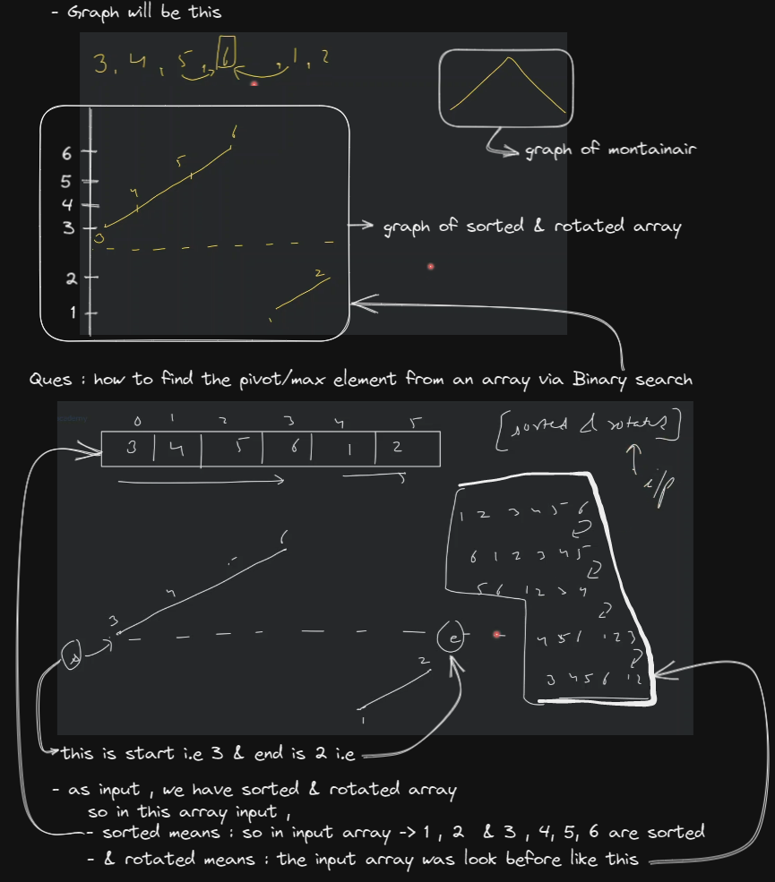
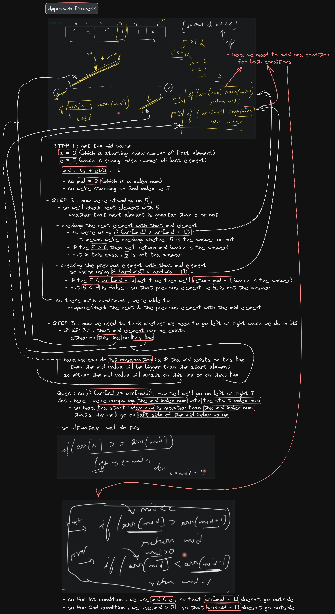

# binary search doubts

## lecture - love babbar (paid course)

- `ques` : find index of pivot element in an sorted & rotated array or find pivot in an array
    - input `[3, 4, 5, 6, 1, 2]`
    - output : we need to find the pivot element i.e `6` 
    - on leetcode , this questions is different but approach is same
    - understanding 
        - pivot element means that element which is greater than both sides of that pivot element  
            so here `6` is greater than both it's left & right side elements ✔️✔️✔️ 
        - so pivot element is `6`
         
    - approach
        - `1st approach` : brute force
            - put linear search & return the max element
            - TC will be O(n) because we did single traverse
        - `2nd approach` : binary search algo
            - TC will be O(log n)
            - approach will be  
                 

