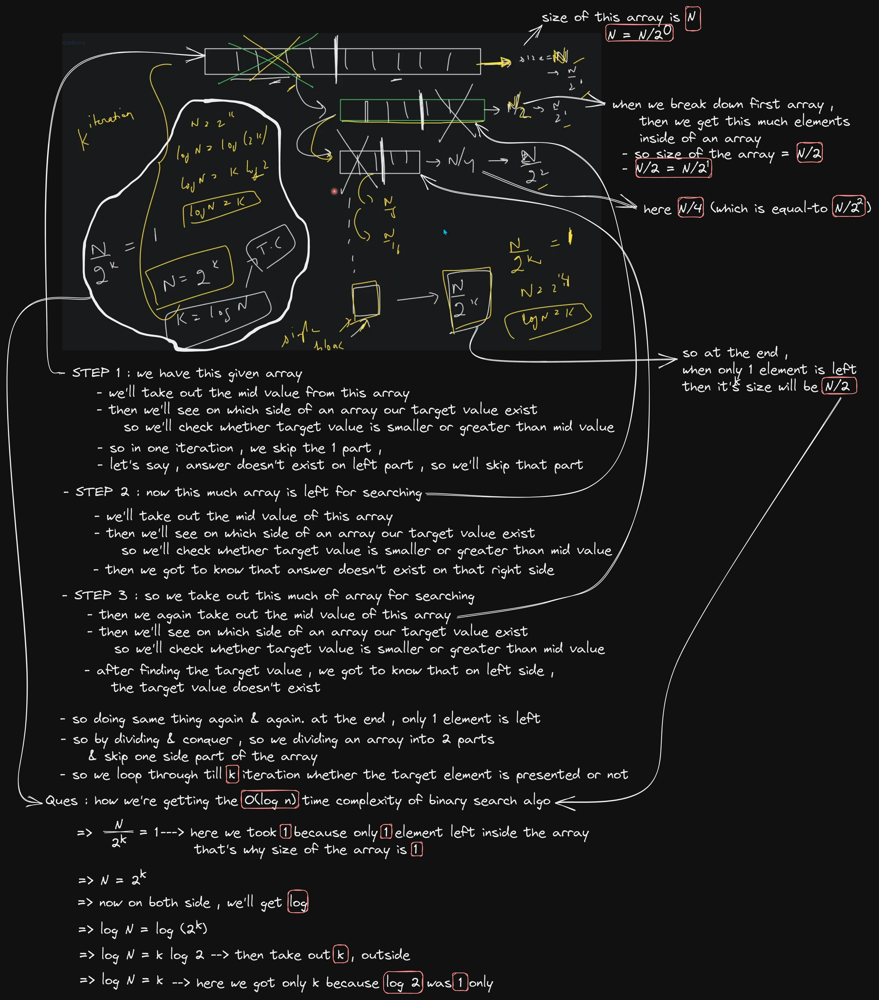
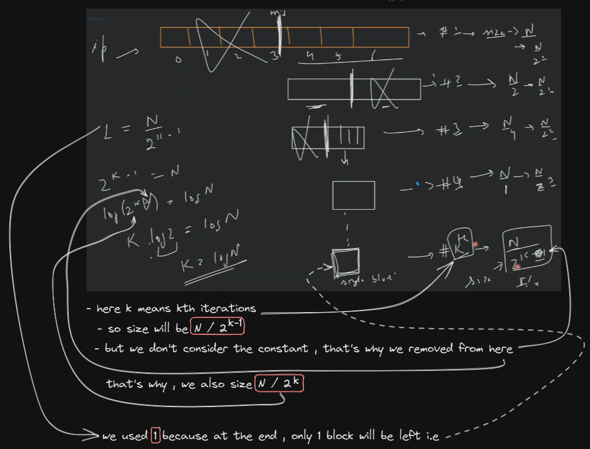
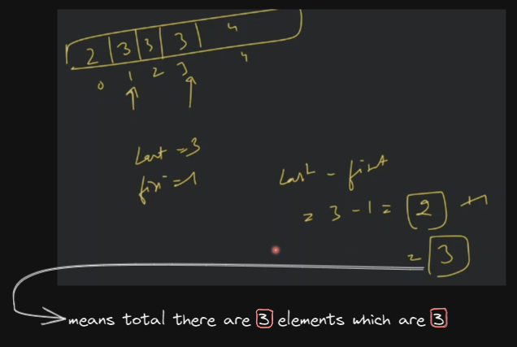

# binary search algo

- questions on binary search
    

## lecture - love babbar (paid course)

- `ques` : implement binary search
    - why we need binary search algo ✅
        - in linear search
            - time complexity of linear search i.e `O(n)`
            - when we have an 1D or linear array , then we traverse on each element one by one <br> 
                so where we're doing single traversal
        - time complexity of binary search is `O(log n)` then what `O(log n)` means & why we need binary search 💡💡💡
            
            - so when we're using binary search on the array which has size i.e `2^100` <br>
                then we just need to do 100 comparison which is optimized instead of using linear search
        - so due to binary search algo , we save tons of computation time & due to this we have the processing power 💡💡💡
    - limitation or condition where we can use binary search & where we can't use it 💡💡💡
        - either you're using array or vector or any data structure <br>
            like in array , each elements/data should be either in increasing/ascending order or decreasing/descending order <br>
            means each data inside any data structure (like array) should be <br>
            in sorted order (either ascending or descending order) then we can apply binary search
        - so we can say that binary search can be applied only on monotonic/monotonous function <br>
            `monotonic` means either data inside an array are in ascending order or descending order
        - Eg : inside an array , if the data is random order then we can't apply binary search algo on that array 💡💡💡

    - understanding binary search algo
        - about it 
            - what is it ? 
                - binary search algo also called Divide & Conquerer Technique
                - it's a searching technique & 
            - why ? 
                - due to it , our number of comparisons becomes less means we don't need to traverse the complete array again & again
                - Eg : `2^10` is easy to do linear search & find out the target value  <br>
                    but `2^100` then we can't do linear search 
            - advantage of it 
                - due to it , in each iteration , we're dividing the array into sub-array & neglecting the one part of the array
                - time complexity `O(log n)`
            - space complexity : `O(1)`
            - when we do recursion , then our code will become even less than we just wrote
        - Example : 
            - we have given input i.e `[3, 5, 7, 9, 11, 15, 18]` which is in increasing order
            - we need to find out target i.e `15` , so whether 15 is present in this array or not
        - approach to implement binary search algo
            - `1st approach` : if we don't know binary search algo , then we'll use linear search algo
                - so we need to check & compare each element of an array
                - so in linear search algo , time complexity will be `O(n)`
            - `2nd approach` : we have an array which is already in increasing order
                - so we'll use binary search because we can take the advantage of given input array <br>
                    which is already in increasing order
                - `STEP 1` : so inside that array , starting value is considered as start & ending value is will be as end
                - `STEP 2` : then find the middle element 
                    - formula to find out the middle element
                        `mid = (starting element index + ending element index) / 2` <br>
                        only take index of starting element & ending element of an array , don't take the element itself 💡💡💡
                    - Eg : in that array starting element index is `0` of 3 & ending element is `6` of 18 <br>
                        `(0 + 6)/2 = 3` , so middle element index is `3` which is 9
                - `STEP 3` : now , check is `arr[mid] = 9` is equal-to the value of target like this
                    ```cpp
                    if (arr[mid] == target) {
                        return true;
                    }
                    ```
                    - so in this case , mid element i.e 9 is not equal-to the target value
                - `STEP 4` : now , where the target in the array , so we have 2 places to find the target value of mid element
                    - `1st place` : the target value can be on left side of the mid value
                    - `2nd place`  : the target value can be on right side of the mid value like this
                        
                    - `STEP 4.1` : if the target value is smaller than mid value , then answer exists on left side 
                        - so inside that array , we'll check each elements which are left side of the middle value 
                        - & ending value will no more `18` , <br>
                            ending value will be that element which is just before the middle element i.e `7` 💡💡💡 like this
                                
                        ```cpp
                        if (target < arr[mid]) {
                            e = mid - 1;
                        }
                        ```
                    - `STEP 4.2` : same as STEP 4.1 
                        - if target is largest than mid value, then the target value exists on right side of mid element <br>
                            so starting element will be the element just after the mid value i.e `11`
                        - so we'll do `mid + 1`
                        ```cpp
                        if (target > arr[mid]) {
                            s = mid + 1 ; 
                        }
                        ``` 
                - so ultimately , we have 3 places where the target value exists
                    
            - code example ✅
                
                - behind the scene , this is happening & how we get `O(log n)` time complexity of binary search algo 
                    
                - doubt <br>
                    
        - time complexity of binary search algo
            
            - at the end , if only 1 block is left , then means length of an array is `1` , that's why we took `1`
        - code 
            ```cpp
            int binarySearch(int arr[], int n, int target) {
                int start = 0;
                int end = n - 1;

                int mid = (start + end)/2 ;

                while(start <= end) {
                    // here we use equal-to sign instead of this -> start < end
                        // because there's one point will come when only 1 element left & that element will be start & end also 
                        // that's why we're using --> <= 💡💡💡

                    int midElement = arr[mid] ;

                    // element found
                    if (midElement == target) {
                        return mid;
                    }

                    // check in left part and neglect right part
                    if (target < midElement) {
                        end = mid - 1;
                    } else { // key > arr[mid]
                        // check in right part and neglect left part
                        start = mid + 1 ;
                    }

                    mid = (start + end) / 2 ;
                }

                return -1 ; // -1 means we didn't got the target value inside the array
            }

            int main() {
                int arr[] = {2, 4, 6, 8, 9, 11, 23} ;
                int n = 7 ;
                int target = 23 ;

                cout << binarySearch(arr, n, target) << endl;
                return 0;
            }
            ```
            - in this code , there's 1 mistake i.e `int mid = (start + end) / 2` . so on this line of code , <br>
                integer can be overflow. so integer range is `[-2^31, 2^31 - 1]` , so if we have `start value = 2` <br>
                & `end value = 2^31 - 1` then we'll get this <br>
                
            - we can write this line of code i.e `int mid = (start + end) / 2` in different way , so that we don't get integer overflow error
                - `1st way` <br>
                    
                    - do this way i.e `s/2 + e/2` , we'll not go out of range which means we're in safe side
                    - here `s` means starting index value of the element & `e` means ending index value of the element 
                - `2nd way` <br>
                    
                    - instead of using 2nd way , just use the 1st way 
            - making code , bug free & avoiding the integer overflow error
                ```cpp
                int binarySearch(int arr[], int n, int target) {
                    int start = 0;
                    int end = n - 1;

                    int mid = start/2 + end/2 ; // OR int mid = start + (end - start) / 2;

                    while(start <= end) {
                        int midElement = arr[mid] ;

                        // element found
                        if (midElement == target) {
                            return mid;
                        }

                        // check in left part and neglect right part
                        if (target < midElement) {
                            end = mid - 1;
                        } else { 
                            // check in right part and neglect left part
                            start = mid + 1 ;
                        }

                        mid = start/2 + end/2 ; // OR mid = start + (end - start) / 2;
                    }

                    return -1 ; 
                }

                int main() {
                    int arr[] = {2, 4, 6, 8, 9, 11, 23} ;
                    int n = 7 ;
                    int target = 232 ;

                    cout << binarySearch(arr, n, target) << endl;
                    return 0;
                }
                ```
                - `mid = start/2 + end/2` check is it giving correct output or not <br>
                    but `mid = start + (end - start) / 2` is working correctly ✔️✔️✔️
                - to know about `vector` in c++ , see the STL YT video of him
            - submission code in leetcode
                ```cpp
                class Solution {
                    public :
                        int search(vector<int>& nums, int target) {
                            int n = nums.size() ;
                            int start = 0;
                            int end = n-1;

                            int mid = start + (end - start)/2 ;

                            while(start <= end) {
                                int midElement = nums[mid] ;

                                // element found
                                if (midElement == target) {
                                    return mid;
                                }

                                // check in left part & neglect right part
                                if (target < midElement) {
                                    end = mid - 1;
                                } else {
                                    // check in right part & neglect left part
                                    start = mid+1;
                                }

                                mid = start + (end - start)/2 ;
                            }
                            return -1;
                        }
                }
                ```
        - in STL , we have in-built `binary_search()` function , it takes 3 arguments i.e 
            - `1st argument` : arr 
            - `2nd argument` : length of the array 
            - `3rd argument` : target value 
            - & we need to include `#include <algorithm>` <br>
                but if you include this `#include <bits/stdc++.h>` then we don't need to include any package <br>
                because `<bits/stdc++.h>` means we're importing all packages
            - code 
                ```cpp
                #include <iostream>
                #include <algorithm>
                using namespace std;

                int main() {
                    int arr[] = {2, 4, 6, 8, 9, 11, 23} ;
                    int n = 7 ;
                    int target = 323 ;

                    cout << binary_search(arr, arr + n, target) << endl;
                        // it returns 1 if the target value is found
                        // return -1 when the target value doesn't exists

                    return 0;
                }
                ```
            - explore `lower_bound()` & `upper_bound()` functions which are related to pointer concept

- `ques` : find first & last occurrence of an element inside of an array
    - understanding 
        
        - can we apply binary search algo ? 
            - yes , because we have an sorted array as a input
            - & target value also given
    - approach
        
    - code
        - code of first occurrence
            ```cpp
            int firstOcc(int arr[], int n, int target) {
                int start = 0 ;
                int end = 1 ;

                int mid = start + (end - start)/2 ;
                int ans = -1; // here we used -1 means we're saying that if we don't get the answer then return -1
                    // this variable i.e ans will contain index of that element which is first occurrence 
                while(start <= end) {
                    int midElement = arr[mid];

                    // element found
                    if (midElement == target) {
                        ans = mid;
                        end = mid - 1; // for first occurrence , we search on left side instead of doing in right side 
                                        // which is obvious 💡💡💡
                    }

                    // check in left part & neglect right part
                    if (target < midElement) {
                        end = mid - 1;
                    } else {
                        // check in right part & neglect left part
                        start = mid+1;
                    }

                    mid = start + (end - start)/2 ;
                }
                return ans;
            }

            int main() {
                int arr[] = {2, 3, 3, 3, 4, 7, 9} ;
                int n = 7 ;
                int target = 3 ;

                cout << binarySearch(arr, n, target) << endl;
                return 0;
            }
            ```
            - dry run for first occurrence 
                
        - code of last occurrence
            - for last occurrence , we need to check on right side which is obvious 💡💡💡
            - & we just need to change the single statement inside `midElement == target` condition <br>
                i.e from `end = mid - 1` into `end = mid + 1`
            ```cpp
            int firstOcc(int arr[], int n, int target) {
                int start = 0 ;
                int end = 1 ;

                int mid = start + (end - start)/2 ;
                int ans = -1; // here we used -1 means we're saying that if we don't get the answer then return -1
                    // this variable i.e ans will contain index of that element which is first occurrence 
                while(start <= end) {
                    int midElement = arr[mid];

                    // element found
                    if (midElement == target) {
                        ans = mid;
                        end = mid + 1; 
                            // for last occurrence , we search on right side instead of doing in left side 
                            // which is obvious ✔️
                    }

                    // check in left part & neglect right part
                    if (target < midElement) {
                        end = mid - 1;
                    } else {
                        // check in right part & neglect left part
                        start = mid+1;
                    }

                    mid = start + (end - start)/2 ;
                }
                return ans;
            }

            int main() {
                int arr[] = {2, 3, 3, 3, 4, 7, 9} ;
                int n = 7 ;
                int target = 3 ;

                cout << binarySearch(arr, n, target) << endl;
                return 0;
            }
            ```

- `ques` : find total no. of occurrence of element in sorted array ?
    - understand
        - we have 2 ways to solve this question 
            - `1st way` : linear search which has time complexity is `O(n)` 
            - `2nd way` : binary search algo which has time complexity is `O(log n)` , so formula is `last - first + 1` , <br>
                we'll get value of last & first via those 2 functions i.e first occurrence & last occurrence
        

- what we learned yet 
    - binary search algo
    - STL - binary search inbuilt function , lower bound (first occurrence) & upper bound (last occurrence) <br>
        they're same i.e first & last occurrence

- `ques` : find fixed point in a sorted array
    - understanding  
        - fixed point - means both that value & index of that value is same , means value == index
        - input array `[-10, -5, 0, 3, 7]` <br>
            so we can see that `3` is a value & it's index number is also `3` , so we can say that's fixed point <br>
            so output is `3` 
    - approach
        - brute force approach