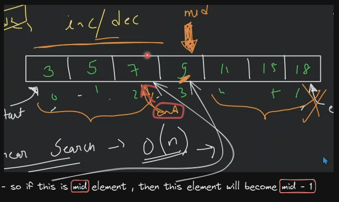

# binary search algo

- questions on binary search
    

## lecture - love babbar (paid course)

- why we need binary search algo ✅
    - in linear search
        - time complexity of linear search i.e `O(n)`
        - when we have an 1D or linear array , then we traverse on each element one by one <br> 
            so where we're doing single traversal
    - time complexity of binary search is `O(log n)` then what `O(log n)` means & why we need binary search 💡💡💡
        
        - so when we're using binary search on the array which has size i.e `2^100` <br>
            then we just need to do 100 comparison which is optimized instead of using linear search
    - so due to binary search algo , we save tons of computation time & due to this we have the processing power 💡💡💡
- limitation or condition where we can use binary search & where we can't use it 💡💡💡
    - either you're using array or vector or any data structure <br>
        like in array , each elements/data should be either in increasing/ascending order or decreasing/descending order <br>
        means each data inside any data structure (like array) should be <br>
        in sorted order (either ascending or descending order) then we can apply binary search
    - so we can say that binary search can be applied only on monotonic/monotonous function <br>
        `monotonic` means either data inside an array are in ascending order or descending order
    - Eg : inside an array , if the data is random order then we can't apply binary search algo on that array 💡💡💡

- understanding binary search algo
    - Example : 
        - we have given input i.e `[3, 5, 7, 9, 11, 15, 18]` which is in increasing order
        - we need to find out target i.e `15` , so whether 15 is present in this array or not
    - approach to implement binary search algo
        - `1st approach` : if we don't know binary search algo , then we'll use linear search algo
            - so we need to check & compare each element of an array
            - so in linear search algo , time complexity will be `O(n)`
        - `2nd approach` : we have an array which is already in increasing order
            - so we'll use binary search because we can take the advantage of given input array <br>
                which is already in increasing order
            - `STEP 1` : so inside that array , starting value is considered as start & ending value is will be as end
            - `STEP 2` : then find the middle element 
                - formula to find out the middle element
                    `mid = (starting element index + ending element index) / 2` <br>
                    only take index of starting element & ending element of an array , don't take the element itself 💡💡💡
                - Eg : in that array starting element index is `0` of 3 & ending element is `6` of 18 <br>
                    `(0 + 6)/2 = 3` , so middle element index is `3` which is 9
            - `STEP 3` : now , check is `arr[mid] = 9` is equal-to the value of target like this
                ```cpp
                if (arr[mid] == target) {
                    return true;
                }
                ```
                - so in this case , mid element i.e 9 is not equal-to the target value
            - `STEP 4` : now , where the target in the array , so we have 2 places to find the target value of mid element
                - `1st place` : the target value can be on left side of the mid value
                - `2nd place`  : the target value can be on right side of the mid value like this
                    
                - `STEP 4.1` : if the target value is smaller than mid value , then answer exists on left side 
                    - so inside that array , we'll check each elements which are left side of the middle value 
                    - & ending value will no more `18` , <br>
                        ending value will be that element which is just before the middle element i.e `7` 💡💡💡 like this
                            
                    ```cpp
                    if (target < arr[mid]) {
                        e = mid - 1;
                    }
                    ```
                - `STEP 4.2` : same as STEP 4.1 
                    - if target is largest than mid value, then the target value exists on right side of mid element <br>
                        so starting element will be the element just after the mid value i.e `11`
                    - so we'll do `mid + 1`
                    ```cpp
                    if (target > arr[mid]) {
                        s = mid + 1 ; 
                    }
                    ``` 
            - so ultimately , we have 3 places where the target value exists
                
        - code example 

            - write the code example in exacldraw