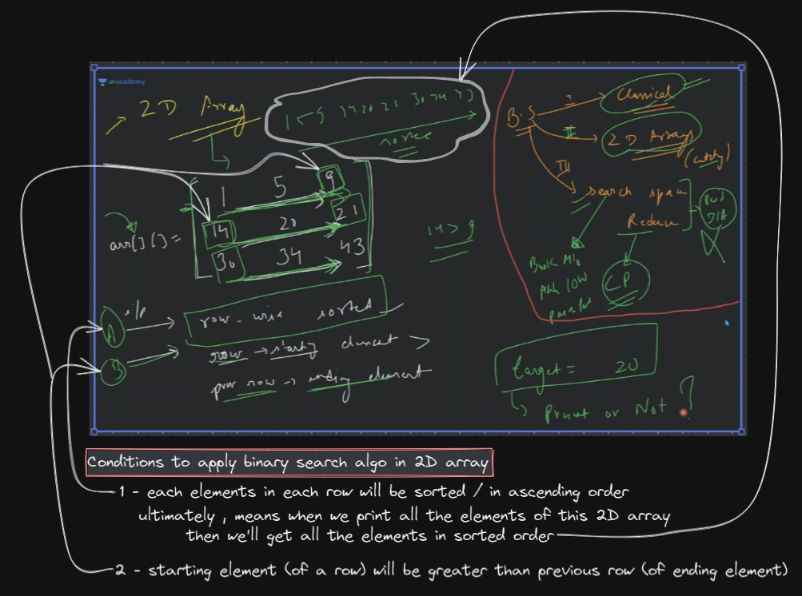
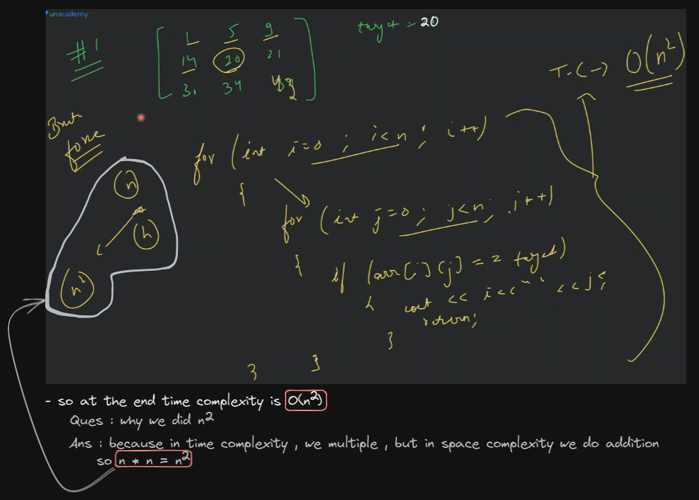

# Binary search algo problems

## lecture - love babbar (paid course)

- here we'll how to apply binary search algo in 2D array
- how do we know that what level of questions we have in binary search algo
    - `1st level` : classical questions (that you just did in 1D array)
        - if you understand those 10 questions then you completed the 1st level
    - `2nd level` : 2D array (we solve catchy questions)
    - `3rd level` : reduce search space (this concept is related to CP) & it contains questions like : 
        - book allocation 
        - Aggressive Cows   
            https://leetcode.com/discuss/general-discussion/1302335/aggressive-cows-spoj-fully-explained-c
        - painter’s partition

- how to use binary search algo in 2D array
    - `ques` : find the target element in 2D array via binary search algo
        - understanding ✅
            
        - approach : we have 2 ways 
            - `1st way` : using linear search algo or brute force
                
            - `2nd way` : optimize approach i.e binary search algo
                - we already know those 2 conditions in order to apply binary search algo in 2D array  
                    but if the question is not fulfilling those 2 conditions then we can't apply binary search algo in 2D array

