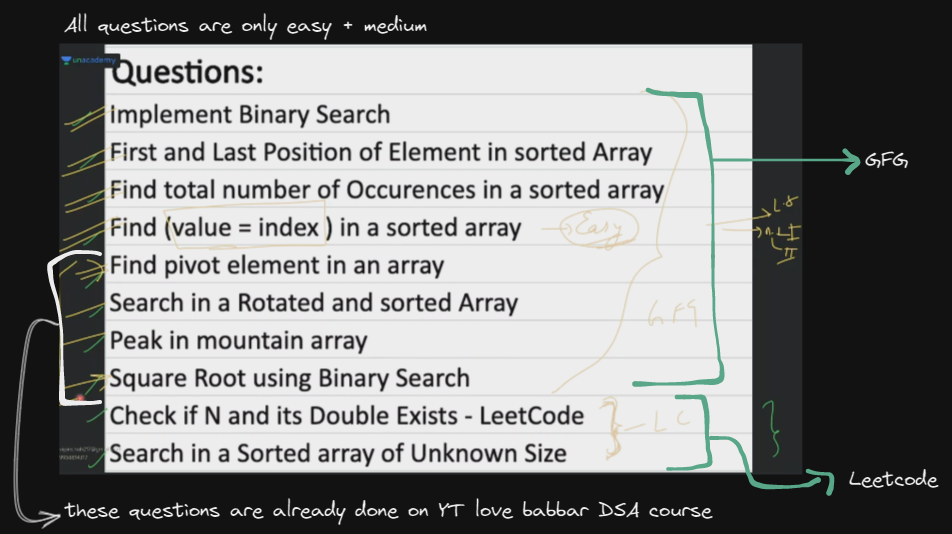

# binary search

- questions on binary search
    

## lecture - love babbar (paid course)

- why we need binary search ✅
    - in linear search
        - time complexity of linear search i.e `O(n)`
        - when we have an 1D or linear array , then we traverse on each element one by one   
            so where we're doing single traversal
    - time complexity of binary search is `O(log n)` then what `O(log n)` means & why we need binary search 💡💡💡
        
    - limitation or condition where we can use binary search & where we can't use it 💡💡💡
        

    

