# Big O Notation : Time & Space Complexity

## lecture - abdul bari sir

- time complexity : in daily life when we do any work/task , we want to know how much time it takes for that performing that particular task
    - so usually , in daily life , we measure the time based on the work that we have to do
    - so now we're using machines to do over work that's computers to do over work <br>
        so we want to know how much machine takes for doing the same task
    - Eg : like if a person is making a bread in 15 min - 20min then
        - if you're using machine for making that bread then how much the machine takes 
        - so if machine is taking 4-5hrs then it's better to do it manually
    - so how much time a machine takes to complete that task is very important for us <br>
        so we use machine for problem solving & what type of problem solving <br>
        `what type of problem solving` : the work that we use do it using pen & paper , so that same work <br>
        we want our computers to do that . so computers are used for performing computation task <br>
        so computation also needs time . that's why we want to measure how much time a machine will take
    - so actually , that depends on the process or the procedure for completing that task <br>
        so that time complexity basically depends on the procedure that you're adopting 💡💡💡
    - so we'll see examples & based on these examples , we'll see what procedure may take what amount of time 💡💡💡

    - Eg : of array `[2,5,9,6,12,15,8,3,7]` & there's are 10 elements
        - now tell me that , inside this array , will always be 10 elements or depends on the problem ? <br> 
            so it's depends on the problem
        - so how many elements will be there ? , so we say `n` elements will be there <br> 
            it maybe 10 or 10,000 or 10 million , so we don't know how many elements are there that's why we say `n` elements 
        - so that number of elements may start from 1 to infinity , so we don't define infinity for the maximum number <br>
            or whatever that number you can imagine you take , so here `n` means not just 5 or 10 <br>
            so `n` means some number of elements
        - so let's say there're `n` elements inside that array like this
            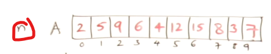
            - now what operation you want to do with these elements , so we want to add all of them
            - so for adding then we need to go through all of them , so you need to take one by one & adding them
            - so how much time this adding operation will takes , so time depends on the number of elements <br> 
                so here `what's the time taken` i.e n 
            - so now next thing we want to do i.e i want to search for a particular number <br>
                like whether element 12 is there or not . or let's say i want to search for element 21 <br>
                so we need to check for all & there's no 21 element
            - so how much time it's taking . so it depends on the number of elements that you have to compare
            - so how many elements are there . so `n` elements are there , so what's the time taken i.e `n` <br>
                which means when we have `n` elements in an array & you're going through all of them just once or one time <br>
                then the time is `n`
            - so `n` is represented as a degree , but ususally , we use the term i.e order means `order of n` like this 
                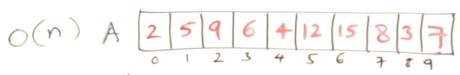
            - & there're other terms like BigO , Omega , theta , we'll see at the end of the course of abdul bari <br>
                because we'll having the good understanding of time complexity & these other terms are Asymptotic notations
        - `2 thing` : if we want to access all the elements then what the code we have to write , so we have to write this 
            ```js
            for (let i = 0 ; i < n ; i++) {
                /* 
                    here whatever you want to do like count number of elements , sum of elements of an array , etc
                    that logic we'll write here
                 */
            }
            ```
            - so this for loop will take each element one by one , so time will be O(n) mneas order of n
            - now for finding the time complexity either we can measure the time based on the work that we're doing <br>
                means what's your procedure , if you're clear with your procedure then you can know the time
            - or else , from the code/program that you wrote , from that code you can also find the time complexity <br>
                if there's a for loop , we're going from 0 to last element i.e `i < n` means it's `n` <br>
                means it's taking O(n) times , so whatever inside the for loop body , that thing will repeat `n` times <br>  
                so we can analyse based on the procedure also or based on the code/program also
        - Eg : let's say we're on first element of that array , & we're analyzing all the other further elements inside that array
            - & again begin on the 2nd element of that array , we're analyzing all the next further elements <br>
                let's assume that you're comparing for sorting purpose
            - so with 2nd element , we're comparing further each of the elements & same thing we'll do for each elements <br>
                so for one element , we're checking all the elements & then next element , it'll check for all means processing for all
            - so here `n` elements are begin processed `but for how many times` <br>
                so for each elements `n` elements are processed , so it'll be `n * n = n²` , so we can say `O(n²)` 💡💡💡
            - so for processing/writing code for sorting will look like this 
                ```js
                for (let i = 0; i < n; i++) {
                    for (let j = i+1 ; j < n; j++) {
                        /* 
                            here we write our logic
                         */
                    }
                }
                ```
                - so when you have two nested for loops , then it's `n²` , so you don't have to check line by line <br>
                    so just look at the code , you got the rough idea but check the code thorougly , so you don't miss any line 💡💡💡
        - Eg : now let's say , being on the first element , we're processing rest of the elements , so `n - 1` elements we're processing 
            - now being on the second element , we're processing rest of the elements <br>
                but we're not processing first one so it'll be n - 2 + n - 1
            - now being on the third element , we're processing rest of the elements , right now just imagine that you're doing something <br>
                so it'll become & go on reducing & finally we'rell get this `1 + 2 + 3 + 4 + ..... n - 3 + n - 2 + n - 1` <br>
                & this means `n(n - 1)/2` means sum of first `n` natural numbers
            - so that'll become `n² - n / 2` , so here what's the degree of this `n²` polynominal i.e n² so , O(n²) like this 
                
        - Eg : now let's say we're taking `4th index` element of that array & assume that 4th index element is the middle element 
            - & again consider before that elenent is the middle element like this <br>
                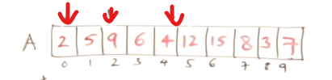
            - so we're not processing the entire elements . we're processing half - half array , <br>
                so that process will always be divided by 2 . so when something is successively divided until it reaches 1 <br>
                that is represented as `log₂n` means log₂ of n elements & here we're dividing by 2 that's why we took `2` <br> 
                so the time complexity will be logn
            - so the code will look like this
                ```js
                for (let i = n; i > 1; i=i/2) { // here every time , we'll divide by 2
                    /* 
                        write logic
                     */
                }
                ```
                - now just look at the for loop , don't tell bindly order of n , read how the for-loop is behaving
                - so how we got `log₂n` , so if the value of i is getting divided by 2 everything <br>
                    then it's `log n` & we got `n` because we're diving n no. of elements & we're dividing by 2 <br>
                    so ultimately , time complexity will be `log₂n` like this <br>
                    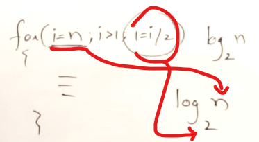
                - & how long it's happening , until for loop reaches 1 , that's why we use `log` 💡💡💡 <br>
                    & same thing will be happen if we use while loop also
            - `Note : when to use while loop 🔥` : 
                - usually , when we're not incrementing by 1 every time then instead of using for loop 
                - use the while loop , but you can for loop also 
                - but for loop , usually used for like a counter which is incrementing by 1 💡💡💡
            - so we see both ways to get the time complexity from the code & from the work/procedure <br>
                & if you're analyzing from the work/process that's more better

    - Eg : of linked list & it same as array which we'll see in next lecture
    - Eg : a matrix , 
        - so in this picture , we have the matrix of 4 * 4 means 4 by 4 like this <br>
            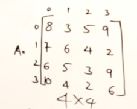
        - so total how many elements , so if dimension is n * n then total elements will be `n²` <br>
            so time complexity will be `O(n²)`
        - so when you're processing up on a matrix then it'll require N square amount of time , <br>
            if you're processing on all the elements
        - if you say that you're processing a row then time complexity will be `O(n)` <br>
            if you're processing a column so again it's `O(n)` , if you're processing all the elements <br>
            which require 2 loops then time complexity will be `O(n²)`
        - program of looping over the matrix
            ```js
            for (let i = 0; i < n; i++) {
                for (let j = 0; j < n; j++) {
                    /* 
                    ------
                    ------
                    -----
                     */
                }
            }
            ```
            - & let's say you having a loop or a functions which has a loop inside this second nested loop <br>
                then the time complexity for those total 3 loops i.e `n³` means n cube 
        - if you're processing only one statement or two statements which don't have any loops then time complexity is `O(n²)`

    - eg : of array of linked list <br>
        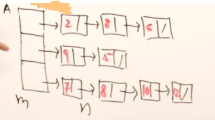
        - so total how many elements are there i.e `n` , so total how much processing you're required <br>
            so we can say `O(m + n)` processing is required but if you say that you want to consider only `n` elements <br>
            which are present right now then you can say total processing is `O(n)` 💡💡💡
        - we're not considering `m` because it's totally depends on situation whether we need to include or not <br>
            so you're processing for `m` also but you don't want to consider the time taken by `m`

    - eg : of binary tree <br>
        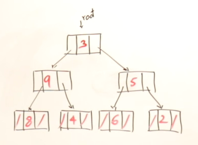
        - & total elements are 7 elements . now let's say you're processing like for searching 
        - & suppose , you're searching via branch/path , so at the bottom , we have some elements <br>
            & when you go up then we need to divided by 2 & divide by 2 until it reaches 1 element 
        - so time complexity will be `log₂n`
        - but if you're spending time on a tree along with the height of the tree then we'll get `O(logn)`
        - if you want to process on each element then how many elements are there i.e `n` <br>
            so time complexity will be `O(n)` 💡💡💡
        - now if you write the code for this program then time complexity will be `order of n -> O(n)` <br> 
            but analyze the code properly 

    - so time complexity is actually depends on work that you're doing 💡💡💡

- space complexity : 
    - we want to know how much spaces is consumed in main memory during the execution of the program
    - Eg : in that same array , total 7 elements are there but in future it could be any number of times <br>
        so total `n` elements are there 
    - here we're not calculating bytes , we want to know the spaces dependent on what i.e `n` <br>
        so if the value of `n` is more then the spaces will be more 💡💡💡
    - Eg : of linked list 
        - so along with the elements we the space for links also , so let's say 2n , so again `O(n)`
    - Eg : of matrix 
        - space complexity will be `n^2`
    - Eg : of array of linked list 
        - space complexity will be `m + n`
    - Eg : of binary tree
        - here n nodes are there , so space complexity will be `O(n)`
    - here we'll see examples , & just by looking at the program code without look at the process , we'll take out time complexity 

- Eg : calculating time & space complexity
    - how to analyze , so we assume that every simple statement in a function or a program takes 1 unit of time <br>
        & what is simple statement ? , means the statement may be having automatic operations assignment or a conditional <br> 
        statement if it's more complex then we have to study that also in detail
    - Example 1 : of swap code <br>
        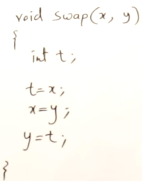
        - here we're inter-changing the value of x & y
        - & each statement will take 1 unit of time because those are just an assignment , so total time is 3 <br>
            so the `f(n) = 3` like this <br>
            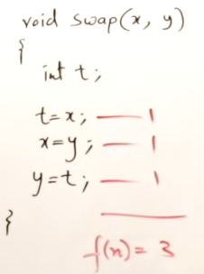
        - so here 3 is constant like this O(1) 
        - & `why it's contant` : because here degree of n is 0(zero) , so power of 0 is equal-to O(1) like this
            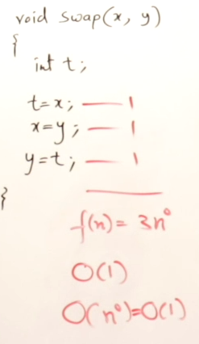
    - Example 2 : of sum code <br>
        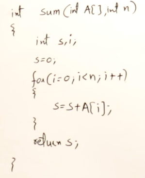
        - here `s = 0` will take 1 unit of time
        - now in for loop , first we have assignment then condition then assignment 💡 <br>
            & this for loop will not be executed only one time , it'll execute for `n` times
        - so initially , `i = 0` will run only 1 time & that increment `i++` will happen `n` times <br> 
            & condition also `i < n` will run n times but if one time condition will fail , so it'll stop <br>
            so time of that condition will be `n + 1` 💡💡💡 
            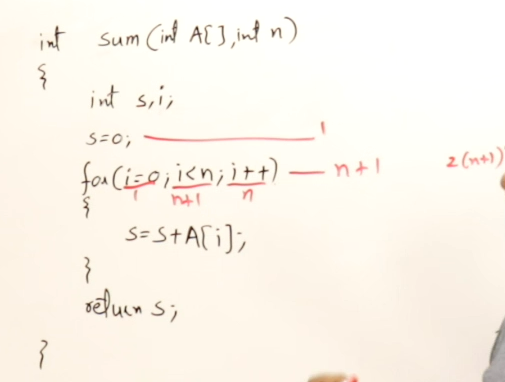
            - so time will be `n + 1` if we're not taking constant or `2(n+1)` if we're taking constant
        - now `s = s + A[i]` is assignment & arithmetic operator , so this will execute as long as our loop is running <br>
            so how many times it'll run i.e `n` times 💡💡💡 & `return s` will run 1 time 
        - calculate totla time , so first 2n comes becuz there're two times n & 1 are 3 times , so total time will be like this <br>
            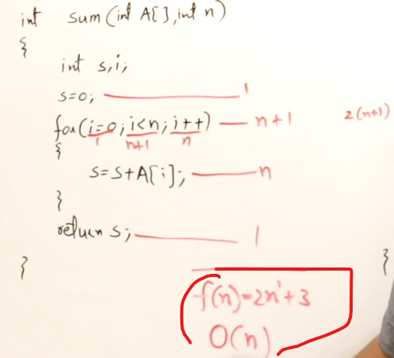
            - so basically , when you have only one for loop then time complexity will be O(n) or order of n
            - or we can read & get the total time complexity , so we know we have 2 ways to calculate the time complexity
        - so you ask questions from yourself in order to get the time complexity ✅
            - like we're doing sum of all elements in an array
            - so how much it'll take , so it depends on number of elements 
            - how many elements are there i.e n elements
            - so time is how much i.e O(n)
    - Example 3 : matrix addition <br>
        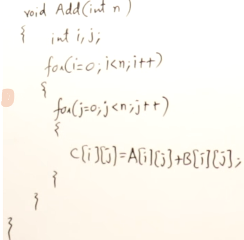
        - so outer for loop will take `n + 1` time
        - now inner loop will take `n` & that statement inside inner loop , will also take n time like this
            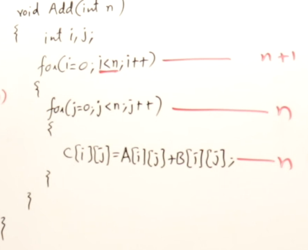
        - now how much total time will take that inner loop , so shall we write n + 1 or n * (n + 1) <br>
            so we have nested loop , so it should be multiplication 💡💡💡
        - & that statement which is inside that inner loop , will repeat n more times , so n * n
        - now we can make a function to calculate total time like this <br>
            so `n * n` & `n * n` will be `2n^2` & `+` then 2n (becuz we have 2 times n) & then + 1 like this
            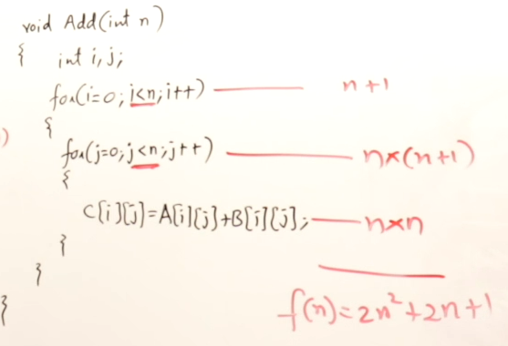 <br>
            so this is time that we got
        - so skip the constant & skip those number which are less than `n^2` so we'll get `O(n²)`
        - now we're saying order of n^2 but you can say big O of n^2 like this `O(n²)` <br>
            or theta of n² -> θ(n²) or omega of n²
        - so other Asymptotic notation we'll see at the end of the lecture
    - Example 4 : function with loop <br>
        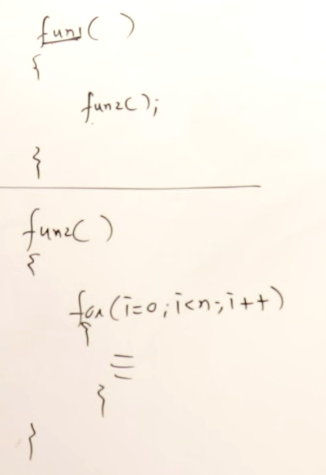 <br>
        - so inside func2() is will take 1 , so func1() will take O(1) , this answer is wrong
        - because func2() contain a loop , so that loop will take order of n times , so it'll be `n` <br>
            so the time is taken by the func2() is not 1 , it'll be n , so that's why func1() will also take n 
        - so total time will be taken by func1() i.e O(n) 💡💡💡
        - so mostly , loops makes time as n or n^2 or n^3 ,so it's depends on loop that you're using 💡💡💡 <br>
            & same concept will be same for while loop also
        - but the loop is behaving in a different way like logn or something else then you need to read the code <br>
            then get the time complexity 

## lecture - Kunal Kushwaha

- agenda : 
    - intro of Space & Time Complexity
    - compare various cases
    - what is BigO notation & other Asymptotic notation
    - what is a mathematical aspect of it
    - what is a intuition behind it & what does it mean in simple words
    - how to solve recurrence relation like linear recurrence , divide & conqueror recurrence (which is a part of recursion)
    
- `what is time complexity ?` : 
    - let's say we have two machine i.e an old computer & M1 macbook(which is very fast)
        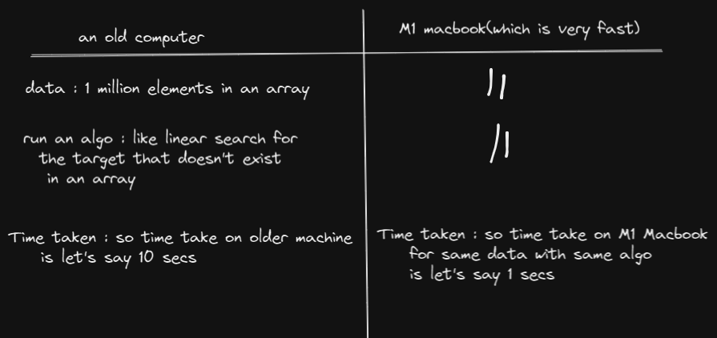
    - now Question : `is which time has better time complexity ?` : 
        - if you said that old computer or M1 macbook then you're wrong in both the ways
        - Ans : is that both machines have the same time complexity 💡💡💡
            because `Time complexity != time taken` 💡💡💡
        - & you may heard that `time complexity = total amount of time taken to run the program` ❌ <br>
            this is wrong statement 
    - so `what's time complexity if time complexity is not equal-to time taken ?` : ✅ 
        - let's say we created a graph for both the machines
            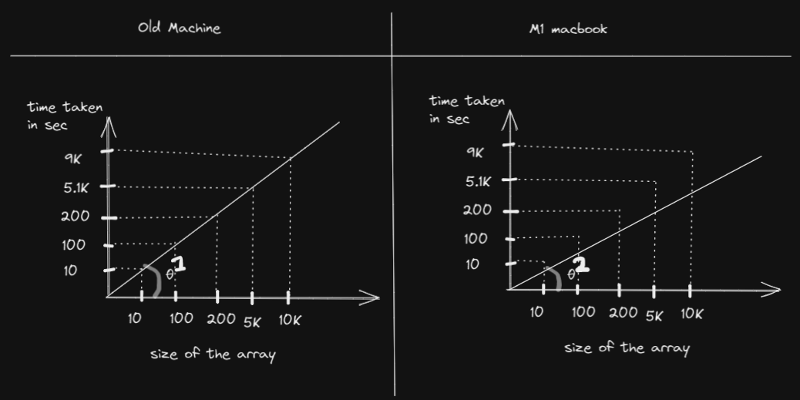
            - so for old machine , we have straight line & for M1 macbook , we have straight line but with less slope <br>
                the theta angle is smaller of M1 macbook than older machine 💡💡💡
            - so even though the time taken by both the machine is different but the relationship <br>
                b/w the size of the array & the time taken is same means linear 💡💡💡
            - Eg : if we have 20K size then estimate amount of time taken will be around 20K which is obvious
                - so old machine will take 20K time & if the size is 20K in M1 macbook then same algo will take around 2K seconds
            - so 5K size of the array will take 5.1K seconds which is shown in the graph <br>
                but in macbook machine , on 5K size of the array will take 200 seconds
            - so how you're able to give the estimate time for both the machines
        - so what is time complexity ? ✅
            - so time complexity will be that graph or that mathematical function which is on graph i.e called time complexity 
            - means time complexity is a function that tells us how the time is going to grow as data/inputs grows 💡💡💡
            - so on that graph , for both the machines , time is growing linear as the size is growing <br>
                value maybe different but in both the cases , time is growing linear 
            - time complexity doesn't gives us time , it's a function which gives us the relationship about <br>
                how the time will grow as the inputs/data grows 💡💡🔥 <br>
                it's not the time = time taken to run the algorithm that's wrong
            - we'll represent the time complexity via Asymptotic notations 
- `why that relationship is important ?` & `we'll see why do we skip less dominating term & constant` <br>
    & `why do we also take worst case ?` ✅ 
    - let's take example of two algorithm i.e linear search & binary search 
    - so time complexity of learn search grows linearly means `n` & binary search grows with `logn` , <br>
        so what does these means 
        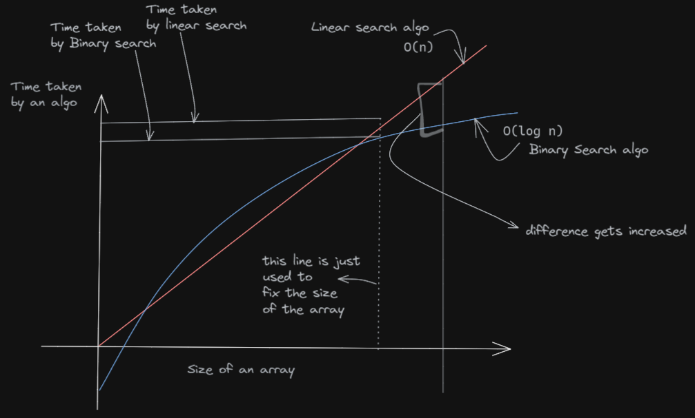
        - so time taken by linear search is greater than time taken by binary search 💡💡💡 , so difference gets increased
        - so that `O(log n) (of binary search)` will take less time & `o(n) (of linear search)` will take more time  
        - so `O(log n)` is better & efficient time complexity that's why we care 💡💡💡
    - let's take constant time complexity 
        - `constant` : means doesn't matter what the size is , time will always be constant 💡💡💡
        - so on graph , constant will be shown like this
            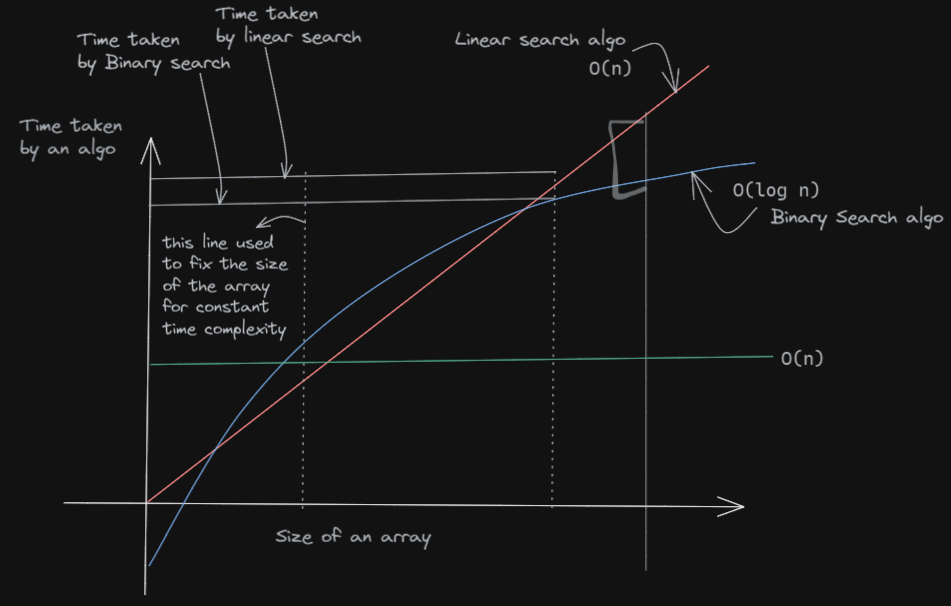
            - so here `O(n)` is taking more time , then `O(logn)` is taking less time & constant `O(N)` is take even less time 
            - but while calculating the time complexity , we don't care about the small numbers 💡💡💡 <br>
                so in time complexity , always look at the bigger numbers 
            - so when your data/inputs goes in large size , then think always about worst case 💡💡💡
            - so time complexity wise , which one is smaller i.e `O(n) < O(log n) < O(n)` 💡💡💡
        - so which algo is better here i.e binary search is better
- `what do we need to consider when thinking about complexity ?` 🔥
    - `1` : always look for worst case time complexity
        - Eg : let's say your website is running & 10 users are using your webapp <br>
            so is that more worry/concern for your infrastructure or code optimization <br>
            or is the worry about what if 2Million people start using your webapp
        - so in which situation , has higher change of crashing your webapp ? 10 people or 2million <br>
            so 2Million will create impact & this is your worst case 💡💡💡
        - so when thinking about time complexity , always look at worst case time complexity 💡💡💡 <br>
            so always look at worst case while designing your algorithm 💡💡💡
        - & definitely , you can optimize your best case but more concern about worst case complexity 💡💡💡
    - `2` : always look at time complexity for large/infinite data
        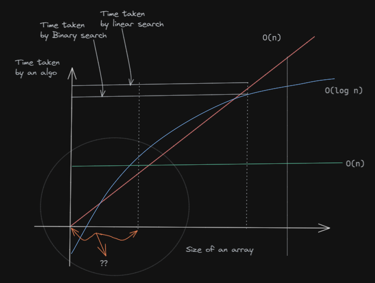
        - see inside the circle , this statement `O(n) < O(log n) < O(n)` is not true right now 
        - so earlier , we said that constant takes less amount of time but when the array decrease <br>
            then constant time complexity is taking more time then O(log n) then O(n) , <br>
            & you're correct which might be possible
        - but for small amount of data , we know that relatively , it'll take more or less or random time <br>
            but overall the entire time for all those time complexity will be small because array of size or data is small 💡💡💡
        - & if you're handing the small data & your code is optimize then the code will handle that small data <br>
            doesn't matter which time complexity is working on but the problem will arise when the array of size or data size <br>
            started increase a lot then you need to worry 💡💡💡
        - so that's why we're worry about large size of the data , so always look at time complexity for large or infinite data
    - `3` : Eg : if we have the graph like this <br>
        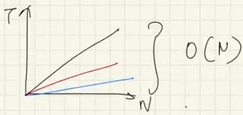
        - so in whatever the way , those lines are going , but overall those are going linear <br>
            but actual value is different , so value can be like this or whatever value can be possible 
            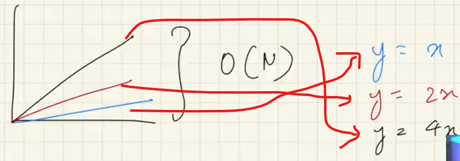 <br>
            so even though , the values are different but those are going linearly 
        - & these constants values are defining the slope of the line ✔️💡
        - `3.1` : even though the value of actual time is different & all they're growing linearly 
        - `3.2` : we actually don't care about the actual time taken  
            - because actual time take will depends on machine to machine , <br>
                that's why we only care about relationship b/w how the time will grow when the input/data grows
            - `Ques : reason why we skip all the constants ✅` : do we really need to worry about those constants time complexity values
                - if we say slope like this `y = 3x + 5` & even though this is giving the correct answer <br>
                    so do we need that correct answer or do we need only the relationship <br>
                    & for this `y = 3x + 5` , time complexity will be linear i.e O(n) 
                - so do we need to care about what that extra time is taking <br>
                    no , we just need to care about how the line is growing
                - so do we need those constants i.e 3 & 5 of `y = 3x + 5` , Ans is No 💡💡💡 <br>
                    because if we plot the graph of this `y = 3x + 5` then the line also go linear like this <br>
                    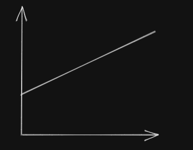 <br>
                    that's why we skip all the constants 💡💡💡
        - `3.4` : always skip less dominating terms ✅
            - Eg : let's say the graph is of O(n^3 + log n)
                - now from `3.2` , so if we're talking about large amount of data , let's say 1million of data <br>
                    then what'll be the approx total time will be taken . <br>
                    let's say for 1million size of the array & O(n^3) then time complexity will be like 1 million cube in seconds 
                - so 1 million of data is O(1million)^3 + log (1million)) , so log of 1 million will be 6 seconds <br>
                    so 1million^3 in seconds + 6 sec like this <br>
                    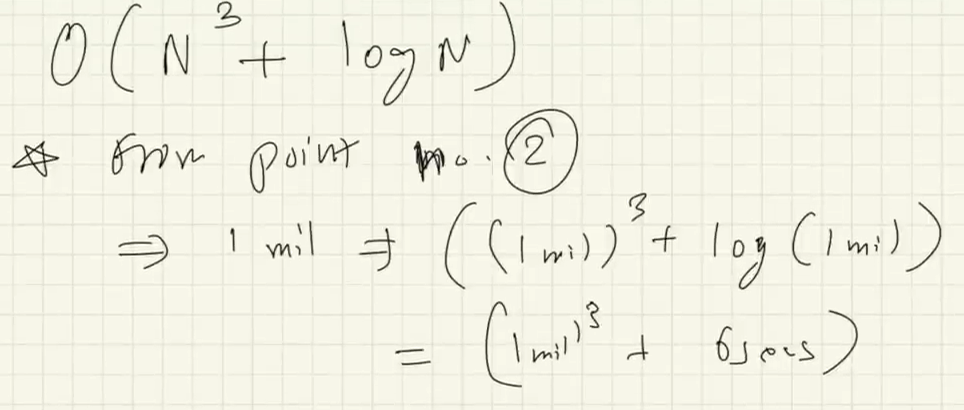 
                    - so here , does that 6 seconds comparing with 1 million^3 has any significance
                    - so 6 seconds is very small that's why skip this   
    - `Ques` : find out the time complexity from the given equation ✅
        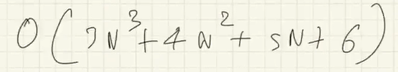 
        - here skip all the constants then we'll get this 
            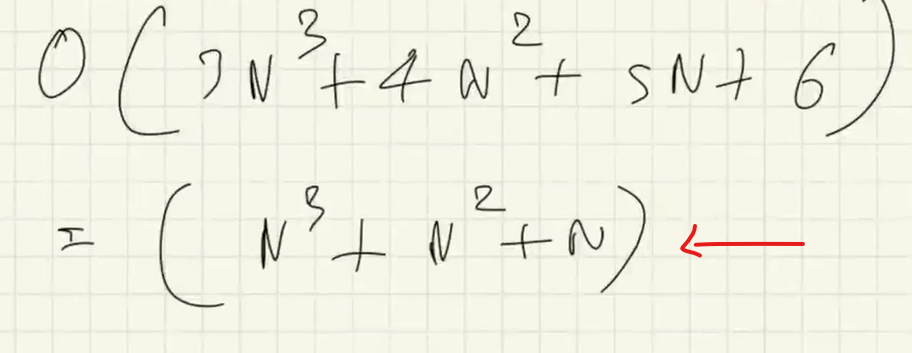 
        - now skip the less dominating terms , so we're skipping N^2 & N then we'll get this answer 
            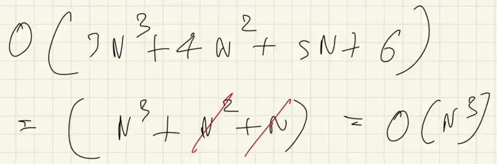 
        - now , plotting the graph 
            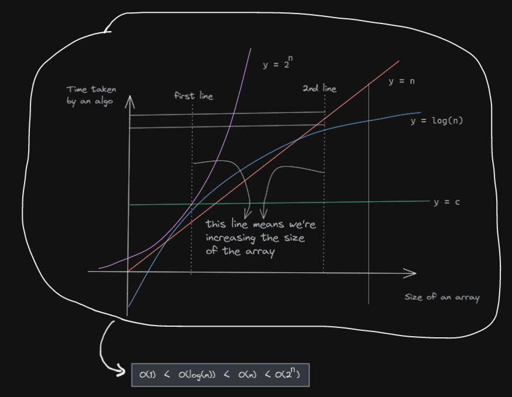 
            - so here `O(log(n))` is taken as greater than O(1) & then more time will be taken by `O(N)` than `O(log(n))` <br>
                if you're considering the 2nd line of the array size in the graph
            - now `y = 2^n` is very very bad time complexity which means exponential complexity <br>
                eg : fibonacci which was exponential . so if we consider the 1st line of the array size in the graph <br>
                then for such a small data , time limit has exceeded a lot means for the small data <br>
                it's taking too much time which is not visible in the graph which is very bad 💡💡💡
            - that's why for `n = 50` , you're not getting the answer in fibonacci question 💡💡💡
        - & these're not just the time complexity which exists , so you have to figure out . for eg : if we get n * log then means  
            - `log` means larger number which is going to be more than `n` , so `n log` will come b/w them like this  
                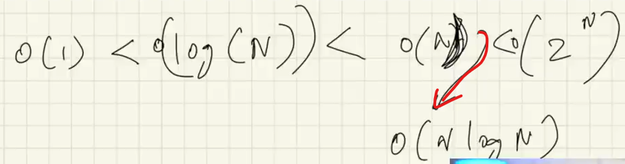 
            - because we're multiplying from n with log^n then obviously it'll greater ✔️
- `Big O notation & other Asymptotic notations ?` ✅ : 
    - first , we'll see meaning of them in the form of simple word & mathematical representation
    - `1` : BigO notation
        - word definition : Eg : let's say you wrote an algorithm which has time complexity i.e O(N^3)
            - so what does that mean BigO of N^3 & N^3 means size of the array <br>
                will grow as the input grows in an N cube fashion & here BigO is saying means this is the upper bound 💡💡💡
            - means the graph that you have has the upper bound <br>
                `upper bound` : means the complexity/relationship/graph can't exceed N^3 💡💡💡
            - Eg : your algo that you wrote maybe solved in constant time or O(n) time or O(n log) time <br>
                or O(log n) time or O(N^2) time or O(N^2 logn) or O(n^3) but it never be solved/exceed time complexity <br>
                or relationship/graph/function/value will never exceed more than N^3 💡💡💡
                - means time complexity can't be lik O(N^4) or O(n^3 log N)
            - `O(N^3)` means has upper bound
        - mathematical representation : of `O(N^3)`
             
            - means it has some/finite value , that circle which we marked means number is larger like infinity <br>
                as we seen that always look at time complexity for large/infinite data
        - Eg : so according to mathematical representation : 
            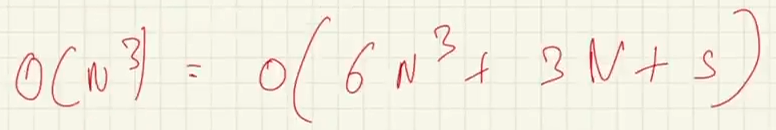 
            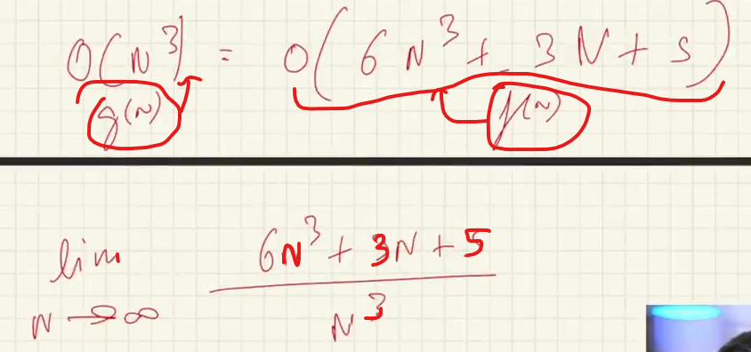 
            - limit/lim means when the value of N reaches infinity or close to infinity
            - so if we solve the question then we'll get this answer
                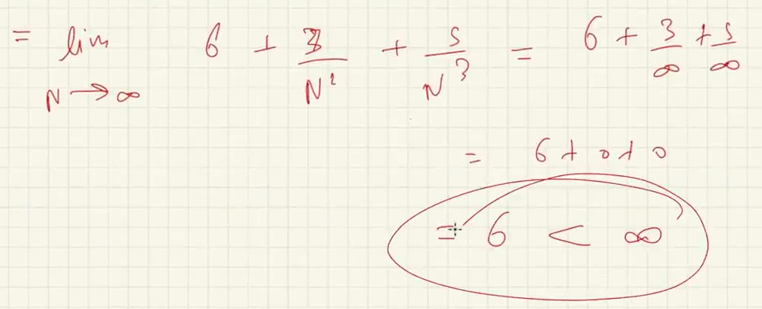 
                - Note : if we divide anything by infinity , we'll get 0(zero) ✔️
            - so `6 < infinity` is equal-to this mathematical representation 💡💡💡
                 
                - which is less than infinity
                - so here `6` is the finite value which we're getting , becuz it's showing an upper bound 💡💡💡 
        - so our algorithm will never exceed that `O(N^3)` & our algo can be better than this like O(1) <br>
            but it'll never exceed Order of N cube 💡💡💡
    - `2` : Big Omega notation
        - it's opposite of BigO notation 💡💡💡
        - word definition : Eg : if you say that an algo has the time complexity of `Ω(N^3)`
            - then it means an algo will take at-least N^3 or N cube time complexity , means lower bound 💡💡💡
            - means an algo can take N^4 time or N^3 log n time <br>
                but time complexity will never can't go less/below the N^3 because of lower bound 💡💡💡
            - so minimum N^3 time complexity is required 
        - mathematical representation : <br>
            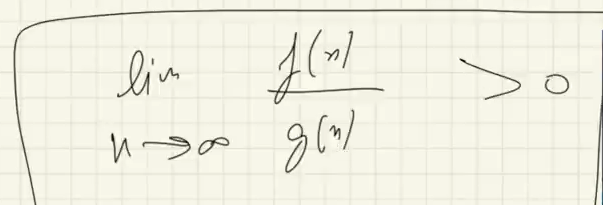 
            - so Big Omega is the opposite of BigO Notation
        - BigO notation is most important because we always look at worst case time complexity 💡💡💡 <br>
            but in Big Omega notation , time complexity of an algo can go further than the worst case <br>
            that's why we need the worst case 💡💡💡
    - now sometimes , we also want to specify the running time which is equal-to whatever equation that we have <br>
        means an equation have both upper bound & lower bound together
        - Ques : let's say an algo has lower & upper bound as O(N^2) , so how we can represent this
        - Ans : O(N^2) & Ω(N^2)
        - now mathematician said this is very repetitive , so that's why Theta notation is created
    - `3` : Theta Notation
        - if we say `θ(N^2)` means this
            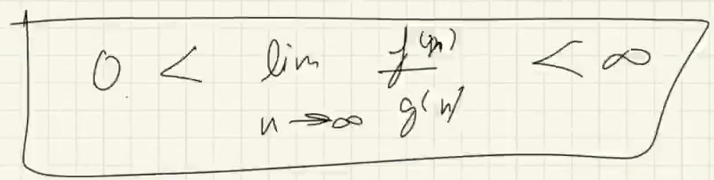 
        - word definition : theta notation means combining both upper bound & lower bound
        - but in reality or while doing practice , we only consider Big O notation <br>
            because it talks about the worst case 💡💡💡
    - now there are two more little notation i.e little O notation & little Omega notation 
        - `4` : little O notation
            - we know that Big O notation is giving the upper bound <br>
                so this little O notation also give upper bound but it's not strict upper bound 💡💡💡
            - word definition : it's loosely upper bound 
                - difference b/w Big O notation & little O notation 
                    - in Big O notation : let's say we have `f = O(g)` <br>
                        which means f is not faster than g then it means `f <= g`
                    - in Little O notation : f = O(g) then means `f < g` means strictly slower than g 💡💡💡
            - mathematical representation : 
                - so if you're saying f is strictly lower than g , you can say numerator is <br>
                    slower than denominator , so we'll get 0
                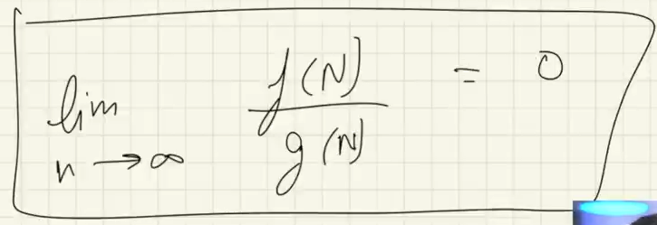 
                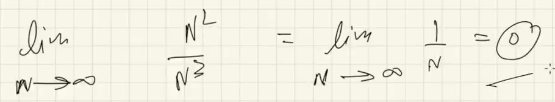 
        - `5` : little omega notation 
            - Big Omega is giving the lower bound & little omega also give the lower bound <br>
                but it'll be loosely lower bound 💡💡💡
            - word definition : difference b/w Big omega & little omega
                - in Big Omega , if we say `f = Ω(g)` means `f >= g` which is giving lower bound
                - in little omega , `f = w(g)` means strictly lower bound means f > g
            - mathematical representation : if f > g means if numerator is greater than denominator then we'll get infinity
                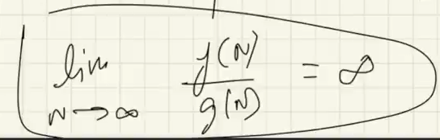 
            - Example is : 
                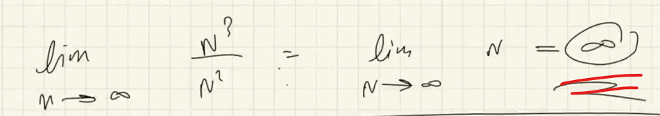 
    - use it when you want strictly less than or greater than <br>
        but in practice & for interview , for algorithms & compare program , we use Big O notation 💡💡💡

- `space complexity & auxiliary space` : 
    - space complexity means input space & the auxiliary space 💡💡💡 <br>
        & the auxiliary space is the extra space or temporary space taken/used by an algorithm
    - Eg : if the question say that take an input of an array of size N & do something with it
        - so the space complexity means the input that you're taking an array of size N <br>
            & the extra space that algorithm is using 💡💡💡
        - people say space complexity = only the extra space we're taking , which is wrong
        - so space complexity = extra space + original space which is required by the input 💡💡💡  
    - in interview , we can't really do about the thing that we need input for <br>
        we only care about how much extra space used by an algorithm 
        - Eg : in binary search , the space complexity is constant <br>
            which means the auxiliary space is constant because binary search is not taking any extra space 💡💡💡
        - but you'll say that while doing binary search , we were using three variables <br>
            & these variables also use some extra space , so how we can say that space complexity is constant <br>
            Ans : if the size of an array is 100 or 1000 or 10K or 1 million or any size <br>
            then for every single time , we're going to those 3 variables that's why space complexity is constant 💡💡💡
    - Ques : take an input of size N & create a new array of size 2N & add the duplicate numbers in that new array
        - Ans : so space complexity = N for input that we're taking + the entire thing <br>
            i.e creating a new array & copying the whole element inside tht new array then adding a new element
        - so in order to solve the problem , a new array is created , so that size actually dependent on size N <br>
            hence , the space complexity is O(N)
        - so space complexity = space for the input + auxiliary space 💡💡💡
        - & we always talk about the auxiliary space while finding the space complexity 💡💡💡
    - space complexity of different algorithms : 
        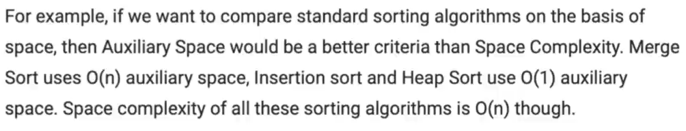 

    57:54


## lecture - codebasics YT

## lecture - LetMeCode YT

## lecture - love babbar

## lecture - neso academy

## lecture - ZTM 

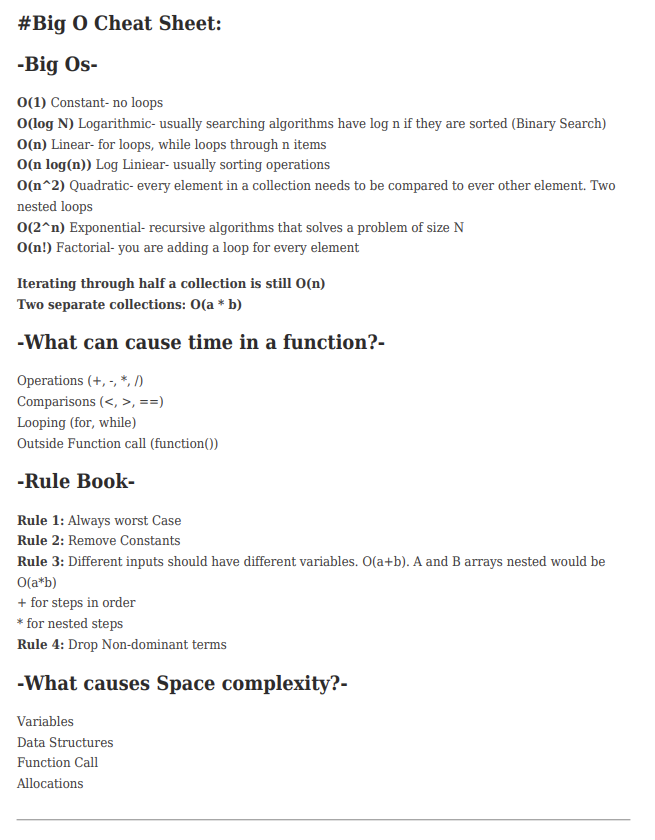


